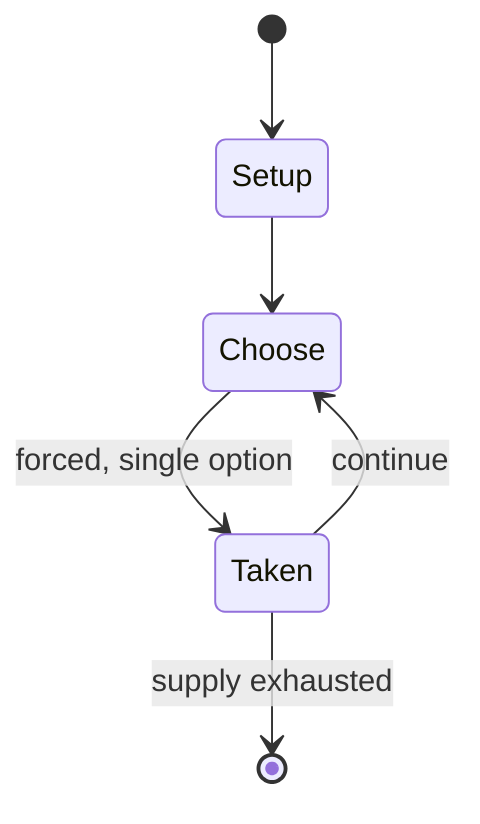

# Dots and Boxes

*abstract strategy game*

`dots_and_boxes` &nbsp; state: **DEEPENED** &nbsp; method: **heuristic**

## Found layer (recorded, not trusted)

| field | value |
| --- | --- |
| wikidata | Q1142531 |
| wikipedia | Dots and boxes |
| genres (source) | -- |
| instance of (source) | abstract strategy game, paper-and-pencil game |
| country of origin | -- |

## Declared layer (orders bench work)

| field | value |
| --- | --- |
| year created | -- |
| epoch | -- |
| region | -- |
| media | ABSTRACT, PAPER_AND_PENCIL |
| players | 2 |
| age band | -- |
| exogenous process | -- |
| loss shape | -- |
| live axes | SPATIAL |
| horizon | VARIABLE |
| scoring shape | -- |
| information | -- |
| interaction | COMPETITIVE |
| turn structure | PHASE_STRUCTURED |
| tractability | SAMPLING_ONLY |
| randomness | -- |
| luck factor | 0.35 |
| rules complexity | 2.89 |
| strategic depth | 2.25 |
| novelty | 0.6196 |
| solved status | -- |
| strategies | sacrifice |
| algorithms | -- |

## Object model

```
Episode
  players      : 2
  turn_structure: PHASE_STRUCTURED
  horizon       : VARIABLE
  scoring       : ?

Placement      -- position subject to geometric legality
```

## State transition diagram



## Research item -- turn trace

```
# Dots and Boxes -- simulated turn events
# generated from the DECLARED vector, not from a rulebook.
# structure: exo=None loss=None horizon=VARIABLE scoring=None axes=SPATIAL

t=0    SETUP        players=2  pot=0  capacity=6
t=1    FORCED       p1 single legal option taken (pot_gain=+1.5)
t=2    FORCED       p1 single legal option taken (pot_gain=+1.8)
t=3    SPATIAL      p1 places at (7,6); adjacency legal
t=4    FORCED       p1 single legal option taken (pot_gain=+1.8)
t=5    FORCED       p1 single legal option taken (pot_gain=+1.8)
t=6    FORCED       p1 single legal option taken (pot_gain=+1.9)
t=7    SPATIAL      p1 places at (0,6); adjacency legal
t=8    FORCED       p1 single legal option taken (pot_gain=+1.2)
t=9    ENDTURN      turn passes to p2
t=10   FORCED       p2 single legal option taken (pot_gain=+1.3)
t=11   FORCED       p2 single legal option taken (pot_gain=+1.1)
t=12   FORCED       p2 single legal option taken (pot_gain=+1.3)
t=13   FORCED       p2 single legal option taken (pot_gain=+0.7)
t=14   SPATIAL      p2 places at (2,3); adjacency legal
t=15   FORCED       p2 single legal option taken (pot_gain=+1.9)
t=16   FORCED       p2 single legal option taken (pot_gain=+1.0)
t=17   FORCED       p2 single legal option taken (pot_gain=+0.6)
t=18   FORCED       p2 single legal option taken (pot_gain=+1.2)
t=19   ENDTURN      turn passes to p1
t=20   FORCED       p1 single legal option taken (pot_gain=+1.1)
t=21   FORCED       p1 single legal option taken (pot_gain=+1.4)
t=22   SPATIAL      p1 places at (3,5); adjacency legal
t=23   ENDTURN      turn passes to p2
t=24   FORCED       p2 single legal option taken (pot_gain=+1.7)
t=25   ENDTURN      turn passes to p1
t=26   FORCED       p1 single legal option taken (pot_gain=+0.8)

terminal: VARIABLE
```

## Conditions

| kind | threshold | effect | trigger |
| --- | --- | --- | --- |
| TERMINATE | -- | -- | The game ends when no more lines can be placed. |
| LOSE | -- | -- | But with their last move, they have to open the next, larger chain, and the novice loses the game. |

## Source extract

Dots and boxes is a pencil-and-paper game for two players (sometimes more). It was first
published in the 19th century by French mathematician Édouard Lucas, who called it la
pipopipette. It has gone by many other names, including dots and dashes, game of dots, dot to
dot grid, boxes, and pigs in a pen. The game starts with an empty grid of dots. Usually two
players take turns adding a single horizontal or vertical line between two unjoined adjacent
dots. A player who completes the fourth side of a 1×1 box earns one point and takes another
turn. A point is typically recorded by placing a mark that identifies the player in the box,
such as an initial. The game ends when no more lines can be placed. The winner is the player
with the most points. The board may be of any size grid. When short on time, or to learn the
game, a 2×2 board (3×3 dots) is suitable. A 5×5 board, on the other hand, is good for experts.
== Strategy ==  For most novice players, the game begins with a phase of more-or-less randomly
connecting dots, where the only strategy is to avoid adding the third side to any box. This
continues until all the remaining (potential) boxes are joined into chains – groups of one

<sub>Wikipedia, CC BY-SA. Retained as evidence for the structural
classification above. Every rule inferred from it is HYPOTHESIZED
until audited against a rulebook.</sub>
