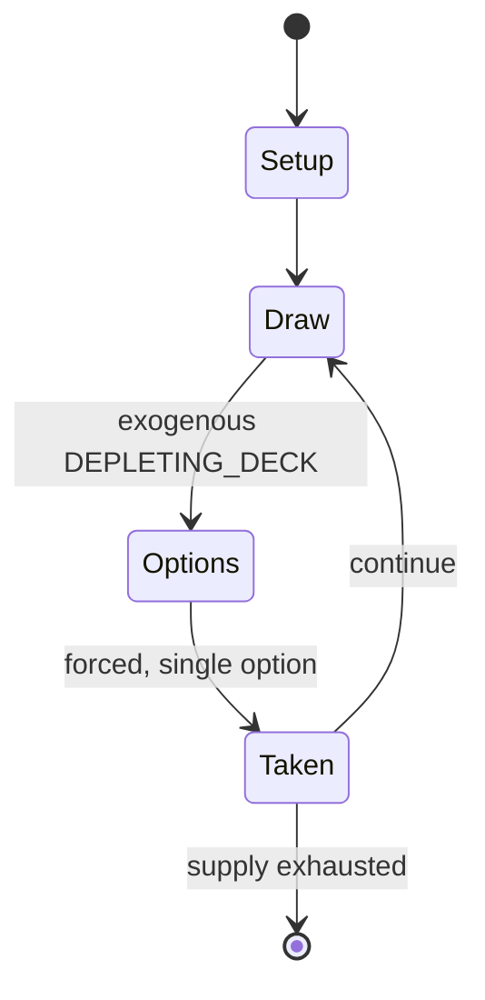

# Dou dizhu

`dou_dizhu` &nbsp; state: **DEEPENED** &nbsp; method: **heuristic**

## Found layer (recorded, not trusted)

| field | value |
| --- | --- |
| wikidata | Q1251329 |
| wikipedia | Dou dizhu |
| genres (source) | -- |
| instance of (source) | -- |
| country of origin | -- |

## Declared layer (orders bench work)

| field | value |
| --- | --- |
| year created | -- |
| epoch | -- |
| region | -- |
| media | CARD, GAMBLING |
| players | -- |
| age band | -- |
| exogenous process | DEPLETING_DECK |
| loss shape | -- |
| live axes | BID |
| horizon | -- |
| scoring shape | SET_COLLECTION_CONVEX |
| information | -- |
| interaction | COMPETITIVE |
| turn structure | STRICT_TURN |
| tractability | EXACT_WITH_CUT |
| randomness | DECK_SHUFFLE |
| luck factor | 0.48 |
| rules complexity | 2.34 |
| strategic depth | 2.25 |
| novelty | 0.714 |
| solved status | -- |
| strategies | spatial_packing |
| algorithms | -- |

## Object model

```
Episode
  players      : ?
  turn_structure: STRICT_TURN
  horizon       : ?
  scoring       : SET_COLLECTION_CONVEX

Deck           -- ordered multiset, drawn without replacement
Hand           -- private multiset held by one player
DiscardPile    -- public accumulation of spent cards
Auction        -- priced competition resolving to one winner
```

## State transition diagram



## Research item -- turn trace

```
# Dou dizhu -- simulated turn events
# generated from the DECLARED vector, not from a rulebook.
# structure: exo=DEPLETING_DECK loss=None horizon=None scoring=SET_COLLECTION_CONVEX axes=BID

t=0    SETUP        players=2  pot=0  capacity=6
t=1    DRAW         p1 draw from deck -> outcome #2  (p=0.039)
t=2    FORCED       p1 single legal option taken (pot_gain=+1.1)
t=3    DRAW         p1 draw from deck -> outcome #3  (p=0.103)
t=4    FORCED       p1 single legal option taken (pot_gain=+1.4)
t=5    BID          p1 sealed bid of 2 against 1 rivals
t=6    DRAW         p1 draw from deck -> outcome #5  (p=0.295)
t=7    FORCED       p1 single legal option taken (pot_gain=+1.3)
t=8    BID          p1 sealed bid of 6 against 1 rivals
t=9    DRAW         p1 draw from deck -> outcome #3  (p=0.278)
t=10   FORCED       p1 single legal option taken (pot_gain=+1.6)
t=11   DRAW         p1 draw from deck -> outcome #5  (p=0.201)
t=12   FORCED       p1 single legal option taken (pot_gain=+0.7)
t=13   DRAW         p1 draw from deck -> outcome #5  (p=0.001)
t=14   FORCED       p1 single legal option taken (pot_gain=+1.9)
t=15   DRAW         p1 draw from deck -> outcome #6  (p=0.190)
t=16   FORCED       p1 single legal option taken (pot_gain=+1.7)
t=17   DRAW         p1 draw from deck -> outcome #6  (p=0.041)
t=18   FORCED       p1 single legal option taken (pot_gain=+1.5)
t=19   DRAW         p1 draw from deck -> outcome #6  (p=0.228)
t=20   FORCED       p1 single legal option taken (pot_gain=+0.6)
t=21   BID          p1 sealed bid of 3 against 1 rivals
t=22   DRAW         p1 draw from deck -> outcome #3  (p=0.064)
t=23   FORCED       p1 single legal option taken (pot_gain=+1.0)
t=24   BID          p1 sealed bid of 4 against 1 rivals
t=25   ENDTURN      turn passes to p2
t=26   DRAW         p2 draw from deck -> outcome #1  (p=0.191)
t=27   FORCED       p2 single legal option taken (pot_gain=+0.9)

terminal: VARIABLE
```

## Source extract

Dou dizhu (simplified Chinese: 斗地主; traditional Chinese: 鬥地主; pinyin: dòu dìzhǔ; Jyutping: dau3
dei6 zyu2; lit. 'fighting the landlord') is a card game in the genre of shedding and gambling.
It is one of the most popular card games played in China. Dou dizhu is described as easy to
learn but hard to master, requiring mathematical and strategic thinking as well as carefully
planned execution. Suits are irrelevant in playing dou dizhu. Players can easily play the game
with a set of dou dizhu playing cards, without the suits printed on the cards. Less popular
variations of the game do exist in China, such as four-player and five-player dou dizhu played
with two packs of cards.   == Culture ==  The class struggle during the land reform in the 1950s
after the Chinese Communist Party took over China encouraged peasants to take up arms against
the landlords, hence the name dou dizhu. China's Generation Y, who are among the most
enthusiastic player groups, has no personal experience of this specific overt class struggle
(compare with the covert contemporary property bubble). Nowadays, the name of the game carries
no negative connotation.  The actual place of origin for the game is in Hubei

<sub>Wikipedia, CC BY-SA. Retained as evidence for the structural
classification above. Every rule inferred from it is HYPOTHESIZED
until audited against a rulebook.</sub>
