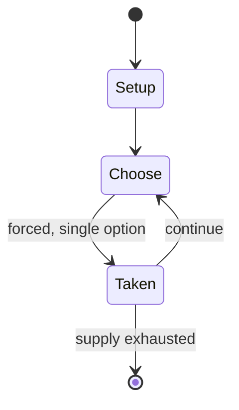

# Dou shou qi

`dou_shou_qi` &nbsp; state: **DEEPENED** &nbsp; method: **heuristic**

## Found layer (recorded, not trusted)

| field | value |
| --- | --- |
| wikidata | -- |
| wikipedia | Dou shou qi |
| genres (source) | -- |
| instance of (source) | -- |
| country of origin | -- |

## Declared layer (orders bench work)

| field | value |
| --- | --- |
| year created | -- |
| epoch | -- |
| region | -- |
| media | BOARD |
| players | -- |
| age band | -- |
| exogenous process | NONE |
| loss shape | OPPORTUNITY_ONLY |
| live axes | SPATIAL |
| horizon | -- |
| scoring shape | -- |
| information | PERFECT |
| interaction | COMPETITIVE |
| turn structure | -- |
| tractability | SAMPLING_ONLY |
| randomness | NONE |
| luck factor | 0.35 |
| rules complexity | 2.05 |
| strategic depth | 2.0 |
| novelty | 0.3528 |
| solved status | -- |
| strategies | -- |
| algorithms | retrograde_analysis |

## Object model

```
Episode
  players      : ?
  turn_structure: ?
  horizon       : ?
  scoring       : ?

Board          -- spatial substrate; cells carry position and occupancy
Piece          -- movable token owned by a player
Placement      -- position subject to geometric legality
```

## State transition diagram



## Research item -- turn trace

```
# Dou shou qi -- simulated turn events
# generated from the DECLARED vector, not from a rulebook.
# structure: exo=NONE loss=OPPORTUNITY_ONLY horizon=None scoring=None axes=SPATIAL

t=0    SETUP        players=2  pot=0  capacity=6
t=1    FORCED       p1 single legal option taken (pot_gain=+0.5)
t=2    FORCED       p1 single legal option taken (pot_gain=+1.0)
t=3    SPATIAL      p1 places at (0,7); adjacency legal
t=4    FORCED       p1 single legal option taken (pot_gain=+0.6)
t=5    SPATIAL      p1 places at (2,7); adjacency legal
t=6    FORCED       p1 single legal option taken (pot_gain=+1.3)
t=7    FORCED       p1 single legal option taken (pot_gain=+0.9)
t=8    SPATIAL      p1 places at (7,0); adjacency legal
t=9    FORCED       p1 single legal option taken (pot_gain=+1.7)
t=10   ENDTURN      turn passes to p2
t=11   FORCED       p2 single legal option taken (pot_gain=+1.6)
t=12   FORCED       p2 single legal option taken (pot_gain=+1.3)
t=13   FORCED       p2 single legal option taken (pot_gain=+1.2)
t=14   SPATIAL      p2 places at (0,3); adjacency legal
t=15   FORCED       p2 single legal option taken (pot_gain=+1.3)
t=16   FORCED       p2 single legal option taken (pot_gain=+1.4)
t=17   SPATIAL      p2 places at (3,5); adjacency legal
t=18   FORCED       p2 single legal option taken (pot_gain=+1.9)
t=19   FORCED       p2 single legal option taken (pot_gain=+1.1)
t=20   SPATIAL      p2 places at (7,6); adjacency legal
t=21   FORCED       p2 single legal option taken (pot_gain=+1.3)
t=22   FORCED       p2 single legal option taken (pot_gain=+1.9)
t=23   FORCED       p2 single legal option taken (pot_gain=+1.8)
t=24   FORCED       p2 single legal option taken (pot_gain=+0.5)
t=25   SPATIAL      p2 places at (4,3); adjacency legal
t=26   ENDTURN      turn passes to p1

terminal: VARIABLE
```

## Conditions

| kind | threshold | effect | trigger |
| --- | --- | --- | --- |
| ELIMINATE | -- | removed | Animals capture opponent pieces by "killing/eating" them (the attacking piece replaces the captured piece on its square; the captured piece is removed from the game). |
| WIN | -- | -- | The player who is first to maneuver any one of their pieces into the opponent's den wins the game. |
| BOUNDARY | -- | -- | Amongst the many examples shown on BoardGameGeek there is at least one where the pieces are designed so that they are no longer visible by the opponent (mounted as a card on a stand like Stratego pieces). |

## Source extract

Jungle or dou shou qi (simplified Chinese: 斗兽棋; traditional Chinese: 鬥獸棋; pinyin: dòu shòu qí;
lit. 'fighting animal game') is a modern Chinese board game with an obscure history. A British
version known as "Jungle King" was sold in the 1960s by the John Waddington company. The game is
played on a 7×9 board and is popular with children in the Far East. Jungle is a two-player
strategy game and has been cited by The Playboy Winner's Guide to Board Games as resembling the
Western game Stratego. The game is also known as the jungle game, children's chess, oriental
chess and animal chess.   == Overview == The Jungle gameboard represents a jungle terrain with
dens, traps "set" around dens, and rivers. Each player controls eight game pieces representing
different animals of various rank. Stronger-ranked animals can capture ("eat") animals of weaker
or equal rank. The player who is first to maneuver any one of their pieces into the opponent's
den wins the game. An alternative way to win is to capture all the opponent's pieces.   == Board
== The Jungle gameboard, usually made of paper, consists of seven columns and nine rows of
squares (7×9 rectangle = 63 squares). Pieces move on the square

<sub>Wikipedia, CC BY-SA. Retained as evidence for the structural
classification above. Every rule inferred from it is HYPOTHESIZED
until audited against a rulebook.</sub>
