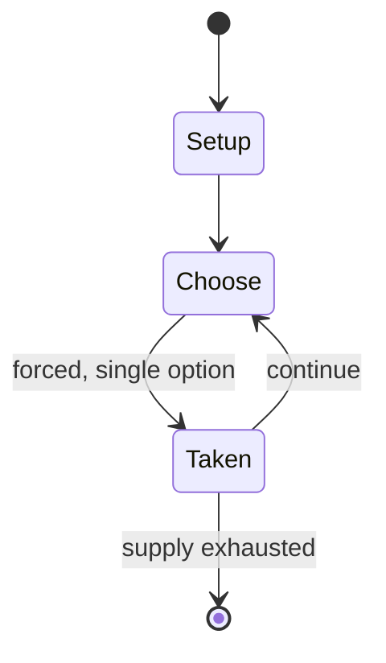

# Down Down Baby

`down_down_baby` &nbsp; state: **DEEPENED** &nbsp; method: **heuristic**

## Found layer (recorded, not trusted)

| field | value |
| --- | --- |
| wikidata | Q5302804 |
| wikipedia | Down Down Baby |
| genres (source) | -- |
| instance of (source) | -- |
| country of origin | -- |

## Declared layer (orders bench work)

| field | value |
| --- | --- |
| year created | -- |
| epoch | -- |
| region | -- |
| media | - |
| players | -- |
| age band | CHILD |
| exogenous process | -- |
| loss shape | -- |
| live axes | - |
| horizon | -- |
| scoring shape | -- |
| information | -- |
| interaction | -- |
| turn structure | -- |
| tractability | SAMPLING_ONLY |
| randomness | -- |
| luck factor | 0.35 |
| rules complexity | 1.66 |
| strategic depth | 2.0 |
| novelty | 0.0914 |
| solved status | -- |
| strategies | -- |
| algorithms | -- |

## Object model

```
Episode
  players      : ?
  turn_structure: ?
  horizon       : ?
  scoring       : ?

State          -- opaque; no medium or axis evidence was found
Player         -- an agent that selects among legal successors
```

## State transition diagram



## Research item -- turn trace

```
# Down Down Baby -- simulated turn events
# generated from the DECLARED vector, not from a rulebook.
# structure: exo=None loss=None horizon=None scoring=None axes=-

t=0    SETUP        players=2  pot=0  capacity=6
t=1    FORCED       p1 single legal option taken (pot_gain=+0.9)
t=2    FORCED       p1 single legal option taken (pot_gain=+0.5)
t=3    FORCED       p1 single legal option taken (pot_gain=+1.8)
t=4    FORCED       p1 single legal option taken (pot_gain=+1.3)
t=5    FORCED       p1 single legal option taken (pot_gain=+0.9)
t=6    FORCED       p1 single legal option taken (pot_gain=+1.0)
t=7    FORCED       p1 single legal option taken (pot_gain=+0.5)
t=8    FORCED       p1 single legal option taken (pot_gain=+1.4)
t=9    FORCED       p1 single legal option taken (pot_gain=+1.2)
t=10   FORCED       p1 single legal option taken (pot_gain=+0.8)
t=11   FORCED       p1 single legal option taken (pot_gain=+0.6)
t=12   ENDTURN      turn passes to p2
t=13   FORCED       p2 single legal option taken (pot_gain=+1.3)
t=14   ENDTURN      turn passes to p1
t=15   FORCED       p1 single legal option taken (pot_gain=+0.6)
t=16   ENDTURN      turn passes to p2
t=17   FORCED       p2 single legal option taken (pot_gain=+0.7)
t=18   FORCED       p2 single legal option taken (pot_gain=+0.6)
t=19   ENDTURN      turn passes to p1
t=20   FORCED       p1 single legal option taken (pot_gain=+1.1)
t=21   FORCED       p1 single legal option taken (pot_gain=+1.4)
t=22   ENDTURN      turn passes to p2
t=23   FORCED       p2 single legal option taken (pot_gain=+1.5)
t=24   FORCED       p2 single legal option taken (pot_gain=+1.2)
t=25   FORCED       p2 single legal option taken (pot_gain=+0.6)
t=26   FORCED       p2 single legal option taken (pot_gain=+1.1)

terminal: VARIABLE
```

## Source extract

"Down Down Baby" (also known as "Roller Coaster") is a clapping game played by children in
English-speaking countries.  In the game, two or more children stand in a circle, and clap hands
in tune to a rhyming song. It has been used in various songs and media productions since the mid
20th century. As with most hand-clapping games, there are many variations. Modified versions of
the song have appeared in Little Anthony and the Imperials's "Shimmy Shimmy Ko-Ko Bop", Nelly's
"Country Grammar", Simian Mobile Disco's "Hotdog", The Damned's "New Rose", The Drums' "Let's Go
Surfing", Cayucas' "Jessica WJ", Carter USM's "Watching the Big Apple Turnover", Bella Thorne
and Zendaya's "Contagious Love", the film Big, EXO's "Ko Ko Bop", Kyle's "Yes!", and Lana Del
Rey's "A&W".   == References ==   == External links == The British Library - Video recording of
Down Down Baby, 2010 Archived October 21, 2012, at the Wayback Machine

<sub>Wikipedia, CC BY-SA. Retained as evidence for the structural
classification above. Every rule inferred from it is HYPOTHESIZED
until audited against a rulebook.</sub>
