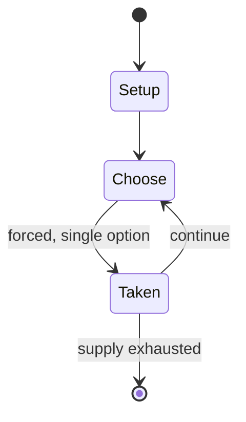

# Dr. Panda Games

*Chinese video game devoloper*

`dr_panda_games` &nbsp; state: **DEEPENED** &nbsp; method: **heuristic**

## Found layer (recorded, not trusted)

| field | value |
| --- | --- |
| wikidata | Q16251608 |
| wikipedia | Dr. Panda |
| genres (source) | educational video game |
| instance of (source) | video game |
| country of origin | -- |

## Declared layer (orders bench work)

| field | value |
| --- | --- |
| year created | 2012 |
| epoch | CONTEMPORARY |
| region | -- |
| media | VIDEO |
| players | -- |
| age band | -- |
| exogenous process | -- |
| loss shape | -- |
| live axes | - |
| horizon | -- |
| scoring shape | -- |
| information | -- |
| interaction | -- |
| turn structure | -- |
| tractability | SAMPLING_ONLY |
| randomness | -- |
| luck factor | 0.35 |
| rules complexity | 1.64 |
| strategic depth | 2.0 |
| novelty | 0.0896 |
| solved status | -- |
| strategies | -- |
| algorithms | -- |

## Object model

```
Episode
  players      : ?
  turn_structure: ?
  horizon       : ?
  scoring       : ?

WorldState     -- simulation state advanced by the engine
Avatar         -- player-controlled agent
Clock          -- frame or tick counter
```

## State transition diagram



## Research item -- turn trace

```
# Dr. Panda Games -- simulated turn events
# generated from the DECLARED vector, not from a rulebook.
# structure: exo=None loss=None horizon=None scoring=None axes=-

t=0    SETUP        players=2  pot=0  capacity=3
t=1    FORCED       p1 single legal option taken (pot_gain=+0.9)
t=2    FORCED       p1 single legal option taken (pot_gain=+1.2)
t=3    ENDTURN      turn passes to p2
t=4    FORCED       p2 single legal option taken (pot_gain=+1.1)
t=5    FORCED       p2 single legal option taken (pot_gain=+1.7)
t=6    FORCED       p2 single legal option taken (pot_gain=+1.9)
t=7    FORCED       p2 single legal option taken (pot_gain=+1.1)
t=8    FORCED       p2 single legal option taken (pot_gain=+1.7)
t=9    FORCED       p2 single legal option taken (pot_gain=+1.2)
t=10   FORCED       p2 single legal option taken (pot_gain=+1.4)
t=11   ENDTURN      turn passes to p1
t=12   FORCED       p1 single legal option taken (pot_gain=+1.6)
t=13   FORCED       p1 single legal option taken (pot_gain=+1.4)
t=14   FORCED       p1 single legal option taken (pot_gain=+1.0)
t=15   FORCED       p1 single legal option taken (pot_gain=+1.6)
t=16   FORCED       p1 single legal option taken (pot_gain=+1.6)
t=17   FORCED       p1 single legal option taken (pot_gain=+1.1)
t=18   FORCED       p1 single legal option taken (pot_gain=+1.0)
t=19   ENDTURN      turn passes to p2
t=20   FORCED       p2 single legal option taken (pot_gain=+0.8)
t=21   FORCED       p2 single legal option taken (pot_gain=+1.1)
t=22   FORCED       p2 single legal option taken (pot_gain=+1.4)
t=23   FORCED       p2 single legal option taken (pot_gain=+1.5)
t=24   ENDTURN      turn passes to p1
t=25   FORCED       p1 single legal option taken (pot_gain=+0.7)
t=26   FORCED       p1 single legal option taken (pot_gain=+1.6)

terminal: VARIABLE
```

## Source extract

Dr. Panda (formerly TribePlay, Chinese: 熊貓博士) is a Chinese video game developer that creates
educational applications for children on smartphones and tablets. The company is based in
Chengdu, China. The company's series of Dr. Panda games includes role-playing apps aimed at
children ages 2 to 5. The games are available on platforms including iOS, Android, and Windows
Phone.   == History == Dr. Panda expanded into 3D graphics with the release of Dr. Panda Home in
2013. It was listed as one of The Guardian's Best 20 Android Apps of the Week in 2013.   ==
References ==

<sub>Wikipedia, CC BY-SA. Retained as evidence for the structural
classification above. Every rule inferred from it is HYPOTHESIZED
until audited against a rulebook.</sub>
