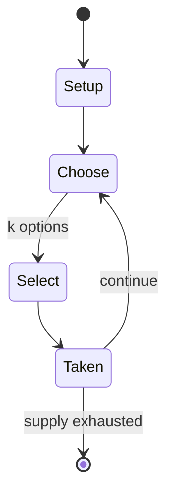

# Dragomino

*2020 board game*

`dragomino` &nbsp; state: **DEEPENED** &nbsp; method: **heuristic**

## Found layer (recorded, not trusted)

| field | value |
| --- | --- |
| wikidata | Q107236390 |
| wikipedia | Dragomino |
| genres (source) | -- |
| instance of (source) | children's game, tile-based game |
| country of origin | -- |

## Declared layer (orders bench work)

| field | value |
| --- | --- |
| year created | -- |
| epoch | -- |
| region | -- |
| media | BOARD, TILE |
| players | 2-4 |
| age band | CHILD |
| exogenous process | -- |
| loss shape | -- |
| live axes | SELECT |
| horizon | VARIABLE |
| scoring shape | -- |
| information | -- |
| interaction | -- |
| turn structure | -- |
| tractability | SAMPLING_ONLY |
| randomness | -- |
| luck factor | 0.35 |
| rules complexity | 2.11 |
| strategic depth | 2.25 |
| novelty | 1.0 |
| solved status | -- |
| strategies | probability_estimation |
| algorithms | -- |

## Object model

```
Episode
  players      : 2-4
  turn_structure: ?
  horizon       : VARIABLE
  scoring       : ?

Board          -- spatial substrate; cells carry position and occupancy
Piece          -- movable token owned by a player
TileBag        -- unordered draw source
Layout         -- placed tiles and their adjacencies
OptionSet      -- the choices available after an exogenous draw
```

## State transition diagram



## Research item -- turn trace

```
# Dragomino -- simulated turn events
# generated from the DECLARED vector, not from a rulebook.
# structure: exo=None loss=None horizon=VARIABLE scoring=None axes=SELECT

t=0    SETUP        players=2  pot=0  capacity=8
t=1    SELECT       p1 3 options; take #3  (pot_gain=+2.9, capacity=-0)
t=2    SELECT       p1 2 options; take #1  (pot_gain=+2.2, capacity=-2)
t=3    ENDTURN      turn passes to p2
t=4    SELECT       p2 2 options; take #1  (pot_gain=+2.5, capacity=-1)
t=5    ENDTURN      turn passes to p1
t=6    SELECT       p1 2 options; take #1  (pot_gain=+1.7, capacity=-0)
t=7    SELECT       p1 3 options; take #3  (pot_gain=+1.4, capacity=-0)
t=8    SELECT       p1 4 options; take #4  (pot_gain=+2.0, capacity=-2)
t=9    SELECT       p1 3 options; take #3  (pot_gain=+1.0, capacity=-0)
t=10   SELECT       p1 3 options; take #3  (pot_gain=+3.1, capacity=-1)
t=11   SELECT       p1 3 options; take #2  (pot_gain=+1.9, capacity=-2)
t=12   SELECT       p1 2 options; take #2  (pot_gain=+1.7, capacity=-1)
t=13   SELECT       p1 2 options; take #2  (pot_gain=+3.1, capacity=-0)
t=14   SELECT       p1 3 options; take #3  (pot_gain=+0.6, capacity=-0)
t=15   SELECT       p1 2 options; take #1  (pot_gain=+3.5, capacity=-0)
t=16   SELECT       p1 4 options; take #3  (pot_gain=+1.8, capacity=-2)
t=17   SELECT       p1 3 options; take #1  (pot_gain=+3.2, capacity=-2)
t=18   SELECT       p1 4 options; take #2  (pot_gain=+2.3, capacity=-1)
t=19   SELECT       p1 2 options; take #2  (pot_gain=+1.5, capacity=-1)
t=20   SELECT       p1 1 options; take #1  (pot_gain=+3.4, capacity=-0)
t=21   SELECT       p1 1 options; take #1  (pot_gain=+3.2, capacity=-1)
t=22   SELECT       p1 1 options; take #1  (pot_gain=+1.1, capacity=-0)
t=23   SELECT       p1 1 options; take #1  (pot_gain=+1.8, capacity=-0)
t=24   SELECT       p1 4 options; take #3  (pot_gain=+3.1, capacity=-0)
t=25   SELECT       p1 1 options; take #1  (pot_gain=+0.9, capacity=-2)
t=26   ENDTURN      turn passes to p2

terminal: VARIABLE
```

## Conditions

| kind | threshold | effect | trigger |
| --- | --- | --- | --- |
| TERMINATE | -- | -- | The game ends when all landscape tiles have been taken. |

## Source extract

Dragomino is a children's tile-laying board game designed by Bruno Cathala, Marie Fort, and
Wilfried Fort and published by Blue Orange Games. It is based on Kingdomino. It won the 2021
Kinderspiel des Jahres.   == Gameplay == Each player is a dragon-rider scouting for dragons and
begins the game with one base landscape tile consisting of desert terrain and snow terrain. The
six types of landscape tiles are desert, forest, mountain, prairie, snow, and volcano. Each
turn, the player executes two actions: visit a place, which requires the player to select one of
four available tiles; and show a discovery, which requires the player to connect the new tile to
their board. Once this is done, the player checks for connections between the edges of the new
tile and those already part of the board. Those with different landscapes result in no action,
whereas those with a matching landscape allow the player to take a dragon egg token of the
corresponding type, denoted by the colour, for each match. The player then flips the dragon egg
token to reveal either a baby dragon or an empty shell. This is then placed at the location of
the match. A baby dragon is worth 1 point, whereas an empty shell

<sub>Wikipedia, CC BY-SA. Retained as evidence for the structural
classification above. Every rule inferred from it is HYPOTHESIZED
until audited against a rulebook.</sub>
