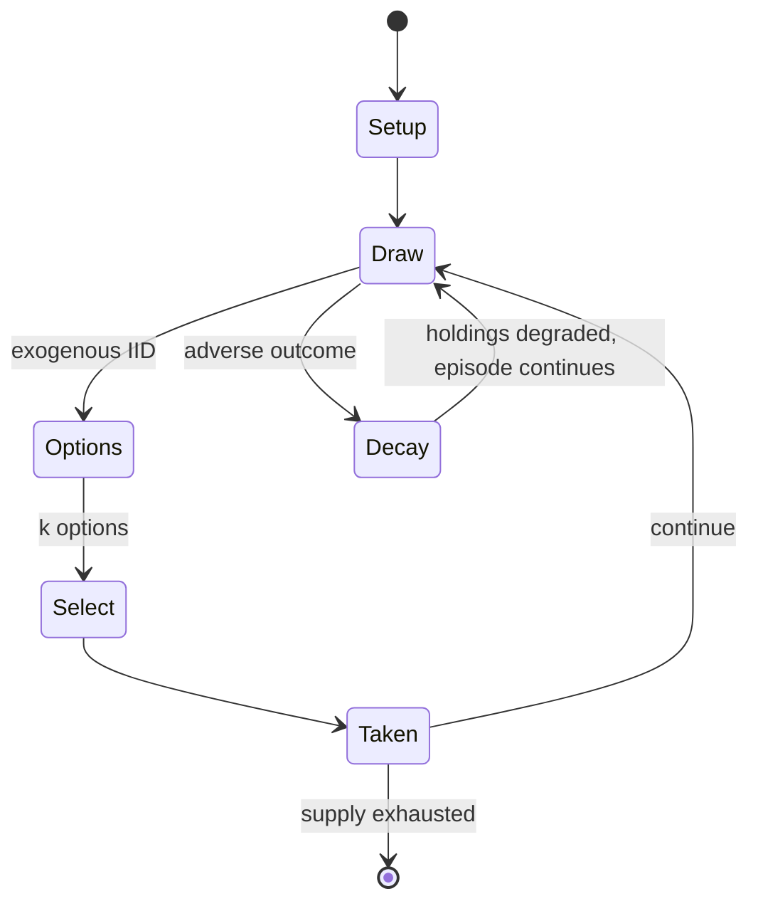

# Draughts

`draughts` &nbsp; state: **DEEPENED** &nbsp; method: **heuristic**

## Found layer (recorded, not trusted)

| field | value |
| --- | --- |
| wikidata | -- |
| wikipedia | Draughts |
| genres (source) | -- |
| instance of (source) | -- |
| country of origin | -- |

## Declared layer (orders bench work)

| field | value |
| --- | --- |
| year created | -3000 |
| epoch | DEEP_ANTIQUITY |
| region | -- |
| media | BOARD |
| players | 2 |
| age band | -- |
| exogenous process | IID |
| loss shape | PARTIAL_DECAY |
| live axes | SELECT |
| horizon | -- |
| scoring shape | RACE_POSITION |
| information | ASYMMETRIC |
| interaction | SOLITAIRE |
| turn structure | STRICT_TURN |
| tractability | EXACT |
| randomness | DICE |
| luck factor | 0.05 |
| rules complexity | 2.12 |
| strategic depth | 1.4 |
| novelty | 0.8212 |
| solved status | SOLVED_STRONG |
| strategies | area_control, sacrifice |
| algorithms | -- |

## Object model

```
Episode
  players      : 2
  turn_structure: STRICT_TURN
  horizon       : ?
  scoring       : RACE_POSITION

Board          -- spatial substrate; cells carry position and occupancy
Piece          -- movable token owned by a player
OptionSet      -- the choices available after an exogenous draw
```

## State transition diagram



## Research item -- turn trace

```
# Draughts -- simulated turn events
# generated from the DECLARED vector, not from a rulebook.
# structure: exo=IID loss=PARTIAL_DECAY horizon=None scoring=RACE_POSITION axes=SELECT

t=0    SETUP        players=2  pot=0  capacity=5
t=1    DRAW         p1 roll from d6 pool -> outcome #2  (p=0.260)
t=2    SELECT       p1 3 options; take #3  (pot_gain=+1.7, capacity=-1)
t=3    DRAW         p1 roll from d6 pool -> outcome #5  (p=0.200)
t=4    SELECT       p1 1 options; take #1  (pot_gain=+1.5, capacity=-2)
t=5    ENDTURN      turn passes to p2
t=6    DRAW         p2 roll from d6 pool -> outcome #4  (p=0.298)
t=7    SELECT       p2 3 options; take #1  (pot_gain=+1.9, capacity=-2)
t=8    ENDTURN      turn passes to p1
t=9    DRAW         p1 roll from d6 pool -> outcome #2  (p=0.237)
t=10   SELECT       p1 1 options; take #1  (pot_gain=+2.1, capacity=-0)
t=11   ENDTURN      turn passes to p2
t=12   DRAW         p2 roll from d6 pool -> outcome #3  (p=0.007)
t=13   SELECT       p2 3 options; take #3  (pot_gain=+1.0, capacity=-1)
t=14   DRAW         p2 roll from d6 pool -> outcome #4  (p=0.179)
t=15   SELECT       p2 2 options; take #2  (pot_gain=+0.8, capacity=-2)
t=16   DRAW         p2 roll from d6 pool -> outcome #2  (p=0.101)
t=17   SELECT       p2 1 options; take #1  (pot_gain=+2.7, capacity=-2)
t=18   DRAW         p2 roll from d6 pool -> outcome #1  (p=0.282)
t=19   SELECT       p2 4 options; take #4  (pot_gain=+2.5, capacity=-0)
t=20   ENDTURN      turn passes to p1
t=21   DRAW         p1 roll from d6 pool -> outcome #6  (p=0.182)
t=22   SELECT       p1 1 options; take #1  (pot_gain=+3.4, capacity=-0)
t=23   DRAW         p1 roll from d6 pool -> outcome #2  (p=0.296)
t=24   SELECT       p1 1 options; take #1  (pot_gain=+2.5, capacity=-0)
t=25   ENDTURN      turn passes to p2
t=26   DRAW         p2 roll from d6 pool -> outcome #3  (p=0.232)
t=27   SELECT       p2 1 options; take #1  (pot_gain=+2.3, capacity=-1)

terminal: VARIABLE
```

## Conditions

| kind | threshold | effect | trigger |
| --- | --- | --- | --- |
| ELIMINATE | -- | -- | It eliminated majority capture precedence and introduced the flying king. |
| PENALTY | -- | -- | If the player does not capture, the other player can remove the opponent's piece as a penalty (or muffin), and where there are two or more such positions the player forfeits pieces that cannot be moved (although some rul |

## Source extract

Checkers (North American English), also known as draughts (; British English), is a group of
strategy board games for two players which involve forward movements of uniform game pieces and
mandatory captures by jumping over opponent pieces. Checkers is developed from alquerque. The
term "checkers" derives from the checkered board which the game is played on, whereas "draughts"
derives from the verb "to draw" or "to move". The most popular forms of checkers in Anglophone
countries are American checkers (also called English draughts), which is played on an 8×8
checkerboard; Russian draughts, Turkish draughts and Armenian draughts, all of them on an 8×8
board; and international draughts, played on a 10×10 board – with the last widely played in many
countries worldwide. There are many other variants played on 8×8 boards. Canadian checkers and
Malaysian/Singaporean checkers (also locally known as dam) are played on a 12×12 board. American
checkers was weakly solved in 2007 by a team of Canadian computer scientists led by Jonathan
Schaeffer. From the standard starting position, perfect play by each side will result in a draw.
== General rules == Checkers is played by two opponents on o

<sub>Wikipedia, CC BY-SA. Retained as evidence for the structural
classification above. Every rule inferred from it is HYPOTHESIZED
until audited against a rulebook.</sub>
