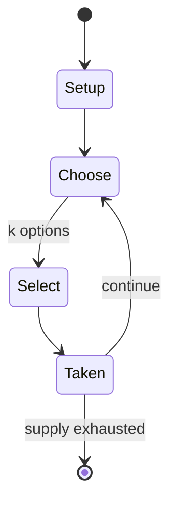

# Drawception

*web-based drawing game*

`drawception` &nbsp; state: **DEEPENED** &nbsp; method: **heuristic**

## Found layer (recorded, not trusted)

| field | value |
| --- | --- |
| wikidata | Q22907939 |
| wikipedia | Drawception |
| genres (source) | party video game |
| instance of (source) | video game |
| country of origin | United States |

## Declared layer (orders bench work)

| field | value |
| --- | --- |
| year created | 2012 |
| epoch | CONTEMPORARY |
| region | NORTH_AMERICA |
| media | VIDEO |
| players | -- |
| age band | -- |
| exogenous process | -- |
| loss shape | -- |
| live axes | SELECT |
| horizon | -- |
| scoring shape | -- |
| information | -- |
| interaction | -- |
| turn structure | -- |
| tractability | SAMPLING_ONLY |
| randomness | -- |
| luck factor | 0.35 |
| rules complexity | 2.0 |
| strategic depth | 2.0 |
| novelty | 0.0896 |
| solved status | -- |
| strategies | -- |
| algorithms | -- |

## Object model

```
Episode
  players      : ?
  turn_structure: ?
  horizon       : ?
  scoring       : ?

WorldState     -- simulation state advanced by the engine
Avatar         -- player-controlled agent
Clock          -- frame or tick counter
OptionSet      -- the choices available after an exogenous draw
```

## State transition diagram



## Research item -- turn trace

```
# Drawception -- simulated turn events
# generated from the DECLARED vector, not from a rulebook.
# structure: exo=None loss=None horizon=None scoring=None axes=SELECT

t=0    SETUP        players=2  pot=0  capacity=6
t=1    SELECT       p1 3 options; take #2  (pot_gain=+0.7, capacity=-2)
t=2    SELECT       p1 1 options; take #1  (pot_gain=+1.6, capacity=-2)
t=3    SELECT       p1 1 options; take #1  (pot_gain=+1.7, capacity=-0)
t=4    SELECT       p1 3 options; take #1  (pot_gain=+3.4, capacity=-0)
t=5    SELECT       p1 3 options; take #1  (pot_gain=+2.3, capacity=-0)
t=6    SELECT       p1 4 options; take #2  (pot_gain=+3.2, capacity=-1)
t=7    SELECT       p1 2 options; take #1  (pot_gain=+3.3, capacity=-0)
t=8    SELECT       p1 3 options; take #1  (pot_gain=+2.9, capacity=-2)
t=9    SELECT       p1 3 options; take #1  (pot_gain=+3.1, capacity=-2)
t=10   ENDTURN      turn passes to p2
t=11   SELECT       p2 2 options; take #2  (pot_gain=+2.9, capacity=-2)
t=12   ENDTURN      turn passes to p1
t=13   SELECT       p1 4 options; take #4  (pot_gain=+1.2, capacity=-2)
t=14   SELECT       p1 4 options; take #1  (pot_gain=+3.4, capacity=-1)
t=15   SELECT       p1 1 options; take #1  (pot_gain=+1.3, capacity=-1)
t=16   SELECT       p1 2 options; take #2  (pot_gain=+1.7, capacity=-0)
t=17   ENDTURN      turn passes to p2
t=18   SELECT       p2 4 options; take #2  (pot_gain=+1.0, capacity=-0)
t=19   SELECT       p2 1 options; take #1  (pot_gain=+1.5, capacity=-1)
t=20   ENDTURN      turn passes to p1
t=21   SELECT       p1 3 options; take #2  (pot_gain=+2.4, capacity=-2)
t=22   SELECT       p1 2 options; take #2  (pot_gain=+2.5, capacity=-2)
t=23   SELECT       p1 1 options; take #1  (pot_gain=+2.9, capacity=-2)
t=24   SELECT       p1 1 options; take #1  (pot_gain=+0.8, capacity=-2)
t=25   SELECT       p1 2 options; take #1  (pot_gain=+0.5, capacity=-2)
t=26   SELECT       p1 4 options; take #3  (pot_gain=+2.3, capacity=-1)

terminal: VARIABLE
```

## Source extract

Drawception is a multiplayer web-based drawing and guessing game. Considered similar to the
telephone game, it was created by Jeremiah Freyholtz (aka "Reed") and released as an early beta
on March 26, 2012.   == Gameplay == Drawception combines drawing with telephone game rules
played by 12, 15, or 24 random players, with some exceptions. (With specific settings, a player
can create 6-player games; in the past, there used to be glitched games with hundreds of
players.) A game begins with a phrase, which a player then draws. Another player then describes
that drawing. This process repeats until all players have taken their turn. Players are notified
once a game has been completed and can view the resulting chain of drawings and descriptions.
Games typically transform unexpectedly and end completely differently from where they began.
Players can optionally purchase cosmetic color palettes and tools from the game's virtual store.
They can purchase with ducks, a virtual currency that they get from other players, or with
microtransactions, which, once made, gives the player access to Drawception Gold, which offers
the ability to award ducks to others as a way to reward helpful players.

<sub>Wikipedia, CC BY-SA. Retained as evidence for the structural
classification above. Every rule inferred from it is HYPOTHESIZED
until audited against a rulebook.</sub>
