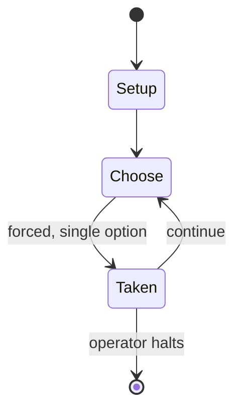

# Dream11

*Dream11 is a fantasy sports platform based in India that allows users to play fantasy cricket, football, kabaddi and basketball games.*

`dream11` &nbsp; state: **DEEPENED** &nbsp; method: **heuristic**

## Found layer (recorded, not trusted)

| field | value |
| --- | --- |
| wikidata | Q53080990 |
| wikipedia | Dream11 |
| genres (source) | -- |
| instance of (source) | business, fantasy sport |
| country of origin | -- |

## Declared layer (orders bench work)

| field | value |
| --- | --- |
| year created | 2020 |
| epoch | CONTEMPORARY |
| region | -- |
| media | GAMBLING, SPORT |
| players | -- |
| age band | -- |
| exogenous process | -- |
| loss shape | -- |
| live axes | - |
| horizon | OPEN_ENDED |
| scoring shape | -- |
| information | -- |
| interaction | TEAM |
| turn structure | -- |
| tractability | SAMPLING_ONLY |
| randomness | -- |
| luck factor | 0.35 |
| rules complexity | 2.0 |
| strategic depth | 2.0 |
| novelty | 0.6085 |
| solved status | -- |
| strategies | -- |
| algorithms | -- |

## Object model

```
Episode
  players      : ?
  turn_structure: ?
  horizon       : OPEN_ENDED
  scoring       : ?

Pitch          -- bounded physical region
Player         -- embodied agent with a foul count
Clock          -- counts down; stoppages are rule events
Official       -- detects infractions and applies penalties
```

## State transition diagram



## Research item -- turn trace

```
# Dream11 -- simulated turn events
# generated from the DECLARED vector, not from a rulebook.
# structure: exo=None loss=None horizon=OPEN_ENDED scoring=None axes=-

t=0    SETUP        players=2  pot=0  capacity=4
t=1    FORCED       p1 single legal option taken (pot_gain=+1.9)
t=2    ENDTURN      turn passes to p2
t=3    FORCED       p2 single legal option taken (pot_gain=+1.1)
t=4    FORCED       p2 single legal option taken (pot_gain=+1.5)
t=5    FORCED       p2 single legal option taken (pot_gain=+1.0)
t=6    FORCED       p2 single legal option taken (pot_gain=+1.1)
t=7    FORCED       p2 single legal option taken (pot_gain=+1.0)
t=8    ENDTURN      turn passes to p1
t=9    FORCED       p1 single legal option taken (pot_gain=+1.8)
t=10   FORCED       p1 single legal option taken (pot_gain=+1.2)
t=11   FORCED       p1 single legal option taken (pot_gain=+1.9)
t=12   FORCED       p1 single legal option taken (pot_gain=+1.0)
t=13   FORCED       p1 single legal option taken (pot_gain=+0.6)
t=14   FORCED       p1 single legal option taken (pot_gain=+0.8)
t=15   ENDTURN      turn passes to p2
t=16   FORCED       p2 single legal option taken (pot_gain=+2.0)
t=17   FORCED       p2 single legal option taken (pot_gain=+1.6)
t=18   FORCED       p2 single legal option taken (pot_gain=+1.9)
t=19   FORCED       p2 single legal option taken (pot_gain=+0.7)
t=20   ENDTURN      turn passes to p1
t=21   FORCED       p1 single legal option taken (pot_gain=+1.2)
t=22   FORCED       p1 single legal option taken (pot_gain=+1.9)
t=23   ENDTURN      turn passes to p2
t=24   FORCED       p2 single legal option taken (pot_gain=+1.9)
t=25   FORCED       p2 single legal option taken (pot_gain=+1.5)
t=26   FORCED       p2 single legal option taken (pot_gain=+0.7)

terminal: OPEN_ENDED
```

## Conditions

| kind | threshold | effect | trigger |
| --- | --- | --- | --- |
| BOUNDARY | -- | -- | A user who scores the maximum points in their joined contests attains the first rank on the leader-board. |
| BOUNDARY | -- | -- | To participate in a Dream11 game, a user must be at least 18 years old and needs to get their profile verified using their PAN. |

## Source extract

Dream11 is an Indian fantasy sports platform that allows users to play daily fantasy sports
contests, primarily in cricket. The platform allowed users to take part in paid and free
contests by assembling a virtual team of real-life players, and score points based on those
players' actual statistical performance on the field of play. Paid contests were discontinued in
August 2025 after the Parliament of India passed the Promotion and Regulation of Online Gaming
Act, 2025. In April 2019, Dream11 became the first Indian fantasy sport company to become a
unicorn. In November 2021, Dream11 was valued at $8 billion. In October 2023, Dream11 claimed to
have 200 million users.   == History == Dream11 was co-founded by Harsh Jain (son of Indian
businessman Anand Jain) and Bhavit Sheth in 2008. In 2012, they introduced freemium fantasy
sports in India for cricket fans. In 2014, the company reported 1 million registered users,
which grew to 2 million in 2016 and to 45 million in 2018. In April 2019, Steadview Capital
completed secondary investment in Dream11. Apart from Steadview, Dream11's investors included
Kalaari Capital, Think Investments, Multiples Equity and Tencent. In April 2019, the

<sub>Wikipedia, CC BY-SA. Retained as evidence for the structural
classification above. Every rule inferred from it is HYPOTHESIZED
until audited against a rulebook.</sub>
