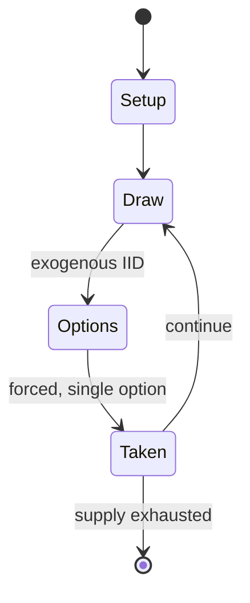

# Dreidel

`dreidel` &nbsp; state: **DEEPENED** &nbsp; method: **heuristic**

## Found layer (recorded, not trusted)

| field | value |
| --- | --- |
| wikidata | Q932695 |
| wikipedia | Dreidel |
| genres (source) | -- |
| instance of (source) | -- |
| country of origin | -- |

## Declared layer (orders bench work)

| field | value |
| --- | --- |
| year created | 2022 |
| epoch | CONTEMPORARY |
| region | -- |
| media | DICE, GAMBLING, WORD |
| players | -- |
| age band | -- |
| exogenous process | IID |
| loss shape | -- |
| live axes | - |
| horizon | -- |
| scoring shape | -- |
| information | -- |
| interaction | -- |
| turn structure | -- |
| tractability | EXACT_WITH_CUT |
| randomness | DICE, SPINNER |
| luck factor | 0.7 |
| rules complexity | 1.93 |
| strategic depth | 1.68 |
| novelty | 0.6405 |
| solved status | -- |
| strategies | -- |
| algorithms | -- |

## Object model

```
Episode
  players      : ?
  turn_structure: ?
  horizon       : ?
  scoring       : ?

DicePool       -- n dice, each an iid categorical draw
Roll           -- realised outcome of a pool
```

## State transition diagram



## Research item -- turn trace

```
# Dreidel -- simulated turn events
# generated from the DECLARED vector, not from a rulebook.
# structure: exo=IID loss=None horizon=None scoring=None axes=-

t=0    SETUP        players=2  pot=0  capacity=8
t=1    DRAW         p1 roll from d6 pool -> outcome #4  (p=0.125)
t=2    FORCED       p1 single legal option taken (pot_gain=+0.8)
t=3    ENDTURN      turn passes to p2
t=4    DRAW         p2 roll from d6 pool -> outcome #5  (p=0.274)
t=5    FORCED       p2 single legal option taken (pot_gain=+1.9)
t=6    ENDTURN      turn passes to p1
t=7    DRAW         p1 roll from d6 pool -> outcome #1  (p=0.200)
t=8    FORCED       p1 single legal option taken (pot_gain=+1.3)
t=9    DRAW         p1 roll from d6 pool -> outcome #2  (p=0.267)
t=10   FORCED       p1 single legal option taken (pot_gain=+2.0)
t=11   ENDTURN      turn passes to p2
t=12   DRAW         p2 roll from d6 pool -> outcome #4  (p=0.199)
t=13   FORCED       p2 single legal option taken (pot_gain=+0.7)
t=14   DRAW         p2 roll from d6 pool -> outcome #2  (p=0.017)
t=15   FORCED       p2 single legal option taken (pot_gain=+1.9)
t=16   DRAW         p2 roll from d6 pool -> outcome #5  (p=0.130)
t=17   FORCED       p2 single legal option taken (pot_gain=+1.4)
t=18   DRAW         p2 roll from d6 pool -> outcome #6  (p=0.037)
t=19   FORCED       p2 single legal option taken (pot_gain=+1.7)
t=20   ENDTURN      turn passes to p1
t=21   DRAW         p1 roll from d6 pool -> outcome #4  (p=0.208)
t=22   FORCED       p1 single legal option taken (pot_gain=+1.2)
t=23   DRAW         p1 roll from d6 pool -> outcome #4  (p=0.300)
t=24   FORCED       p1 single legal option taken (pot_gain=+1.5)
t=25   ENDTURN      turn passes to p2
t=26   DRAW         p2 roll from d6 pool -> outcome #2  (p=0.003)
t=27   FORCED       p2 single legal option taken (pot_gain=+1.0)
t=28   ENDTURN      turn passes to p1

terminal: VARIABLE
```

## Conditions

| kind | threshold | effect | trigger |
| --- | --- | --- | --- |
| WIN | -- | -- | In MLD tournaments the player with the longest time of spin (TOS) is the winner. |

## Source extract

A dreidel, also dreidle or dreidl, ( DRAY-dəl; Yiddish: דרײדל, romanized: dreydl, plural:
dreydlech; Hebrew: סביבון, romanized: sevivon) is a four-sided spinning top, played with during
the Jewish holiday of Hanukkah. The dreidel is a Jewish variant on the teetotum, a gambling toy
found in Europe and Latin America. Each side of the dreidel bears a letter of the Hebrew
alphabet: נ (nun), ג (gimel), ה (hei), ש (shin). These letters are represented in Yiddish as a
mnemonic for the rules of a gambling game possibly derived from teetotum played with a dreidel:
nun stands for the word נישט (nisht, "not", meaning "nothing"), gimel for גאַנץ (gantz, "entire,
whole"), hei for האַלב (halb, "half"), and shin for שטעל אַרײַן (shtel arayn, "put in").
However, according to folk etymology, these four letters represent the Hebrew phrase נֵס גָּדוֹל
הָיָה שָׁם (nes gadól hayáh sham, "a great miracle happened there"), referring to the miracle of
the cruse of oil. For this reason, most dreidels in Israel replace the letter shin with the
letter פ (pe), to represent the phrase נֵס גָּדוֹל הָיָה פֹּה (nes gadól hayáh poh, "a great
miracle happened here"); As many Haredi communities insisted that shin be

<sub>Wikipedia, CC BY-SA. Retained as evidence for the structural
classification above. Every rule inferred from it is HYPOTHESIZED
until audited against a rulebook.</sub>
