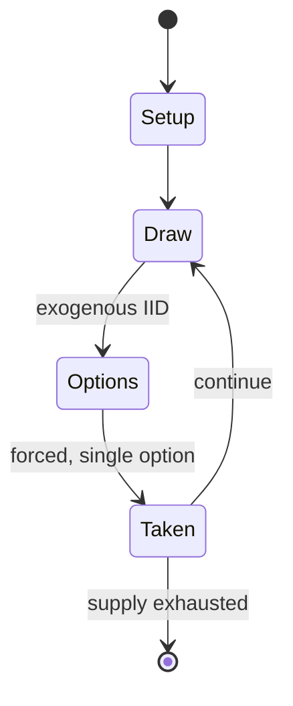

# drop dead

*North American dice game*

`drop_dead` &nbsp; state: **DEEPENED** &nbsp; method: **heuristic**

## Found layer (recorded, not trusted)

| field | value |
| --- | --- |
| wikidata | Q104849183 |
| wikipedia | Drop dead (dice game) |
| genres (source) | -- |
| instance of (source) | dice game |
| country of origin | -- |

## Declared layer (orders bench work)

| field | value |
| --- | --- |
| year created | -- |
| epoch | -- |
| region | -- |
| media | DICE |
| players | -- |
| age band | -- |
| exogenous process | IID |
| loss shape | -- |
| live axes | - |
| horizon | -- |
| scoring shape | -- |
| information | -- |
| interaction | -- |
| turn structure | -- |
| tractability | EXACT_WITH_CUT |
| randomness | DICE |
| luck factor | 0.58 |
| rules complexity | 1.69 |
| strategic depth | 2.12 |
| novelty | 0.6405 |
| solved status | -- |
| strategies | probability_estimation |
| algorithms | -- |

## Object model

```
Episode
  players      : ?
  turn_structure: ?
  horizon       : ?
  scoring       : ?

DicePool       -- n dice, each an iid categorical draw
Roll           -- realised outcome of a pool
```

## State transition diagram



## Research item -- turn trace

```
# drop dead -- simulated turn events
# generated from the DECLARED vector, not from a rulebook.
# structure: exo=IID loss=None horizon=None scoring=None axes=-

t=0    SETUP        players=2  pot=0  capacity=7
t=1    DRAW         p1 roll from d6 pool -> outcome #2  (p=0.039)
t=2    FORCED       p1 single legal option taken (pot_gain=+0.8)
t=3    ENDTURN      turn passes to p2
t=4    DRAW         p2 roll from d6 pool -> outcome #6  (p=0.242)
t=5    FORCED       p2 single legal option taken (pot_gain=+1.9)
t=6    DRAW         p2 roll from d6 pool -> outcome #6  (p=0.289)
t=7    FORCED       p2 single legal option taken (pot_gain=+1.3)
t=8    DRAW         p2 roll from d6 pool -> outcome #6  (p=0.038)
t=9    FORCED       p2 single legal option taken (pot_gain=+1.0)
t=10   DRAW         p2 roll from d6 pool -> outcome #5  (p=0.050)
t=11   FORCED       p2 single legal option taken (pot_gain=+1.0)
t=12   DRAW         p2 roll from d6 pool -> outcome #2  (p=0.250)
t=13   FORCED       p2 single legal option taken (pot_gain=+1.9)
t=14   ENDTURN      turn passes to p1
t=15   DRAW         p1 roll from d6 pool -> outcome #4  (p=0.164)
t=16   FORCED       p1 single legal option taken (pot_gain=+1.0)
t=17   DRAW         p1 roll from d6 pool -> outcome #3  (p=0.069)
t=18   FORCED       p1 single legal option taken (pot_gain=+1.1)
t=19   DRAW         p1 roll from d6 pool -> outcome #3  (p=0.232)
t=20   FORCED       p1 single legal option taken (pot_gain=+1.4)
t=21   ENDTURN      turn passes to p2
t=22   DRAW         p2 roll from d6 pool -> outcome #3  (p=0.052)
t=23   FORCED       p2 single legal option taken (pot_gain=+1.7)
t=24   DRAW         p2 roll from d6 pool -> outcome #4  (p=0.259)
t=25   FORCED       p2 single legal option taken (pot_gain=+1.4)
t=26   DRAW         p2 roll from d6 pool -> outcome #3  (p=0.007)
t=27   FORCED       p2 single legal option taken (pot_gain=+1.6)

terminal: VARIABLE
```

## Source extract

Drop dead is a dice game in which the players try to gain the highest total score. The game was
created in New York. Five dice and paper to record players' scores are all that is needed. A
player rolls the five dice, and if none of the dice come up a two or five, the total of the
rolled numbers added together is added to the player's score. That player is also able to roll
the dice again. When a player rolls the dice and any of them contain a two or five, no points
are recorded immediately, and the dice that include twos and fives are excluded from the future
throws. A player's turn does not stop until their last remaining dice are all twos or fives. At
that point, the player "drops dead" and it becomes the next player's turn. The highest total
score wins. The textbook Understanding Probability by Henk Tijms uses the dice game in a math
question about simulation.   == References ==

<sub>Wikipedia, CC BY-SA. Retained as evidence for the structural
classification above. Every rule inferred from it is HYPOTHESIZED
until audited against a rulebook.</sub>
