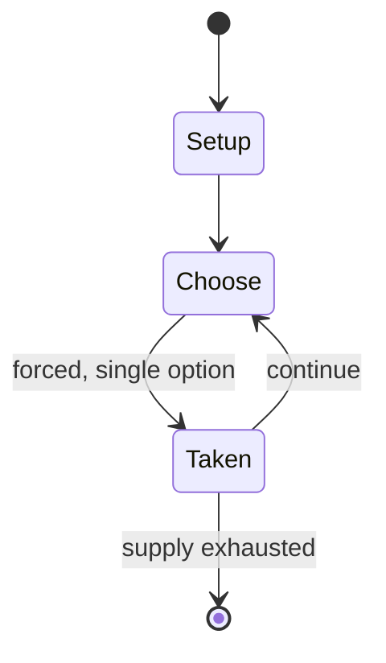

# duchess

*2–6 player chess variant*

`duchess` &nbsp; state: **DEEPENED** &nbsp; method: **heuristic**

## Found layer (recorded, not trusted)

| field | value |
| --- | --- |
| wikidata | Q107366040 |
| wikipedia | Duchess (chess variant) |
| genres (source) | -- |
| instance of (source) | chess variant, multiplayer chess |
| country of origin | -- |

## Declared layer (orders bench work)

| field | value |
| --- | --- |
| year created | 1985 |
| epoch | DIGITAL |
| region | -- |
| media | - |
| players | 2-6 |
| age band | -- |
| exogenous process | -- |
| loss shape | -- |
| live axes | SPATIAL |
| horizon | -- |
| scoring shape | WINNER_TAKE_ALL |
| information | -- |
| interaction | -- |
| turn structure | -- |
| tractability | SAMPLING_ONLY |
| randomness | -- |
| luck factor | 0.35 |
| rules complexity | 2.07 |
| strategic depth | 2.0 |
| novelty | 0.5265 |
| solved status | -- |
| strategies | -- |
| algorithms | -- |

## Object model

```
Episode
  players      : 2-6
  turn_structure: ?
  horizon       : ?
  scoring       : WINNER_TAKE_ALL

Placement      -- position subject to geometric legality
```

## State transition diagram



## Research item -- turn trace

```
# duchess -- simulated turn events
# generated from the DECLARED vector, not from a rulebook.
# structure: exo=None loss=None horizon=None scoring=WINNER_TAKE_ALL axes=SPATIAL

t=0    SETUP        players=2  pot=0  capacity=6
t=1    FORCED       p1 single legal option taken (pot_gain=+1.7)
t=2    ENDTURN      turn passes to p2
t=3    FORCED       p2 single legal option taken (pot_gain=+0.6)
t=4    ENDTURN      turn passes to p1
t=5    FORCED       p1 single legal option taken (pot_gain=+1.1)
t=6    FORCED       p1 single legal option taken (pot_gain=+1.9)
t=7    SPATIAL      p1 places at (7,1); adjacency legal
t=8    FORCED       p1 single legal option taken (pot_gain=+1.5)
t=9    SPATIAL      p1 places at (6,3); adjacency legal
t=10   FORCED       p1 single legal option taken (pot_gain=+1.1)
t=11   SPATIAL      p1 places at (2,7); adjacency legal
t=12   FORCED       p1 single legal option taken (pot_gain=+0.7)
t=13   SPATIAL      p1 places at (4,0); adjacency legal
t=14   FORCED       p1 single legal option taken (pot_gain=+1.1)
t=15   FORCED       p1 single legal option taken (pot_gain=+0.8)
t=16   FORCED       p1 single legal option taken (pot_gain=+2.0)
t=17   SPATIAL      p1 places at (3,2); adjacency legal
t=18   FORCED       p1 single legal option taken (pot_gain=+0.5)
t=19   FORCED       p1 single legal option taken (pot_gain=+2.0)
t=20   SPATIAL      p1 places at (0,7); adjacency legal
t=21   ENDTURN      turn passes to p2
t=22   FORCED       p2 single legal option taken (pot_gain=+0.8)
t=23   SPATIAL      p2 places at (6,3); adjacency legal
t=24   ENDTURN      turn passes to p1
t=25   FORCED       p1 single legal option taken (pot_gain=+1.1)
t=26   SPATIAL      p1 places at (7,4); adjacency legal

terminal: VARIABLE
```

## Source extract

Duchess is a chess variant for 2+ players, created by Alan Blair and John Kramer in 1985 with
the help of Mike Blair and Warwick Hooke. It supports 2-6 players in either free-for-all, 2v2,
or 3v3 formats, and has largely the same rules as standard chess. Notable inclusions are three
fairy chess pieces and a central "vortex" space being used for promotion rather than the back
rank.   == Board layout == A Duchess board consists of six 5x4 flaps surrounding a larger
hexagonal section, which itself consists of two rings of squares (5-to-a-side, then 3-to-a-side)
surrounding the central hexagonal "vortex" space. Only the flaps for which there is a
corresponding color in play are used in a game; the rest are either removed or simply ignored.
Both the central vortex and the corners of each petal are black. Each color has the same
starting positions, on the back three rows of its corresponding flap. The starting flap for each
color may vary, but two colors on the same team cannot be on adjacent flaps.   == Playing pieces
== The pieces of Duchess are sorted into two teams, with red, yellow and magenta making up the
first, and blue, green and cyan the second. Along with the standard chess pi

<sub>Wikipedia, CC BY-SA. Retained as evidence for the structural
classification above. Every rule inferred from it is HYPOTHESIZED
until audited against a rulebook.</sub>
