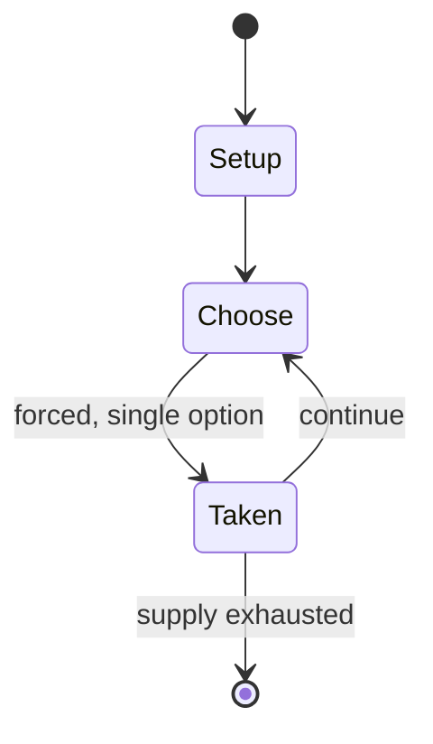

# Duck, duck, goose

`duck_duck_goose` &nbsp; state: **DEEPENED** &nbsp; method: **heuristic**

## Found layer (recorded, not trusted)

| field | value |
| --- | --- |
| wikidata | Q12220668 |
| wikipedia | Duck, duck, goose |
| genres (source) | -- |
| instance of (source) | -- |
| country of origin | -- |

## Declared layer (orders bench work)

| field | value |
| --- | --- |
| year created | -- |
| epoch | -- |
| region | -- |
| media | PLAYGROUND |
| players | -- |
| age band | CHILD |
| exogenous process | -- |
| loss shape | -- |
| live axes | - |
| horizon | -- |
| scoring shape | -- |
| information | -- |
| interaction | -- |
| turn structure | STRICT_TURN |
| tractability | SAMPLING_ONLY |
| randomness | -- |
| luck factor | 0.35 |
| rules complexity | 1.7 |
| strategic depth | 2.0 |
| novelty | 0.4256 |
| solved status | -- |
| strategies | -- |
| algorithms | -- |

## Object model

```
Episode
  players      : ?
  turn_structure: STRICT_TURN
  horizon       : ?
  scoring       : ?

State          -- opaque; no medium or axis evidence was found
Player         -- an agent that selects among legal successors
```

## State transition diagram



## Research item -- turn trace

```
# Duck, duck, goose -- simulated turn events
# generated from the DECLARED vector, not from a rulebook.
# structure: exo=None loss=None horizon=None scoring=None axes=-

t=0    SETUP        players=2  pot=0  capacity=3
t=1    FORCED       p1 single legal option taken (pot_gain=+1.7)
t=2    FORCED       p1 single legal option taken (pot_gain=+0.8)
t=3    FORCED       p1 single legal option taken (pot_gain=+1.5)
t=4    FORCED       p1 single legal option taken (pot_gain=+1.4)
t=5    FORCED       p1 single legal option taken (pot_gain=+1.0)
t=6    ENDTURN      turn passes to p2
t=7    FORCED       p2 single legal option taken (pot_gain=+1.5)
t=8    FORCED       p2 single legal option taken (pot_gain=+1.1)
t=9    FORCED       p2 single legal option taken (pot_gain=+0.8)
t=10   FORCED       p2 single legal option taken (pot_gain=+1.7)
t=11   FORCED       p2 single legal option taken (pot_gain=+0.8)
t=12   FORCED       p2 single legal option taken (pot_gain=+1.2)
t=13   FORCED       p2 single legal option taken (pot_gain=+0.9)
t=14   FORCED       p2 single legal option taken (pot_gain=+0.6)
t=15   FORCED       p2 single legal option taken (pot_gain=+1.8)
t=16   FORCED       p2 single legal option taken (pot_gain=+1.6)
t=17   FORCED       p2 single legal option taken (pot_gain=+1.3)
t=18   FORCED       p2 single legal option taken (pot_gain=+1.6)
t=19   FORCED       p2 single legal option taken (pot_gain=+0.8)
t=20   ENDTURN      turn passes to p1
t=21   FORCED       p1 single legal option taken (pot_gain=+2.0)
t=22   ENDTURN      turn passes to p2
t=23   FORCED       p2 single legal option taken (pot_gain=+1.4)
t=24   FORCED       p2 single legal option taken (pot_gain=+0.9)
t=25   ENDTURN      turn passes to p1
t=26   FORCED       p1 single legal option taken (pot_gain=+1.4)

terminal: VARIABLE
```

## Conditions

| kind | threshold | effect | trigger |
| --- | --- | --- | --- |
| WIN | 2 players | -- | Gomme describes various regional variations: in Shropshire, the two players run in opposite directions and compete to be first to reach the starting point; around London, the chase weaves in and out under the clasped han |

## Source extract

Duck, duck, goose (also called duck, duck, gray duck or Daisy in the dell) is a traditional
children's game often first learned in preschool. The game may be later adapted on the
playground for early elementary students. The object of this game is to walk in a circle,
tapping on each player's head until one is finally chosen; the chosen player must then chase the
picker to avoid becoming the next picker.   == Basic concept == A group of players sit in a
circle, facing inward, while another player, who is "it", walks around tapping or pointing to
each player in turn, calling each a "duck" until finally calling one a "goose", which designates
the chosen player as the chaser. The chaser (goose) then stands and tries to tag the chasee
(it), while the chasee tries to return to and sit where the chaser had been sitting before. If
the chasee (it) succeeds, the chaser (goose) becomes the chasee and the process begins again. If
the chaser (goose) tags the chasee (it), the chaser (goose) may return to their previous spot
and the original chasee (it) restarts the process.   == Variations ==   === Kiss in the ring or
drop handkerchief === In this version of the game, as described by the Britis

<sub>Wikipedia, CC BY-SA. Retained as evidence for the structural
classification above. Every rule inferred from it is HYPOTHESIZED
until audited against a rulebook.</sub>
