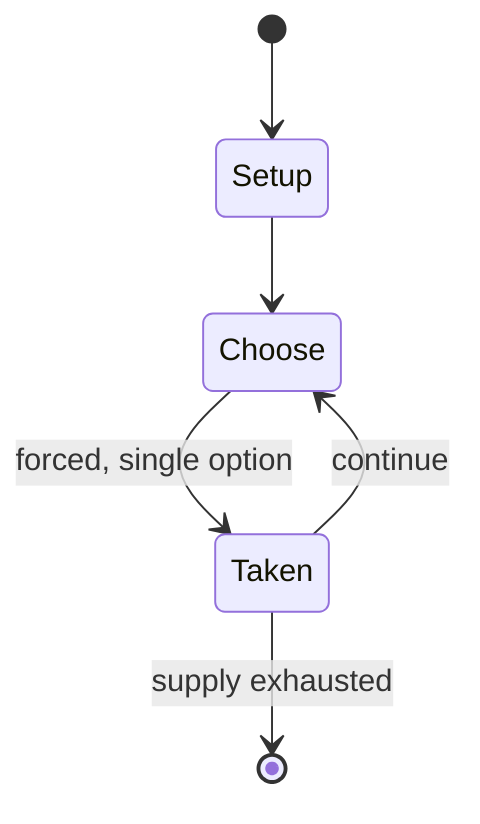

# Dungeon!

*boardgame*

`dungeon` &nbsp; state: **DEEPENED** &nbsp; method: **heuristic**

## Found layer (recorded, not trusted)

| field | value |
| --- | --- |
| wikidata | Q5315118 |
| wikipedia | Dungeon! |
| genres (source) | dungeon crawl, fantasy |
| instance of (source) | board game |
| country of origin | -- |

## Declared layer (orders bench work)

| field | value |
| --- | --- |
| year created | 1974 |
| epoch | DIGITAL |
| region | -- |
| media | BOARD, VIDEO |
| players | 1-8 |
| age band | -- |
| exogenous process | -- |
| loss shape | -- |
| live axes | - |
| horizon | -- |
| scoring shape | -- |
| information | ASYMMETRIC |
| interaction | -- |
| turn structure | -- |
| tractability | SAMPLING_ONLY |
| randomness | -- |
| luck factor | 0.35 |
| rules complexity | 1.7 |
| strategic depth | 2.0 |
| novelty | 0.5245 |
| solved status | -- |
| strategies | -- |
| algorithms | -- |

## Object model

```
Episode
  players      : 1-8
  turn_structure: ?
  horizon       : ?
  scoring       : ?

Board          -- spatial substrate; cells carry position and occupancy
Piece          -- movable token owned by a player
WorldState     -- simulation state advanced by the engine
Avatar         -- player-controlled agent
Clock          -- frame or tick counter
```

## State transition diagram



## Research item -- turn trace

```
# Dungeon! -- simulated turn events
# generated from the DECLARED vector, not from a rulebook.
# structure: exo=None loss=None horizon=None scoring=None axes=-

t=0    SETUP        players=1  pot=0  capacity=4
t=1    FORCED       p1 single legal option taken (pot_gain=+1.3)
t=2    FORCED       p1 single legal option taken (pot_gain=+0.8)
t=3    ENDTURN      turn passes to p1
t=4    FORCED       p1 single legal option taken (pot_gain=+1.5)
t=5    FORCED       p1 single legal option taken (pot_gain=+0.5)
t=6    ENDTURN      turn passes to p1
t=7    FORCED       p1 single legal option taken (pot_gain=+1.5)
t=8    ENDTURN      turn passes to p1
t=9    FORCED       p1 single legal option taken (pot_gain=+0.9)
t=10   FORCED       p1 single legal option taken (pot_gain=+1.5)
t=11   ENDTURN      turn passes to p1
t=12   FORCED       p1 single legal option taken (pot_gain=+0.5)
t=13   FORCED       p1 single legal option taken (pot_gain=+0.9)
t=14   FORCED       p1 single legal option taken (pot_gain=+1.5)
t=15   ENDTURN      turn passes to p1
t=16   FORCED       p1 single legal option taken (pot_gain=+1.0)
t=17   ENDTURN      turn passes to p1
t=18   FORCED       p1 single legal option taken (pot_gain=+0.6)
t=19   FORCED       p1 single legal option taken (pot_gain=+1.1)
t=20   FORCED       p1 single legal option taken (pot_gain=+0.6)
t=21   FORCED       p1 single legal option taken (pot_gain=+1.1)
t=22   FORCED       p1 single legal option taken (pot_gain=+0.7)
t=23   FORCED       p1 single legal option taken (pot_gain=+1.6)
t=24   FORCED       p1 single legal option taken (pot_gain=+0.7)
t=25   FORCED       p1 single legal option taken (pot_gain=+1.7)
t=26   FORCED       p1 single legal option taken (pot_gain=+1.5)

terminal: VARIABLE
```

## Conditions

| kind | threshold | effect | trigger |
| --- | --- | --- | --- |
| WIN | -- | -- | To win the game, the Hero would need to collect only 10,000 gold pieces (GP). |
| WIN | -- | -- | To win the game, the Elf would need to collect only 10,000 gold pieces (GP). |
| WIN | -- | -- | The amount of treasure required to win the game varied by character class- theoretically, this evened out the odds of winning the game, and allowed the less powerful characters to stick to the upper levels of the dungeon |
| WIN | -- | -- | Although the Hero arguably had no advantages, given the weighted treasure requisites to win the game, the Hero packed the most punch for a character class requiring the least amount of treasure to win, being slightly tou |
| WIN | -- | -- | Later editions also included rules for additional classes, each with unique advantages or rules and requiring different amounts of treasure to win the game. |

## Source extract

Dungeon! is an adventure board game designed by David R. Megarry and first released by TSR, Inc.
in 1975. Additional contributions through multiple editions were made by Gary Gygax, Steve
Winter, Jeff Grubb, Chris Dupuis and Michael Gray. Dungeon! simulates some aspects of the
Dungeons & Dragons (D&D) role-playing game, which was released in 1974, although Megarry had a
prototype of Dungeon! ready as early as 1972. Dungeon! features a map of a simple six-level
dungeon with hallways, rooms, and chambers. Players move around the board seeking to defeat
monsters and claim treasure. Greater treasures are located in deeper levels of the dungeon,
along with tougher monsters. Players choose different character classes with different
abilities. The object of the game is to be the first to return to the beginning chamber with a
set value of treasure. The game has been described as the first adventure board game.   ==
Original edition == David M. Ewalt, in his book Of Dice and Men, described Megarry's original
edition of the game as "a Blackmoor-inspired board game that represented TSR's most ambitious
production to date: a color game map, customized cards, tokens, dice, and a rules booklet

<sub>Wikipedia, CC BY-SA. Retained as evidence for the structural
classification above. Every rule inferred from it is HYPOTHESIZED
until audited against a rulebook.</sub>
