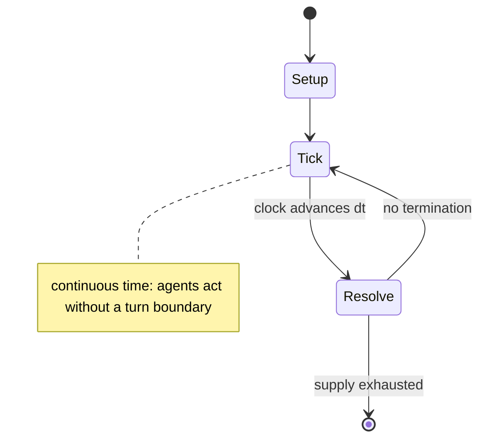

# Dutch Blitz

`dutch_blitz` &nbsp; state: **DEEPENED** &nbsp; method: **heuristic**

## Found layer (recorded, not trusted)

| field | value |
| --- | --- |
| wikidata | Q2575849 |
| wikipedia | Dutch Blitz |
| genres (source) | -- |
| instance of (source) | -- |
| country of origin | -- |

## Declared layer (orders bench work)

| field | value |
| --- | --- |
| year created | 1937 |
| epoch | MODERN |
| region | -- |
| media | CARD |
| players | 5-8 |
| age band | -- |
| exogenous process | -- |
| loss shape | -- |
| live axes | TRADE |
| horizon | VARIABLE |
| scoring shape | LINEAR_ACCUMULATION |
| information | -- |
| interaction | SOLITAIRE |
| turn structure | REAL_TIME |
| tractability | SAMPLING_ONLY |
| randomness | -- |
| luck factor | 0.35 |
| rules complexity | 1.73 |
| strategic depth | 2.0 |
| novelty | 0.6492 |
| solved status | -- |
| strategies | spatial_packing |
| algorithms | -- |

## Object model

```
Episode
  players      : 5-8
  turn_structure: REAL_TIME
  horizon       : VARIABLE
  scoring       : LINEAR_ACCUMULATION

Deck           -- ordered multiset, drawn without replacement
Hand           -- private multiset held by one player
DiscardPile    -- public accumulation of spent cards
Offer          -- proposed exchange between two agents
```

## State transition diagram



## Research item -- clock trace

```
# Dutch Blitz -- simulated clock trace (no turn boundary)
# generated from the DECLARED vector, not from a rulebook.
# structure: exo=None loss=None horizon=VARIABLE scoring=LINEAR_ACCUMULATION axes=TRADE

clk=0.000s  START        agents=8  clock=free running
clk=2.485s  CONTEST      a8 and a1 contend for the same resource
clk=4.240s  ACTION       a6 acts continuously; no turn boundary crossed
clk=6.226s  CONTEST      a5 and a6 contend for the same resource
clk=6.608s  ACTION       a6 acts continuously; no turn boundary crossed
clk=7.563s  ACTION       a2 acts continuously; no turn boundary crossed
clk=8.560s  INFRACTION   a6 commits infraction (count=1)
clk=9.846s  CONTEST      a5 and a6 contend for the same resource
clk=12.082s  ACTION       a4 acts continuously; no turn boundary crossed
clk=13.277s  SCORE        a7 scores (+3)
clk=15.464s  ACTION       a4 acts continuously; no turn boundary crossed
clk=16.674s  ACTION       a1 acts continuously; no turn boundary crossed
clk=17.238s  SCORE        a6 scores (+3)
clk=19.685s  ACTION       a2 acts continuously; no turn boundary crossed
clk=20.260s  CONTEST      a3 and a4 contend for the same resource
clk=22.686s  SCORE        a1 scores (+1)
clk=23.159s  INFRACTION   a7 commits infraction (count=1)
clk=24.139s  ACTION       a1 acts continuously; no turn boundary crossed
clk=26.100s  STOPPAGE     clock halts; state frozen
clk=28.985s  STOPPAGE     clock halts; state frozen
clk=29.717s  CONTEST      a8 and a1 contend for the same resource
clk=31.210s  ACTION       a3 acts continuously; no turn boundary crossed
clk=33.937s  ACTION       a4 acts continuously; no turn boundary crossed
clk=35.226s  INFRACTION   a4 commits infraction (count=1)
clk=36.604s  ACTION       a5 acts continuously; no turn boundary crossed
clk=38.539s  ACTION       a3 acts continuously; no turn boundary crossed
clk=39.313s  STOPPAGE     clock halts; state frozen

note: elapsed time, not move count, is the episode's ordering variable.
```

## Conditions

| kind | threshold | effect | trigger |
| --- | --- | --- | --- |
| TERMINATE | -- | -- | The game ends when a player plays all 10 of the cards out of their Blitz Pile and yells "BLITZ!" Each player scores points at the end of each hand as follows: |

## Source extract

Dutch Blitz is a fast-paced, family oriented, action card game played with a specially printed
deck. The game was created circa 1937 by Werner Ernst George Muller (born 24 August 1912), a
German immigrant from Hamburg, Germany, who settled in Bucks County, Pennsylvania. The game is
very popular among the Pennsylvania Amish and Dutch community, and among Christian groups in the
United States and Canada (primarily in Mennonite communities). The game is similar to Nerts,
which is played with standard playing cards and is in turn based on Canfield, a variant of the
classic Klondike Solitaire.  Unlike Nerts, Dutch Blitz is played with commercially produced
cards. It is an alternate version of the game Ligretto, manufactured in Germany.   == Contents
== The game is played with 160 cards, in four decks; Pump, Carriage, Plow, and Pail. Each deck
includes 10 red, 10 blue, 10 green, and 10 yellow cards.   == Terminology == Blitz Pile This
pile of 10 cards is the most important pile of cards to each player since it is the key towards
"Blitzing" the other players when all cards from this pile have been cleared. Dutch Piles Stacks
of cards in each of the four colors - 1 through 10 in ascending

<sub>Wikipedia, CC BY-SA. Retained as evidence for the structural
classification above. Every rule inferred from it is HYPOTHESIZED
until audited against a rulebook.</sub>
