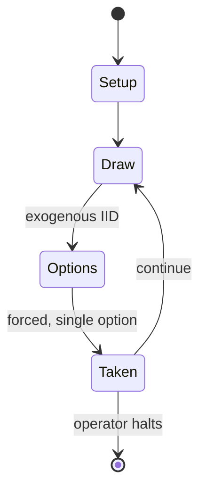

# Earthshaker!

*pinball game*

`earthshaker` &nbsp; state: **DEEPENED** &nbsp; method: **heuristic**

## Found layer (recorded, not trusted)

| field | value |
| --- | --- |
| wikidata | Q20926295 |
| wikipedia | Earthshaker! (pinball) |
| genres (source) | -- |
| instance of (source) | video game |
| country of origin | -- |

## Declared layer (orders bench work)

| field | value |
| --- | --- |
| year created | 1989 |
| epoch | DIGITAL |
| region | -- |
| media | VIDEO |
| players | -- |
| age band | -- |
| exogenous process | IID |
| loss shape | -- |
| live axes | SPATIAL |
| horizon | OPEN_ENDED |
| scoring shape | SET_COLLECTION_CONVEX |
| information | -- |
| interaction | -- |
| turn structure | -- |
| tractability | SAMPLING_ONLY |
| randomness | SPINNER |
| luck factor | 0.35 |
| rules complexity | 1.72 |
| strategic depth | 2.25 |
| novelty | 0.4088 |
| solved status | -- |
| strategies | set_collection |
| algorithms | -- |

## Object model

```
Episode
  players      : ?
  turn_structure: ?
  horizon       : OPEN_ENDED
  scoring       : SET_COLLECTION_CONVEX

WorldState     -- simulation state advanced by the engine
Avatar         -- player-controlled agent
Clock          -- frame or tick counter
Placement      -- position subject to geometric legality
```

## State transition diagram



## Research item -- turn trace

```
# Earthshaker! -- simulated turn events
# generated from the DECLARED vector, not from a rulebook.
# structure: exo=IID loss=None horizon=OPEN_ENDED scoring=SET_COLLECTION_CONVEX axes=SPATIAL

t=0    SETUP        players=2  pot=0  capacity=4
t=1    DRAW         p1 roll from d6 pool -> outcome #1  (p=0.035)
t=2    FORCED       p1 single legal option taken (pot_gain=+1.5)
t=3    ENDTURN      turn passes to p2
t=4    DRAW         p2 roll from d6 pool -> outcome #3  (p=0.173)
t=5    FORCED       p2 single legal option taken (pot_gain=+1.9)
t=6    DRAW         p2 roll from d6 pool -> outcome #6  (p=0.295)
t=7    FORCED       p2 single legal option taken (pot_gain=+1.6)
t=8    DRAW         p2 roll from d6 pool -> outcome #5  (p=0.153)
t=9    FORCED       p2 single legal option taken (pot_gain=+1.0)
t=10   ENDTURN      turn passes to p1
t=11   DRAW         p1 roll from d6 pool -> outcome #4  (p=0.054)
t=12   FORCED       p1 single legal option taken (pot_gain=+1.3)
t=13   ENDTURN      turn passes to p2
t=14   DRAW         p2 roll from d6 pool -> outcome #1  (p=0.274)
t=15   FORCED       p2 single legal option taken (pot_gain=+1.9)
t=16   SPATIAL      p2 places at (5,5); adjacency legal
t=17   DRAW         p2 roll from d6 pool -> outcome #2  (p=0.074)
t=18   FORCED       p2 single legal option taken (pot_gain=+1.1)
t=19   SPATIAL      p2 places at (5,2); adjacency legal
t=20   DRAW         p2 roll from d6 pool -> outcome #6  (p=0.215)
t=21   FORCED       p2 single legal option taken (pot_gain=+0.8)
t=22   DRAW         p2 roll from d6 pool -> outcome #1  (p=0.288)
t=23   FORCED       p2 single legal option taken (pot_gain=+1.5)
t=24   SPATIAL      p2 places at (5,3); adjacency legal
t=25   ENDTURN      turn passes to p1
t=26   DRAW         p1 roll from d6 pool -> outcome #4  (p=0.063)
t=27   FORCED       p1 single legal option taken (pot_gain=+1.0)

terminal: OPEN_ENDED
```

## Source extract

Earthshaker! is a pinball game designed by Pat Lawlor and released by Williams Electronics in
1989. The game features an earthquake theme, advertised with the slogan "It's a Moving
Experience!".   == Design == Earthshaker! was the first pinball machine with a shaker motor that
causes the table to rumble along with the theme of the game. However, this was not patented by
Williams, so it was available for other manufacturers to use in their designs. There are two
strength settings for this motor, and it can be turned off by the operator. The game uses an
alphanumeric display with two lines of 16 characters. The "Earthquake Institute" building on the
sample production run of the first 200 machines sinks into the playfield; for cost savings this
was made to be stationary for the rest of the production run. A third-party aftermarket kit was
later released to add this feature. The game includes a mechanism with representation of a
fault-line at the California-Nevada border which splits apart to reveal a rail for the ball.
Mark Ritchie recorded many of the callouts, although the pinball machine is known for a female
voice saying "Bitchin'!" which was unusual for its time. A "Family" vers

<sub>Wikipedia, CC BY-SA. Retained as evidence for the structural
classification above. Every rule inferred from it is HYPOTHESIZED
until audited against a rulebook.</sub>
