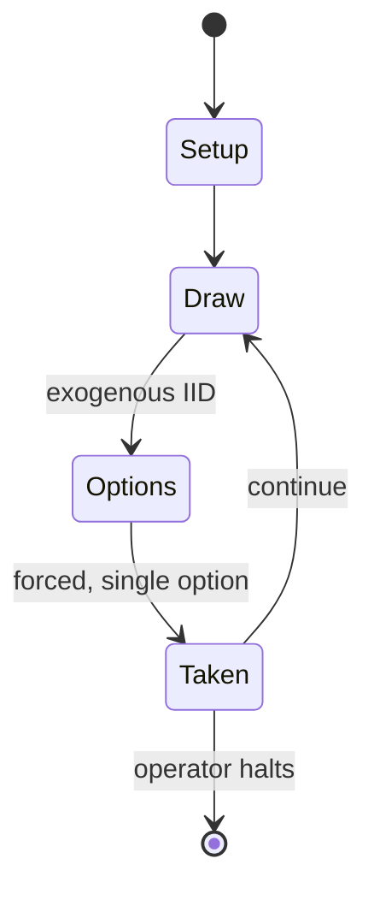

# EastFront

*is a board wargame published by Columbia Games in 1991 that is simulation of the conflict between Germany and the Soviet Union during World War II*

`eastfront` &nbsp; state: **DEEPENED** &nbsp; method: **heuristic**

## Found layer (recorded, not trusted)

| field | value |
| --- | --- |
| wikidata | Q111181262 |
| wikipedia | EastFront |
| genres (source) | -- |
| instance of (source) | board wargame |
| country of origin | -- |

## Declared layer (orders bench work)

| field | value |
| --- | --- |
| year created | 1991 |
| epoch | DIGITAL |
| region | -- |
| media | DICE, WARGAME |
| players | 2 |
| age band | -- |
| exogenous process | IID |
| loss shape | -- |
| live axes | ORDER, SPATIAL |
| horizon | OPEN_ENDED |
| scoring shape | -- |
| information | -- |
| interaction | COMPETITIVE |
| turn structure | PHASE_STRUCTURED |
| tractability | EXACT_WITH_CUT |
| randomness | DICE |
| luck factor | 0.58 |
| rules complexity | 4.35 |
| strategic depth | 1.87 |
| novelty | 0.7421 |
| solved status | -- |
| strategies | -- |
| algorithms | -- |

## Object model

```
Episode
  players      : 2
  turn_structure: PHASE_STRUCTURED
  horizon       : OPEN_ENDED
  scoring       : ?

DicePool       -- n dice, each an iid categorical draw
Roll           -- realised outcome of a pool
Sequence       -- the permutation under the player's control
Placement      -- position subject to geometric legality
```

## State transition diagram



## Research item -- turn trace

```
# EastFront -- simulated turn events
# generated from the DECLARED vector, not from a rulebook.
# structure: exo=IID loss=None horizon=OPEN_ENDED scoring=None axes=ORDER,SPATIAL

t=0    SETUP        players=2  pot=0  capacity=3
t=1    DRAW         p1 roll from d6 pool -> outcome #3  (p=0.012)
t=2    FORCED       p1 single legal option taken (pot_gain=+1.2)
t=3    DRAW         p1 roll from d6 pool -> outcome #1  (p=0.149)
t=4    FORCED       p1 single legal option taken (pot_gain=+2.0)
t=5    DRAW         p1 roll from d6 pool -> outcome #4  (p=0.120)
t=6    FORCED       p1 single legal option taken (pot_gain=+1.2)
t=7    SPATIAL      p1 places at (1,2); adjacency legal
t=8    DRAW         p1 roll from d6 pool -> outcome #1  (p=0.010)
t=9    FORCED       p1 single legal option taken (pot_gain=+0.8)
t=10   DRAW         p1 roll from d6 pool -> outcome #3  (p=0.063)
t=11   FORCED       p1 single legal option taken (pot_gain=+1.3)
t=12   DRAW         p1 roll from d6 pool -> outcome #2  (p=0.125)
t=13   FORCED       p1 single legal option taken (pot_gain=+0.8)
t=14   SPATIAL      p1 places at (3,1); adjacency legal
t=15   ENDTURN      turn passes to p2
t=16   DRAW         p2 roll from d6 pool -> outcome #6  (p=0.219)
t=17   FORCED       p2 single legal option taken (pot_gain=+1.3)
t=18   DRAW         p2 roll from d6 pool -> outcome #3  (p=0.006)
t=19   FORCED       p2 single legal option taken (pot_gain=+0.9)
t=20   DRAW         p2 roll from d6 pool -> outcome #3  (p=0.092)
t=21   FORCED       p2 single legal option taken (pot_gain=+1.1)
t=22   DRAW         p2 roll from d6 pool -> outcome #4  (p=0.107)
t=23   FORCED       p2 single legal option taken (pot_gain=+0.8)
t=24   SPATIAL      p2 places at (5,4); adjacency legal
t=25   ENDTURN      turn passes to p1
t=26   DRAW         p1 roll from d6 pool -> outcome #2  (p=0.068)
t=27   FORCED       p1 single legal option taken (pot_gain=+1.5)
t=28   ENDTURN      turn passes to p2

terminal: OPEN_ENDED
```

## Source extract

EastFront: The War in Russia: 1941–45 is a board wargame published by Columbia Games in 1991
that is simulation of the conflict between Germany and the Soviet Union during World War II.
== Background == In September 1941, German forces launched a surprise attack against the Soviet
Union (Operation Barbarossa) and made large inroads into Soviet territory. The offensive
eventually bogged down as Soviet defenses stiffened. In the fall of 1943, Soviet forces
counterattacked along a broad front, and German forces began a long retreat back to Germany.
== Description == EastFront is a two-player wargame that uses wooden blocks instead of the
traditional die-cut cardboard counters used in other wargames. Because the wooden blocks can be
set on their edge with identifying information facing away from the opposing player, opponents
have limited knowledge about the forces that they are about to engage. The unit's current
strength rating is displayed on the unit's face at the 12 o'clock position of the block, with
step reductions at 3 o'clock, 6 o'clock, and 9 o'clock.   === Components === The game box
contains:   16.5" x 22" paper hex grid map, scaled at 100 m (110 yd) per hex 132 wooden

<sub>Wikipedia, CC BY-SA. Retained as evidence for the structural
classification above. Every rule inferred from it is HYPOTHESIZED
until audited against a rulebook.</sub>
