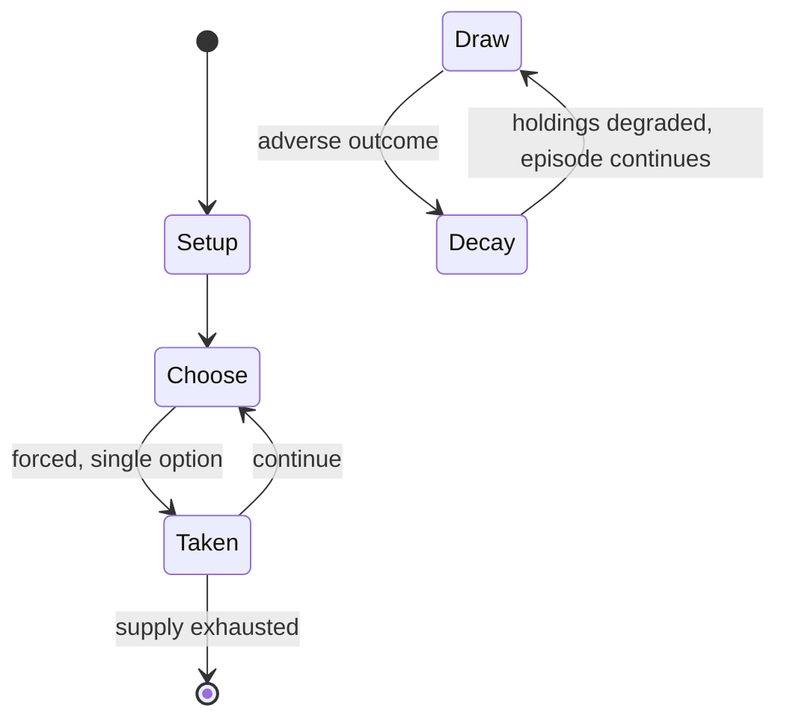

# Egg-and-spoon race

`egg_and_spoon_race` &nbsp; state: **DEEPENED** &nbsp; method: **heuristic**

## Found layer (recorded, not trusted)

| field | value |
| --- | --- |
| wikidata | Q1302771 |
| wikipedia | Egg-and-spoon race |
| genres (source) | -- |
| instance of (source) | -- |
| country of origin | -- |

## Declared layer (orders bench work)

| field | value |
| --- | --- |
| year created | -- |
| epoch | -- |
| region | -- |
| media | DEXTERITY |
| players | -- |
| age band | -- |
| exogenous process | -- |
| loss shape | PARTIAL_DECAY |
| live axes | - |
| horizon | -- |
| scoring shape | RACE_POSITION |
| information | -- |
| interaction | COMPETITIVE |
| turn structure | -- |
| tractability | SAMPLING_ONLY |
| randomness | -- |
| luck factor | 0.35 |
| rules complexity | 1.74 |
| strategic depth | 2.25 |
| novelty | 0.606 |
| solved status | -- |
| strategies | signalling |
| algorithms | -- |

## Object model

```
Episode
  players      : ?
  turn_structure: ?
  horizon       : ?
  scoring       : RACE_POSITION

State          -- opaque; no medium or axis evidence was found
Player         -- an agent that selects among legal successors
```

## State transition diagram



## Research item -- turn trace

```
# Egg-and-spoon race -- simulated turn events
# generated from the DECLARED vector, not from a rulebook.
# structure: exo=None loss=PARTIAL_DECAY horizon=None scoring=RACE_POSITION axes=-

t=0    SETUP        players=2  pot=0  capacity=6
t=1    FORCED       p1 single legal option taken (pot_gain=+0.6)
t=2    ENDTURN      turn passes to p2
t=3    FORCED       p2 single legal option taken (pot_gain=+0.8)
t=4    FORCED       p2 single legal option taken (pot_gain=+1.7)
t=5    FORCED       p2 single legal option taken (pot_gain=+1.5)
t=6    FORCED       p2 single legal option taken (pot_gain=+1.8)
t=7    FORCED       p2 single legal option taken (pot_gain=+0.7)
t=8    FORCED       p2 single legal option taken (pot_gain=+1.8)
t=9    FORCED       p2 single legal option taken (pot_gain=+2.0)
t=10   FORCED       p2 single legal option taken (pot_gain=+1.3)
t=11   FORCED       p2 single legal option taken (pot_gain=+0.6)
t=12   FORCED       p2 single legal option taken (pot_gain=+1.9)
t=13   FORCED       p2 single legal option taken (pot_gain=+1.5)
t=14   FORCED       p2 single legal option taken (pot_gain=+2.0)
t=15   FORCED       p2 single legal option taken (pot_gain=+1.6)
t=16   FORCED       p2 single legal option taken (pot_gain=+1.9)
t=17   FORCED       p2 single legal option taken (pot_gain=+1.5)
t=18   FORCED       p2 single legal option taken (pot_gain=+1.6)
t=19   FORCED       p2 single legal option taken (pot_gain=+0.7)
t=20   FORCED       p2 single legal option taken (pot_gain=+1.8)
t=21   FORCED       p2 single legal option taken (pot_gain=+1.7)
t=22   FORCED       p2 single legal option taken (pot_gain=+0.8)
t=23   ENDTURN      turn passes to p1
t=24   FORCED       p1 single legal option taken (pot_gain=+0.9)
t=25   FORCED       p1 single legal option taken (pot_gain=+1.5)
t=26   FORCED       p1 single legal option taken (pot_gain=+1.2)

terminal: VARIABLE
```

## Conditions

| kind | threshold | effect | trigger |
| --- | --- | --- | --- |
| ELIMINATE | -- | -- | If the egg falls from the spoon, competitors may be required to stop, retrieve, and reposition their egg; or to start again; or may even be disqualified. |
| BOUNDARY | -- | -- | The egg-and-spoon race reached Canada by at least 1922, the first time it was mentioned in The Globe. |
| PENALTY | -- | -- | Due to the lesser penalty imposed for dropping the egg, and consequent encouragement of greater risk-taking, the first penalty scenario may result in a race that is faster overall. |

## Source extract

An egg-and-spoon race is a sporting event in which participants must balance an egg or similarly
shaped item upon a spoon and race with it to the finishing line. At many primary schools an egg-
and-spoon race is staged as part of the annual Sports Day, alongside other events such as the
sack race and the three-legged race.   == History ==  The earliest recorded usage in the Oxford
English Dictionary is in an article of 8 September 1894 featured in The Daily News: "the
gentlemen had a turn in the egg-and-spoon race, in which the competitors had to punt with one
hand and balance an egg on a spoon with the other". Egg-and-spoon races formed part of village
celebrations of the Diamond Jubilee of Queen Victoria in 1897, alongside the tug of war and
blindfold wheelbarrow races. A set of turned and stained wooden eggs and spoons designed for
racing and dating to the 1920s forms part of the Good Time Gallery of the Museum of Childhood in
the Victoria and Albert Museum, London. The egg-and-spoon race reached Canada by at least 1922,
the first time it was mentioned in The Globe. By the 1930s, the phenomenon of the parents' egg-
and-spoon race was sufficiently well established to be satirised i

<sub>Wikipedia, CC BY-SA. Retained as evidence for the structural
classification above. Every rule inferred from it is HYPOTHESIZED
until audited against a rulebook.</sub>
