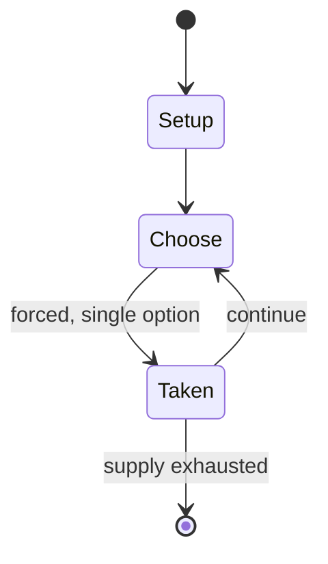

# El Dorado City of Gold

*Pinball machine*

`el_dorado_city_of_gold` &nbsp; state: **DEEPENED** &nbsp; method: **heuristic**

## Found layer (recorded, not trusted)

| field | value |
| --- | --- |
| wikidata | Q20874775 |
| wikipedia | El Dorado City of Gold (pinball) |
| genres (source) | -- |
| instance of (source) | video game |
| country of origin | -- |

## Declared layer (orders bench work)

| field | value |
| --- | --- |
| year created | 1984 |
| epoch | DIGITAL |
| region | -- |
| media | VIDEO |
| players | -- |
| age band | -- |
| exogenous process | -- |
| loss shape | -- |
| live axes | - |
| horizon | -- |
| scoring shape | NONLINEAR |
| information | -- |
| interaction | SOLITAIRE |
| turn structure | -- |
| tractability | SAMPLING_ONLY |
| randomness | -- |
| luck factor | 0.35 |
| rules complexity | 1.72 |
| strategic depth | 2.0 |
| novelty | 0.5764 |
| solved status | -- |
| strategies | -- |
| algorithms | -- |

## Object model

```
Episode
  players      : ?
  turn_structure: ?
  horizon       : ?
  scoring       : NONLINEAR

WorldState     -- simulation state advanced by the engine
Avatar         -- player-controlled agent
Clock          -- frame or tick counter
```

## State transition diagram



## Research item -- turn trace

```
# El Dorado City of Gold -- simulated turn events
# generated from the DECLARED vector, not from a rulebook.
# structure: exo=None loss=None horizon=None scoring=NONLINEAR axes=-

t=0    SETUP        players=2  pot=0  capacity=5
t=1    FORCED       p1 single legal option taken (pot_gain=+1.2)
t=2    FORCED       p1 single legal option taken (pot_gain=+1.7)
t=3    FORCED       p1 single legal option taken (pot_gain=+1.4)
t=4    FORCED       p1 single legal option taken (pot_gain=+2.0)
t=5    FORCED       p1 single legal option taken (pot_gain=+1.5)
t=6    FORCED       p1 single legal option taken (pot_gain=+0.7)
t=7    FORCED       p1 single legal option taken (pot_gain=+1.5)
t=8    FORCED       p1 single legal option taken (pot_gain=+0.6)
t=9    ENDTURN      turn passes to p2
t=10   FORCED       p2 single legal option taken (pot_gain=+0.7)
t=11   FORCED       p2 single legal option taken (pot_gain=+1.7)
t=12   FORCED       p2 single legal option taken (pot_gain=+0.6)
t=13   FORCED       p2 single legal option taken (pot_gain=+1.4)
t=14   FORCED       p2 single legal option taken (pot_gain=+0.9)
t=15   FORCED       p2 single legal option taken (pot_gain=+1.6)
t=16   ENDTURN      turn passes to p1
t=17   FORCED       p1 single legal option taken (pot_gain=+1.6)
t=18   FORCED       p1 single legal option taken (pot_gain=+1.9)
t=19   ENDTURN      turn passes to p2
t=20   FORCED       p2 single legal option taken (pot_gain=+1.2)
t=21   FORCED       p2 single legal option taken (pot_gain=+1.0)
t=22   ENDTURN      turn passes to p1
t=23   FORCED       p1 single legal option taken (pot_gain=+1.5)
t=24   ENDTURN      turn passes to p2
t=25   FORCED       p2 single legal option taken (pot_gain=+0.8)
t=26   FORCED       p2 single legal option taken (pot_gain=+1.0)

terminal: VARIABLE
```

## Source extract

El Dorado City of Gold is a pinball machine designed by Ed Krynski and released in 1984 by
Gottlieb. The game features an El Dorado adventure theme. Different versions of this game with
different names were released: its predecessor the pinball machine is based on, El Dorado (1975)
- a one player replay version, Gold Strike - an Add-a-ball version, Lucky Strike  an Add-A-Ball
version for Italy, Target Alpha - a four player replay version, Canada Dry - a four player
replay game made only for France, and Solar City - a two player replay version.   == Design ==
It is the last game designed by Ed Krynski. Two explorers are depicted on the backglass that
were portrayed by two Gottlieb video game artist, Jeri Knighton and Jeff Lee.   === Original
version (1975) === The original version El Dorado from 1975 depicts a western theme on the
backglass.   === Layout === All these games share the same layout. There are ten drop-targets at
the top of the machine, and five on the right. The game is controlled with four flippers, and
includes a pop bumper near the top right of the playfield, and another towards the left side.
== Gameplay == By knocking down all the top targets twice the player ca

<sub>Wikipedia, CC BY-SA. Retained as evidence for the structural
classification above. Every rule inferred from it is HYPOTHESIZED
until audited against a rulebook.</sub>
