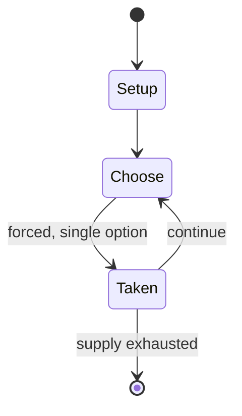

# El Pintor

*2014 studio album by Interpol*

`el_pintor` &nbsp; state: **DEEPENED** &nbsp; method: **heuristic**

## Found layer (recorded, not trusted)

| field | value |
| --- | --- |
| wikidata | Q17150131 |
| wikipedia | El Pintor |
| genres (source) | indie rock |
| instance of (source) | album, anagram |
| country of origin | -- |

## Declared layer (orders bench work)

| field | value |
| --- | --- |
| year created | -- |
| epoch | -- |
| region | -- |
| media | WORD |
| players | -- |
| age band | -- |
| exogenous process | -- |
| loss shape | -- |
| live axes | - |
| horizon | -- |
| scoring shape | -- |
| information | -- |
| interaction | -- |
| turn structure | -- |
| tractability | SAMPLING_ONLY |
| randomness | DICE, HIDDEN_INFO |
| luck factor | 0.63 |
| rules complexity | 1.82 |
| strategic depth | 1.79 |
| novelty | 0.0876 |
| solved status | -- |
| strategies | -- |
| algorithms | -- |

## Object model

```
Episode
  players      : ?
  turn_structure: ?
  horizon       : ?
  scoring       : ?

State          -- opaque; no medium or axis evidence was found
Player         -- an agent that selects among legal successors
```

## State transition diagram



## Research item -- turn trace

```
# El Pintor -- simulated turn events
# generated from the DECLARED vector, not from a rulebook.
# structure: exo=None loss=None horizon=None scoring=None axes=-

t=0    SETUP        players=2  pot=0  capacity=4
t=1    FORCED       p1 single legal option taken (pot_gain=+0.6)
t=2    ENDTURN      turn passes to p2
t=3    FORCED       p2 single legal option taken (pot_gain=+1.7)
t=4    FORCED       p2 single legal option taken (pot_gain=+1.7)
t=5    ENDTURN      turn passes to p1
t=6    FORCED       p1 single legal option taken (pot_gain=+1.5)
t=7    FORCED       p1 single legal option taken (pot_gain=+1.9)
t=8    FORCED       p1 single legal option taken (pot_gain=+0.7)
t=9    FORCED       p1 single legal option taken (pot_gain=+1.6)
t=10   FORCED       p1 single legal option taken (pot_gain=+2.0)
t=11   ENDTURN      turn passes to p2
t=12   FORCED       p2 single legal option taken (pot_gain=+1.7)
t=13   FORCED       p2 single legal option taken (pot_gain=+1.7)
t=14   ENDTURN      turn passes to p1
t=15   FORCED       p1 single legal option taken (pot_gain=+1.6)
t=16   FORCED       p1 single legal option taken (pot_gain=+1.6)
t=17   FORCED       p1 single legal option taken (pot_gain=+1.5)
t=18   FORCED       p1 single legal option taken (pot_gain=+1.2)
t=19   FORCED       p1 single legal option taken (pot_gain=+0.7)
t=20   FORCED       p1 single legal option taken (pot_gain=+1.2)
t=21   FORCED       p1 single legal option taken (pot_gain=+1.7)
t=22   FORCED       p1 single legal option taken (pot_gain=+0.6)
t=23   FORCED       p1 single legal option taken (pot_gain=+0.8)
t=24   FORCED       p1 single legal option taken (pot_gain=+1.7)
t=25   FORCED       p1 single legal option taken (pot_gain=+0.8)
t=26   ENDTURN      turn passes to p2

terminal: VARIABLE
```

## Source extract

El Pintor (Spanish for "the painter"; also an anagram of "Interpol") is the fifth studio album
by the American rock band Interpol. It was released through Matador Records and Soft Limit on
September 8, 2014, internationally, and on September 9, 2014, in North America. El Pintor is the
band's first album without bassist Carlos Dengler, who departed Interpol after the release of
the band's eponymous album in 2010. El Pintor received both critical and fan praise. The band
embarked on a summer tour preceding the album's release. Five singles were released from the
album: "All the Rage Back Home", "Ancient Ways", "My Desire", "Anywhere", and "Everything Is
Wrong".   == Production == Self-produced by the band and recorded at Electric Lady Studios and
Atomic Sound in New York City, the album was engineered by James Brown (known for his work for
Foo Fighters) and mixed by Alan Moulder (known for his production and mixing work for My Bloody
Valentine, Swervedriver, the Smashing Pumpkins and Nine Inch Nails). The bass duties on the
album were taken over by frontman Paul Banks. The album features guest appearances by Brandon
Curtis (Secret Machines), Roger Joseph Manning Jr. (Jellyfish) and R

<sub>Wikipedia, CC BY-SA. Retained as evidence for the structural
classification above. Every rule inferred from it is HYPOTHESIZED
until audited against a rulebook.</sub>
