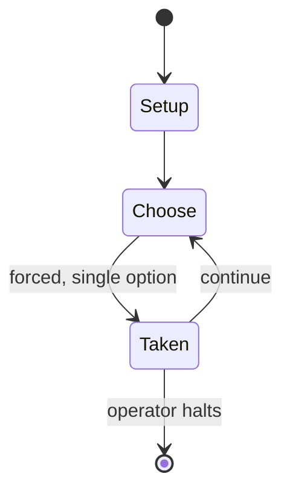

# Elite (video game)

`elite_video_game` &nbsp; state: **DEEPENED** &nbsp; method: **heuristic**

## Found layer (recorded, not trusted)

| field | value |
| --- | --- |
| wikidata | Q55815 |
| wikipedia | Elite (video game) |
| genres (source) | -- |
| instance of (source) | -- |
| country of origin | -- |

## Declared layer (orders bench work)

| field | value |
| --- | --- |
| year created | 1991 |
| epoch | DIGITAL |
| region | -- |
| media | VIDEO |
| players | -- |
| age band | -- |
| exogenous process | -- |
| loss shape | -- |
| live axes | BID, COMMIT_BLIND, ORDER, TRADE |
| horizon | OPEN_ENDED |
| scoring shape | RACE_POSITION |
| information | SIMULTANEOUS |
| interaction | NEGOTIATION |
| turn structure | -- |
| tractability | SAMPLING_ONLY |
| randomness | HIDDEN_INFO, PROCEDURAL_GENERATION, SIMULTANEOUS_CHOICE |
| luck factor | 0.35 |
| rules complexity | 4.5 |
| strategic depth | 2.25 |
| novelty | 0.7749 |
| solved status | -- |
| strategies | spatial_packing |
| algorithms | -- |

## Object model

```
Episode
  players      : ?
  turn_structure: ?
  horizon       : OPEN_ENDED
  scoring       : RACE_POSITION

WorldState     -- simulation state advanced by the engine
Avatar         -- player-controlled agent
Clock          -- frame or tick counter
Auction        -- priced competition resolving to one winner
SealedChoice   -- irrevocable choice made without observation
Sequence       -- the permutation under the player's control
Offer          -- proposed exchange between two agents
```

## State transition diagram



## Research item -- turn trace

```
# Elite (video game) -- simulated turn events
# generated from the DECLARED vector, not from a rulebook.
# structure: exo=None loss=None horizon=OPEN_ENDED scoring=RACE_POSITION axes=BID,COMMIT_BLIND,ORDER,TRADE

t=0    SETUP        players=2  pot=0  capacity=4
t=1    FORCED       p1 single legal option taken (pot_gain=+0.9)
t=2    BID          p1 sealed bid of 1 against 1 rivals
t=3    TRADE        p1 offers 2:1 exchange to p2
t=4    FORCED       p1 single legal option taken (pot_gain=+1.0)
t=5    FORCED       p1 single legal option taken (pot_gain=+1.3)
t=6    FORCED       p1 single legal option taken (pot_gain=+0.5)
t=7    FORCED       p1 single legal option taken (pot_gain=+1.5)
t=8    FORCED       p1 single legal option taken (pot_gain=+0.6)
t=9    FORCED       p1 single legal option taken (pot_gain=+1.9)
t=10   FORCED       p1 single legal option taken (pot_gain=+1.2)
t=11   TRADE        p1 offers 2:1 exchange to p2
t=12   FORCED       p1 single legal option taken (pot_gain=+1.0)
t=13   ENDTURN      turn passes to p2
t=14   FORCED       p2 single legal option taken (pot_gain=+1.3)
t=15   ENDTURN      turn passes to p1
t=16   FORCED       p1 single legal option taken (pot_gain=+1.4)
t=17   FORCED       p1 single legal option taken (pot_gain=+1.4)
t=18   FORCED       p1 single legal option taken (pot_gain=+1.3)
t=19   BID          p1 sealed bid of 5 against 1 rivals
t=20   FORCED       p1 single legal option taken (pot_gain=+1.1)
t=21   BID          p1 sealed bid of 5 against 1 rivals
t=22   TRADE        p1 offers 2:1 exchange to p2
t=23   FORCED       p1 single legal option taken (pot_gain=+1.3)
t=24   FORCED       p1 single legal option taken (pot_gain=+0.7)
t=25   FORCED       p1 single legal option taken (pot_gain=+1.7)
t=26   FORCED       p1 single legal option taken (pot_gain=+1.6)
t=27   BID          p1 sealed bid of 3 against 1 rivals
t=28   ENDTURN      turn passes to p2

terminal: OPEN_ENDED
```

## Conditions

| kind | threshold | effect | trigger |
| --- | --- | --- | --- |
| BOUNDARY | -- | -- | Travel between stars is accomplished by hyperspace jumps, and is constrained to those within range of the limited fuel capacity (a maximum of 7 light years) of the ship's hyperdrive. |
| BOUNDARY | -- | -- | However, in some versions it is necessary to travel to at least the second galaxy to access the game's missions. |
| BOUNDARY | -- | -- | It was written in machine code using assembly language, giving much care to maximum compactness of the code. |
| BOUNDARY | -- | -- | I'm going to continue playing until I am ranked Elite ... or at least Competent ... or even Average ... |
| PENALTY | -- | -- | Elite's technical breakthroughs reportedly amazed the BBC Micro's developers, with Sophie Wilson calling it "the game that couldn't have been written". |

## Source extract

Elite is a space trading video game. It was written and developed by David Braben and Ian Bell
and was originally published by Acornsoft for the BBC Micro computer in September 1984. Elite's
open-ended game model, and revolutionary 3D graphics led to it being ported to virtually every
contemporary home computer system and earned it a place as a classic and a genre maker in gaming
history. The game's title derives from one of the player's goals of raising their combat rating
to the exalted heights of "Elite". Elite was one of the first home computer games to use wire-
frame 3D graphics with hidden-line removal. It added graphics and twitch gameplay aspects to the
genre established by the 1974 game Star Trader. Another novelty was the inclusion of The Dark
Wheel, a novella by Robert Holdstock which gave players insight into the moral and legal codes
to which they might aspire. The first game was followed by the sequels Frontier: Elite II in
1993, and Frontier: First Encounters in 1995, which introduced Newtonian physics, realistic star
systems, and seamless freeform planetary landings. The third sequel Elite Dangerous launched on
16 December 2014. It introduced massively multiplayer w

<sub>Wikipedia, CC BY-SA. Retained as evidence for the structural
classification above. Every rule inferred from it is HYPOTHESIZED
until audited against a rulebook.</sub>
