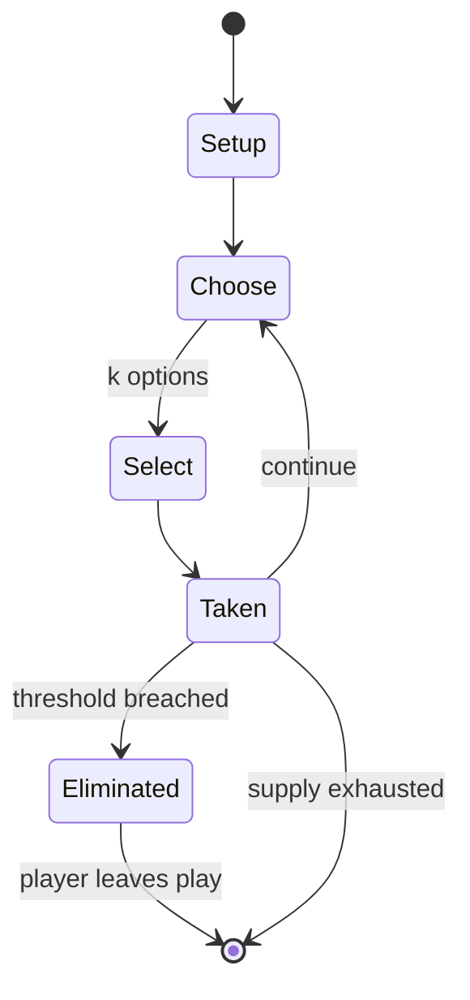

# Ellery Queen's Mystery Magazine Game

*board game*

`ellery_queen_s_mystery_magazine_game` &nbsp; state: **DEEPENED** &nbsp; method: **heuristic**

## Found layer (recorded, not trusted)

| field | value |
| --- | --- |
| wikidata | Q104863626 |
| wikipedia | Ellery Queen's Mystery Magazine Game |
| genres (source) | -- |
| instance of (source) | board game |
| country of origin | -- |

## Declared layer (orders bench work)

| field | value |
| --- | --- |
| year created | 1986 |
| epoch | DIGITAL |
| region | -- |
| media | BOARD |
| players | -- |
| age band | -- |
| exogenous process | -- |
| loss shape | ELIMINATION |
| live axes | SELECT |
| horizon | -- |
| scoring shape | -- |
| information | IMPERFECT |
| interaction | -- |
| turn structure | -- |
| tractability | SAMPLING_ONLY |
| randomness | -- |
| luck factor | -- |
| rules complexity | 2.07 |
| strategic depth | 2.25 |
| novelty | 0.6057 |
| solved status | -- |
| strategies | deduction |
| algorithms | -- |

## Object model

```
Episode
  players      : ?
  turn_structure: ?
  horizon       : ?
  scoring       : ?

Board          -- spatial substrate; cells carry position and occupancy
Piece          -- movable token owned by a player
OptionSet      -- the choices available after an exogenous draw
```

## State transition diagram



## Research item -- turn trace

```
# Ellery Queen's Mystery Magazine Game -- simulated turn events
# generated from the DECLARED vector, not from a rulebook.
# structure: exo=None loss=ELIMINATION horizon=None scoring=None axes=SELECT

t=0    SETUP        players=2  pot=0  capacity=3
t=1    SELECT       p1 4 options; take #1  (pot_gain=+0.6, capacity=-1)
t=2    SELECT       p1 4 options; take #1  (pot_gain=+3.3, capacity=-1)
t=3    ENDTURN      turn passes to p2
t=4    SELECT       p2 1 options; take #1  (pot_gain=+0.8, capacity=-2)
t=5    SELECT       p2 2 options; take #2  (pot_gain=+1.0, capacity=-2)
t=6    SELECT       p2 3 options; take #2  (pot_gain=+1.3, capacity=-2)
t=7    SELECT       p2 2 options; take #1  (pot_gain=+3.4, capacity=-0)
t=8    SELECT       p2 4 options; take #1  (pot_gain=+0.6, capacity=-0)
t=9    SELECT       p2 1 options; take #1  (pot_gain=+0.8, capacity=-2)
t=10   SELECT       p2 1 options; take #1  (pot_gain=+2.2, capacity=-1)
t=11   SELECT       p2 2 options; take #1  (pot_gain=+2.0, capacity=-2)
t=12   SELECT       p2 4 options; take #2  (pot_gain=+3.1, capacity=-1)
t=13   ENDTURN      turn passes to p1
t=14   SELECT       p1 4 options; take #4  (pot_gain=+3.0, capacity=-0)
t=15   ENDTURN      turn passes to p2
t=16   SELECT       p2 3 options; take #1  (pot_gain=+0.8, capacity=-1)
t=17   SELECT       p2 1 options; take #1  (pot_gain=+0.8, capacity=-0)
t=18   SELECT       p2 1 options; take #1  (pot_gain=+0.9, capacity=-0)
t=19   SELECT       p2 4 options; take #1  (pot_gain=+1.9, capacity=-2)
t=20   SELECT       p2 3 options; take #3  (pot_gain=+1.1, capacity=-2)
t=21   SELECT       p2 4 options; take #2  (pot_gain=+2.2, capacity=-2)
t=22   SELECT       p2 1 options; take #1  (pot_gain=+1.1, capacity=-2)
t=23   SELECT       p2 1 options; take #1  (pot_gain=+0.9, capacity=-1)
t=24   SELECT       p2 2 options; take #2  (pot_gain=+3.0, capacity=-0)
t=25   SELECT       p2 4 options; take #4  (pot_gain=+1.6, capacity=-1)
t=26   SELECT       p2 2 options; take #2  (pot_gain=+3.2, capacity=-2)

terminal: VARIABLE
```

## Conditions

| kind | threshold | effect | trigger |
| --- | --- | --- | --- |
| ELIMINATE | -- | eliminated | If the player is wrong, they are eliminated from the game. |
| ELIMINATE | -- | -- | The game continues until either a player reaches the correct conclusion, or all players have been eliminated. |
| WIN | -- | -- | (The solutions are printed in reverse typeface, necessitating the use of a mirror to read them.) If the player's solution is exactly right, that player wins the game. |

## Source extract

Ellery Queen's Mystery Magazine Game is a board game published by Mayfair Games in 1986 in which
players use deduction to solve mysteries similar to those in the Ellery Queen's Mystery
Magazine.   == Description == Ellery Queen's Mystery Magazine Game is a game in which one to six
players visit locations on a map of New York to investigate the clues there and solve the
mystery. The rules also outline a format that can be used by players to create new mysteries for
the game.    === Components === double-sided six-piece map board (large scale map of New York
City on one side, the fictional town of Bromlee Station on the reverse) 4-page Basic rulebook
8-page Advanced rulebook Turn record chart 32-page book containing five mysteries and the
solutions six detective cards and matching plastic tokens. Each detective has different
expertises and different contacts around the city. Detective's Guide to New York, which includes
background on various neighbourhoods, as well as where players can go to use their detective's
expertise. Guide to Bromlee Station gives background information about the fictional town,
nearby Bromlee Mansion, and John Hancock College   === Setup === Players randomly

<sub>Wikipedia, CC BY-SA. Retained as evidence for the structural
classification above. Every rule inferred from it is HYPOTHESIZED
until audited against a rulebook.</sub>
