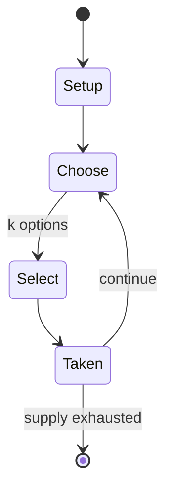

# Elvira and the Party Monsters

*pinball machine*

`elvira_and_the_party_monsters` &nbsp; state: **DEEPENED** &nbsp; method: **heuristic**

## Found layer (recorded, not trusted)

| field | value |
| --- | --- |
| wikidata | Q5368132 |
| wikipedia | Elvira and the Party Monsters |
| genres (source) | -- |
| instance of (source) | pinball machine game, video game |
| country of origin | -- |

## Declared layer (orders bench work)

| field | value |
| --- | --- |
| year created | 1987 |
| epoch | DIGITAL |
| region | -- |
| media | VIDEO |
| players | -- |
| age band | -- |
| exogenous process | -- |
| loss shape | -- |
| live axes | SELECT |
| horizon | -- |
| scoring shape | -- |
| information | -- |
| interaction | TRAITOR |
| turn structure | -- |
| tractability | SAMPLING_ONLY |
| randomness | -- |
| luck factor | 0.35 |
| rules complexity | 2.24 |
| strategic depth | 2.0 |
| novelty | 0.5261 |
| solved status | -- |
| strategies | -- |
| algorithms | -- |

## Object model

```
Episode
  players      : ?
  turn_structure: ?
  horizon       : ?
  scoring       : ?

WorldState     -- simulation state advanced by the engine
Avatar         -- player-controlled agent
Clock          -- frame or tick counter
OptionSet      -- the choices available after an exogenous draw
```

## State transition diagram



## Research item -- turn trace

```
# Elvira and the Party Monsters -- simulated turn events
# generated from the DECLARED vector, not from a rulebook.
# structure: exo=None loss=None horizon=None scoring=None axes=SELECT

t=0    SETUP        players=2  pot=0  capacity=8
t=1    SELECT       p1 4 options; take #1  (pot_gain=+2.7, capacity=-2)
t=2    SELECT       p1 4 options; take #3  (pot_gain=+1.8, capacity=-0)
t=3    SELECT       p1 3 options; take #1  (pot_gain=+2.9, capacity=-2)
t=4    ENDTURN      turn passes to p2
t=5    SELECT       p2 1 options; take #1  (pot_gain=+1.3, capacity=-1)
t=6    SELECT       p2 1 options; take #1  (pot_gain=+2.1, capacity=-0)
t=7    SELECT       p2 1 options; take #1  (pot_gain=+2.7, capacity=-1)
t=8    ENDTURN      turn passes to p1
t=9    SELECT       p1 3 options; take #1  (pot_gain=+3.5, capacity=-0)
t=10   ENDTURN      turn passes to p2
t=11   SELECT       p2 3 options; take #2  (pot_gain=+3.1, capacity=-0)
t=12   SELECT       p2 1 options; take #1  (pot_gain=+0.8, capacity=-0)
t=13   SELECT       p2 3 options; take #3  (pot_gain=+2.4, capacity=-1)
t=14   SELECT       p2 4 options; take #3  (pot_gain=+1.3, capacity=-2)
t=15   SELECT       p2 3 options; take #2  (pot_gain=+2.1, capacity=-2)
t=16   SELECT       p2 2 options; take #1  (pot_gain=+1.8, capacity=-2)
t=17   SELECT       p2 2 options; take #2  (pot_gain=+1.9, capacity=-0)
t=18   SELECT       p2 4 options; take #1  (pot_gain=+3.0, capacity=-0)
t=19   ENDTURN      turn passes to p1
t=20   SELECT       p1 4 options; take #1  (pot_gain=+2.6, capacity=-2)
t=21   SELECT       p1 2 options; take #2  (pot_gain=+1.5, capacity=-2)
t=22   SELECT       p1 1 options; take #1  (pot_gain=+2.6, capacity=-0)
t=23   SELECT       p1 4 options; take #4  (pot_gain=+2.9, capacity=-2)
t=24   ENDTURN      turn passes to p2
t=25   SELECT       p2 2 options; take #2  (pot_gain=+0.8, capacity=-1)
t=26   SELECT       p2 4 options; take #3  (pot_gain=+1.0, capacity=-0)

terminal: VARIABLE
```

## Source extract

Elvira and the Party Monsters is a 1989 pinball machine designed by Dennis Nordman and Jim Patla
and released by Midway (under the Bally label). It features horrorshow-hostess Elvira. It was
followed in 1996 by Scared Stiff and in 2019 by Elvira's House of Horrors, both also designed by
Nordman with art by Greg Freres.   == Design == Most of the game was designed by Dennis Nordman,
but after a motorcycle accident near the end of the design stage, Jim Patla completed it. The
game is a combination of three game ideas:  Monster Mash, with dancing Boogie men was conceived
of by Dennis Nordman when he observed finger puppets with dancing arms at Halloween in 1984.
Greg Freres conceived of Party Monster as a follow-up to Party Animal which had released in
1987. Roger Sharpe, working as Williams marketing director, thought of using Elvira as a theme
The marketing slogan "Elvira is No Cheap Date!" referring to the new .50/.75/1.00 pricing
scheme. Elvira and the Party Monsters was manufactured shortly after the merger of Williams and
Bally. Although the game uses a vaguely Bally-style cabinet and flippers, all the rest of the
game hardware are completely made up of Williams parts. The machi

<sub>Wikipedia, CC BY-SA. Retained as evidence for the structural
classification above. Every rule inferred from it is HYPOTHESIZED
until audited against a rulebook.</sub>
