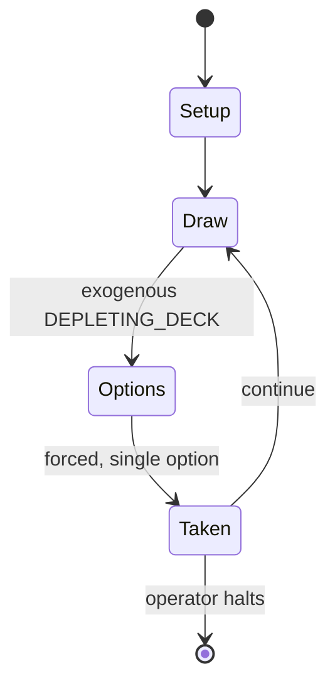

# Empires of the Middle Ages

*strategy board game released in 1980*

`empires_of_the_middle_ages` &nbsp; state: **DEEPENED** &nbsp; method: **heuristic**

## Found layer (recorded, not trusted)

| field | value |
| --- | --- |
| wikidata | Q5374232 |
| wikipedia | Empires of the Middle Ages |
| genres (source) | board wargame |
| instance of (source) | board game |
| country of origin | United States |

## Declared layer (orders bench work)

| field | value |
| --- | --- |
| year created | 1980 |
| epoch | DIGITAL |
| region | NORTH_AMERICA |
| media | BOARD |
| players | 2-6 |
| age band | -- |
| exogenous process | DEPLETING_DECK |
| loss shape | -- |
| live axes | NEGOTIATE |
| horizon | OPEN_ENDED |
| scoring shape | SET_COLLECTION_CONVEX |
| information | -- |
| interaction | NEGOTIATION |
| turn structure | -- |
| tractability | INTRACTABLE |
| randomness | DECK_SHUFFLE |
| luck factor | 0.48 |
| rules complexity | 2.63 |
| strategic depth | 2.25 |
| novelty | 0.8749 |
| solved status | -- |
| strategies | set_collection |
| algorithms | -- |

## Object model

```
Episode
  players      : 2-6
  turn_structure: ?
  horizon       : OPEN_ENDED
  scoring       : SET_COLLECTION_CONVEX

Board          -- spatial substrate; cells carry position and occupancy
Piece          -- movable token owned by a player
Agreement      -- non-binding or binding commitment between agents
```

## State transition diagram



## Research item -- turn trace

```
# Empires of the Middle Ages -- simulated turn events
# generated from the DECLARED vector, not from a rulebook.
# structure: exo=DEPLETING_DECK loss=None horizon=OPEN_ENDED scoring=SET_COLLECTION_CONVEX axes=NEGOTIATE

t=0    SETUP        players=2  pot=0  capacity=8
t=1    DRAW         p1 draw from deck -> outcome #4  (p=0.071)
t=2    FORCED       p1 single legal option taken (pot_gain=+0.6)
t=3    DRAW         p1 draw from deck -> outcome #4  (p=0.081)
t=4    FORCED       p1 single legal option taken (pot_gain=+0.7)
t=5    DRAW         p1 draw from deck -> outcome #3  (p=0.166)
t=6    FORCED       p1 single legal option taken (pot_gain=+0.8)
t=7    ENDTURN      turn passes to p2
t=8    DRAW         p2 draw from deck -> outcome #6  (p=0.226)
t=9    FORCED       p2 single legal option taken (pot_gain=+1.3)
t=10   DRAW         p2 draw from deck -> outcome #3  (p=0.231)
t=11   FORCED       p2 single legal option taken (pot_gain=+1.3)
t=12   DRAW         p2 draw from deck -> outcome #1  (p=0.087)
t=13   FORCED       p2 single legal option taken (pot_gain=+0.7)
t=14   DRAW         p2 draw from deck -> outcome #3  (p=0.189)
t=15   FORCED       p2 single legal option taken (pot_gain=+1.4)
t=16   DRAW         p2 draw from deck -> outcome #3  (p=0.111)
t=17   FORCED       p2 single legal option taken (pot_gain=+1.0)
t=18   DRAW         p2 draw from deck -> outcome #4  (p=0.284)
t=19   FORCED       p2 single legal option taken (pot_gain=+1.6)
t=20   DRAW         p2 draw from deck -> outcome #5  (p=0.241)
t=21   FORCED       p2 single legal option taken (pot_gain=+0.9)
t=22   DRAW         p2 draw from deck -> outcome #1  (p=0.052)
t=23   FORCED       p2 single legal option taken (pot_gain=+1.2)
t=24   DRAW         p2 draw from deck -> outcome #2  (p=0.184)
t=25   FORCED       p2 single legal option taken (pot_gain=+1.5)
t=26   DRAW         p2 draw from deck -> outcome #2  (p=0.036)
t=27   FORCED       p2 single legal option taken (pot_gain=+1.5)
t=28   ENDTURN      turn passes to p1

terminal: OPEN_ENDED
```

## Conditions

| kind | threshold | effect | trigger |
| --- | --- | --- | --- |
| BOUNDARY | -- | -- | undertakes at least one endeavor. |

## Source extract

Empires of the Middle Ages, subtitled "A Dynamic Simulation of Medieval Europe, 771–1467", is a
historical board game published by Simulations Publications, Inc. (SPI) in 1980 that simulates
grand strategy and diplomacy in the Middle Ages.   == Description == Empires of the Middle Ages
is a board game for 2–6 players, each of whom controls an empire in medieval Europe between 771
and 1467. Each empire is composed of various areas that are rated for wealth, religion, language
and population.   === Components === The SPI edition game box holds:  a two-piece map of Europe
and Asia Minor 56 Year cards 56 Event cards (The 2nd edition published by Decision Games
included an additional 107 Event cards) various charts and tables six sets of 100 colored
counters rules booklet   === Gameplay === The object of the game is to create and grow an empire
in terms of wealth, geography and stability.   ==== Round ==== Each Round represents five years
of game time. To begin a round, the Year cards are shuffled, and each player receives five
facedown. Players are not allowed to look at them. Player order for the Round is determined by
leader stature rating and number of areas controlled, with the hig

<sub>Wikipedia, CC BY-SA. Retained as evidence for the structural
classification above. Every rule inferred from it is HYPOTHESIZED
until audited against a rulebook.</sub>
