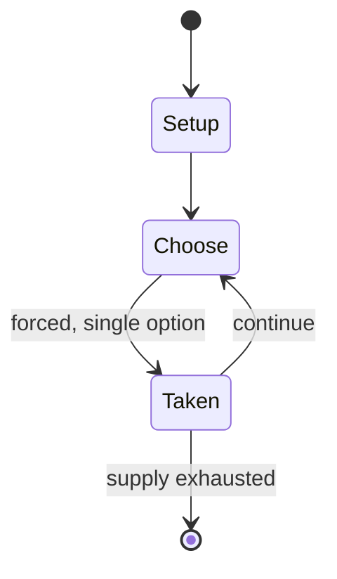

# Endodoi

*traditional mancala game*

`endodoi` &nbsp; state: **DEEPENED** &nbsp; method: **heuristic**

## Found layer (recorded, not trusted)

| field | value |
| --- | --- |
| wikidata | Q3631385 |
| wikipedia | Endodoi |
| genres (source) | -- |
| instance of (source) | board game, mancala |
| country of origin | -- |

## Declared layer (orders bench work)

| field | value |
| --- | --- |
| year created | -- |
| epoch | -- |
| region | -- |
| media | MANCALA |
| players | -- |
| age band | -- |
| exogenous process | -- |
| loss shape | -- |
| live axes | - |
| horizon | -- |
| scoring shape | -- |
| information | -- |
| interaction | COMPETITIVE |
| turn structure | STRICT_TURN |
| tractability | SAMPLING_ONLY |
| randomness | -- |
| luck factor | 0.35 |
| rules complexity | 1.71 |
| strategic depth | 2.0 |
| novelty | 0.4915 |
| solved status | -- |
| strategies | -- |
| algorithms | -- |

## Object model

```
Episode
  players      : ?
  turn_structure: STRICT_TURN
  horizon       : ?
  scoring       : ?

Pits           -- cyclic array of counts
Store          -- player's banked seeds
```

## State transition diagram



## Research item -- turn trace

```
# Endodoi -- simulated turn events
# generated from the DECLARED vector, not from a rulebook.
# structure: exo=None loss=None horizon=None scoring=None axes=-

t=0    SETUP        players=2  pot=0  capacity=8
t=1    FORCED       p1 single legal option taken (pot_gain=+1.4)
t=2    FORCED       p1 single legal option taken (pot_gain=+1.2)
t=3    ENDTURN      turn passes to p2
t=4    FORCED       p2 single legal option taken (pot_gain=+1.9)
t=5    FORCED       p2 single legal option taken (pot_gain=+1.9)
t=6    FORCED       p2 single legal option taken (pot_gain=+1.5)
t=7    FORCED       p2 single legal option taken (pot_gain=+1.3)
t=8    FORCED       p2 single legal option taken (pot_gain=+1.3)
t=9    FORCED       p2 single legal option taken (pot_gain=+1.0)
t=10   FORCED       p2 single legal option taken (pot_gain=+0.6)
t=11   FORCED       p2 single legal option taken (pot_gain=+1.4)
t=12   FORCED       p2 single legal option taken (pot_gain=+1.1)
t=13   FORCED       p2 single legal option taken (pot_gain=+1.9)
t=14   FORCED       p2 single legal option taken (pot_gain=+1.9)
t=15   FORCED       p2 single legal option taken (pot_gain=+1.0)
t=16   FORCED       p2 single legal option taken (pot_gain=+2.0)
t=17   FORCED       p2 single legal option taken (pot_gain=+0.8)
t=18   ENDTURN      turn passes to p1
t=19   FORCED       p1 single legal option taken (pot_gain=+1.2)
t=20   FORCED       p1 single legal option taken (pot_gain=+2.0)
t=21   ENDTURN      turn passes to p2
t=22   FORCED       p2 single legal option taken (pot_gain=+1.4)
t=23   FORCED       p2 single legal option taken (pot_gain=+0.6)
t=24   FORCED       p2 single legal option taken (pot_gain=+0.7)
t=25   FORCED       p2 single legal option taken (pot_gain=+1.7)
t=26   ENDTURN      turn passes to p1

terminal: VARIABLE
```

## Conditions

| kind | threshold | effect | trigger |
| --- | --- | --- | --- |
| TERMINATE | -- | -- | When one of the players cannot move anymore, the game is over. |

## Source extract

Endodoi is a traditional mancala game played by the Maasai people of Kenya and Tanzania. It is
very close to the Ayoayo game of the Yoruba people of Nigeria, although there is no evidence of
a direct relationship between the two. Maasai are known to play Endodoi very quickly, to the
point that an external observer may find it hard to even distinguish individual moves and turns.
== Rules == Endodoi is played on a board with two rows of holes, but the number of holes per row
may vary. A common number is 12. The number of seeds used in the game is also variable; usually,
the initial game setup has somewhere from 3 to 6 seeds per hole. On their turn, each player
takes all seeds from one of their holes and relay-sows them counterclockwise. When the last seed
is sown in an empty hole, and if this hole belongs to the player whose turn it is, he or she
will capture this seed as well as any seed in the opposing hole. When one of the players cannot
move anymore, the game is over. The opponent captures all the seeds that are left on the board
and the winner is the player who captured the most seeds.   == See also == Enkeshui   ==
References == Endodoi Ayoayo and Endodoi rules

<sub>Wikipedia, CC BY-SA. Retained as evidence for the structural
classification above. Every rule inferred from it is HYPOTHESIZED
until audited against a rulebook.</sub>
