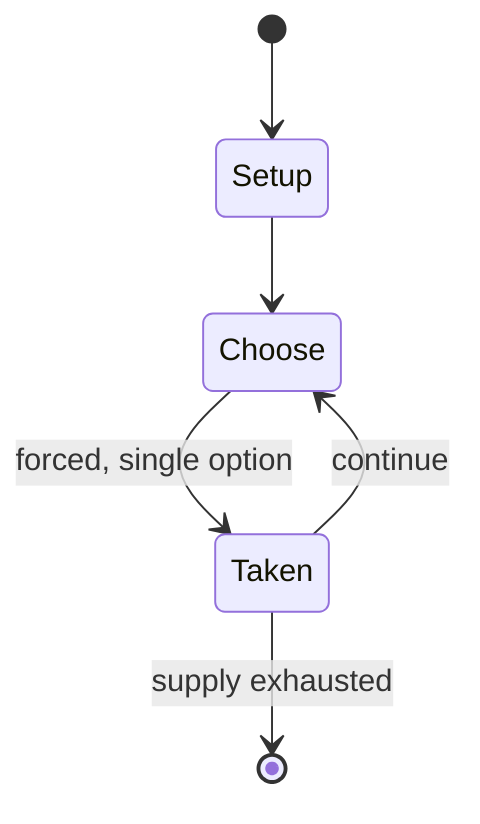

# Enkeshui

*traditional mancala game*

`enkeshui` &nbsp; state: **DEEPENED** &nbsp; method: **heuristic**

## Found layer (recorded, not trusted)

| field | value |
| --- | --- |
| wikidata | Q593466 |
| wikipedia | Enkeshui |
| genres (source) | -- |
| instance of (source) | board game, mancala |
| country of origin | -- |

## Declared layer (orders bench work)

| field | value |
| --- | --- |
| year created | -- |
| epoch | -- |
| region | -- |
| media | MANCALA |
| players | -- |
| age band | -- |
| exogenous process | -- |
| loss shape | -- |
| live axes | - |
| horizon | -- |
| scoring shape | RACE_POSITION |
| information | -- |
| interaction | COMPETITIVE |
| turn structure | STRICT_TURN |
| tractability | SAMPLING_ONLY |
| randomness | -- |
| luck factor | 0.35 |
| rules complexity | 1.86 |
| strategic depth | 2.0 |
| novelty | 0.5909 |
| solved status | -- |
| strategies | -- |
| algorithms | -- |

## Object model

```
Episode
  players      : ?
  turn_structure: STRICT_TURN
  horizon       : ?
  scoring       : RACE_POSITION

Pits           -- cyclic array of counts
Store          -- player's banked seeds
```

## State transition diagram



## Research item -- turn trace

```
# Enkeshui -- simulated turn events
# generated from the DECLARED vector, not from a rulebook.
# structure: exo=None loss=None horizon=None scoring=RACE_POSITION axes=-

t=0    SETUP        players=2  pot=0  capacity=4
t=1    FORCED       p1 single legal option taken (pot_gain=+1.4)
t=2    FORCED       p1 single legal option taken (pot_gain=+1.6)
t=3    FORCED       p1 single legal option taken (pot_gain=+1.2)
t=4    FORCED       p1 single legal option taken (pot_gain=+1.5)
t=5    FORCED       p1 single legal option taken (pot_gain=+1.1)
t=6    FORCED       p1 single legal option taken (pot_gain=+1.8)
t=7    FORCED       p1 single legal option taken (pot_gain=+1.0)
t=8    FORCED       p1 single legal option taken (pot_gain=+0.9)
t=9    FORCED       p1 single legal option taken (pot_gain=+0.6)
t=10   FORCED       p1 single legal option taken (pot_gain=+1.6)
t=11   FORCED       p1 single legal option taken (pot_gain=+1.0)
t=12   ENDTURN      turn passes to p2
t=13   FORCED       p2 single legal option taken (pot_gain=+0.8)
t=14   FORCED       p2 single legal option taken (pot_gain=+1.5)
t=15   FORCED       p2 single legal option taken (pot_gain=+1.2)
t=16   ENDTURN      turn passes to p1
t=17   FORCED       p1 single legal option taken (pot_gain=+1.4)
t=18   FORCED       p1 single legal option taken (pot_gain=+1.9)
t=19   ENDTURN      turn passes to p2
t=20   FORCED       p2 single legal option taken (pot_gain=+1.8)
t=21   FORCED       p2 single legal option taken (pot_gain=+1.3)
t=22   FORCED       p2 single legal option taken (pot_gain=+1.5)
t=23   FORCED       p2 single legal option taken (pot_gain=+1.5)
t=24   FORCED       p2 single legal option taken (pot_gain=+1.4)
t=25   ENDTURN      turn passes to p1
t=26   FORCED       p1 single legal option taken (pot_gain=+1.3)

terminal: VARIABLE
```

## Conditions

| kind | threshold | effect | trigger |
| --- | --- | --- | --- |
| ELIMINATE | -- | removed | if the last seed is dropped in an empty pit of the player's row, and the opposite pit is non-empty all seeds in this pit are captured as well as the seed that caused the capture; all captured seeds are removed from the g |
| WIN | -- | -- | The player who captured most seeds wins the game. |
| TERMINATE | -- | -- | The game ends when one of the players cannot move anymore, because he has no seeds in his row or because he only has seeds in bull pits. |

## Source extract

Enkeshui (or Engesho) is a traditional mancala game played by the Maasai of both Kenya and
Tanzania. It is a rather complex mancala game, and bears some similarities to the Layli Goobalay
mancala played in Somaliland.   == Rules ==   === Equipment and gamesetup === Enkeshui can be
played using a mancala board of different sizes, as long as it has two rows of pits (i.e., it is
a "Mancala II" game). The number of pits in each row may vary; it is usually 8, 10, or 12. 48
seeds are used. As with many traditional mancala games, it is unclear whether the initial setup
is fixed or if it may be chosen by agreement between the players. Anyway, some of the most
typical setups for 2x12 and 2x18 boards are like this:  3 3 0 3 3 0 3 3 0 3 3 0 0 3 3 0 3 3 0 3
3 0 3 3 4 4 4 4 4 4 0 0 0 0 4 4 4 4 4 4 0 0 4 4 4 4 4 4 4 4 4 4 4 4 0 0   === Initial race ===
To choose which player will move first, an initial "sowing race" takes place. Both players take
all the seeds from one of their pits and relay-sow them concurrently. The first player who
finishes sowing will be the first to play in the remainder of the game. Notice that since the
initial race is concurrent, its outcome is quite unpredictable. Thus

<sub>Wikipedia, CC BY-SA. Retained as evidence for the structural
classification above. Every rule inferred from it is HYPOTHESIZED
until audited against a rulebook.</sub>
