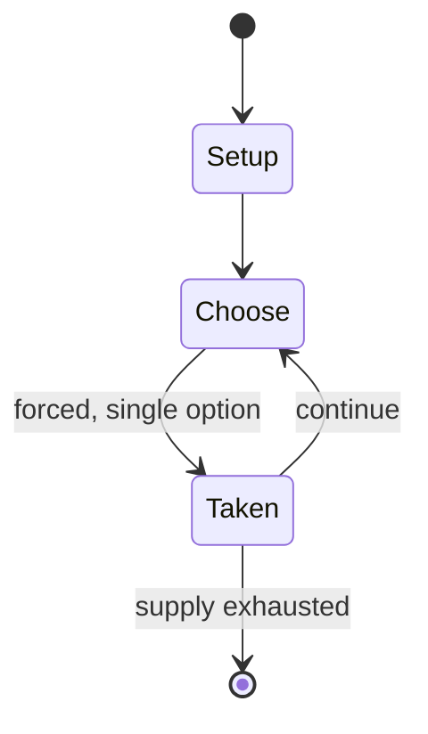

# Epaminondas

*abstract strategy game*

`epaminondas` &nbsp; state: **DEEPENED** &nbsp; method: **heuristic**

## Found layer (recorded, not trusted)

| field | value |
| --- | --- |
| wikidata | Q1060669 |
| wikipedia | Epaminondas (game) |
| genres (source) | -- |
| instance of (source) | abstract strategy game |
| country of origin | -- |

## Declared layer (orders bench work)

| field | value |
| --- | --- |
| year created | 1975 |
| epoch | DIGITAL |
| region | -- |
| media | ABSTRACT, BOARD |
| players | -- |
| age band | -- |
| exogenous process | -- |
| loss shape | -- |
| live axes | - |
| horizon | -- |
| scoring shape | -- |
| information | -- |
| interaction | COMPETITIVE |
| turn structure | -- |
| tractability | SAMPLING_ONLY |
| randomness | -- |
| luck factor | 0.35 |
| rules complexity | 1.86 |
| strategic depth | 2.0 |
| novelty | 0.3541 |
| solved status | -- |
| strategies | -- |
| algorithms | -- |

## Object model

```
Episode
  players      : ?
  turn_structure: ?
  horizon       : ?
  scoring       : ?

Board          -- spatial substrate; cells carry position and occupancy
Piece          -- movable token owned by a player
```

## State transition diagram



## Research item -- turn trace

```
# Epaminondas -- simulated turn events
# generated from the DECLARED vector, not from a rulebook.
# structure: exo=None loss=None horizon=None scoring=None axes=-

t=0    SETUP        players=2  pot=0  capacity=3
t=1    FORCED       p1 single legal option taken (pot_gain=+1.0)
t=2    FORCED       p1 single legal option taken (pot_gain=+0.9)
t=3    FORCED       p1 single legal option taken (pot_gain=+0.9)
t=4    FORCED       p1 single legal option taken (pot_gain=+1.8)
t=5    FORCED       p1 single legal option taken (pot_gain=+0.7)
t=6    FORCED       p1 single legal option taken (pot_gain=+1.0)
t=7    FORCED       p1 single legal option taken (pot_gain=+1.4)
t=8    FORCED       p1 single legal option taken (pot_gain=+2.0)
t=9    ENDTURN      turn passes to p2
t=10   FORCED       p2 single legal option taken (pot_gain=+1.7)
t=11   FORCED       p2 single legal option taken (pot_gain=+1.0)
t=12   ENDTURN      turn passes to p1
t=13   FORCED       p1 single legal option taken (pot_gain=+0.7)
t=14   FORCED       p1 single legal option taken (pot_gain=+0.7)
t=15   FORCED       p1 single legal option taken (pot_gain=+2.0)
t=16   FORCED       p1 single legal option taken (pot_gain=+1.1)
t=17   FORCED       p1 single legal option taken (pot_gain=+1.9)
t=18   FORCED       p1 single legal option taken (pot_gain=+1.4)
t=19   ENDTURN      turn passes to p2
t=20   FORCED       p2 single legal option taken (pot_gain=+1.3)
t=21   FORCED       p2 single legal option taken (pot_gain=+1.2)
t=22   FORCED       p2 single legal option taken (pot_gain=+0.7)
t=23   ENDTURN      turn passes to p1
t=24   FORCED       p1 single legal option taken (pot_gain=+0.5)
t=25   FORCED       p1 single legal option taken (pot_gain=+0.5)
t=26   FORCED       p1 single legal option taken (pot_gain=+1.8)

terminal: VARIABLE
```

## Source extract

Epaminondas is a strategy board game invented by Robert Abbott in 1975. The game is named after
the Theban general Epaminondas, known for the use of phalanx strategy in combat. The concept of
the phalanx is integral to the game. Epaminondas was originally introduced in Sid Sackson's A
Gamut of Games as Crossings. While the original version used an 8×8 checkerboard, the current
game uses a 12×14 board and different rules for capture. When published, it claimed to be one of
the first modern games to acknowledge the name of its inventor in its rules.   == Phalanx == In
the game, a phalanx is a horizontal, vertical, or diagonal line of two or more stones of the
same color, with no empty spaces or enemy stones between them. A stone may belong to more than
one phalanx, depending on the direction considered.   == Rules ==   === Moves === White moves
first; then turns alternate.  A player can move a single piece one space in any direction (the
same as a king in chess). A player can, instead, move a phalanx any number of spaces equal to or
less than the number of pieces in the phalanx. All the pieces in the phalanx must all move in
the same direction, and that direction must be along the li

<sub>Wikipedia, CC BY-SA. Retained as evidence for the structural
classification above. Every rule inferred from it is HYPOTHESIZED
until audited against a rulebook.</sub>
