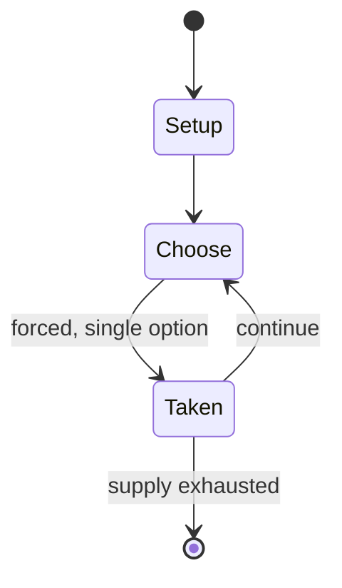

# eRepublik

*2008 video game*

`erepublik` &nbsp; state: **DEEPENED** &nbsp; method: **heuristic**

## Found layer (recorded, not trusted)

| field | value |
| --- | --- |
| wikidata | Q244503 |
| wikipedia | ERepublik |
| genres (source) | massively multiplayer online game |
| instance of (source) | video game, website |
| country of origin | -- |

## Declared layer (orders bench work)

| field | value |
| --- | --- |
| year created | 2007 |
| epoch | CONTEMPORARY |
| region | -- |
| media | VIDEO |
| players | -- |
| age band | -- |
| exogenous process | -- |
| loss shape | -- |
| live axes | - |
| horizon | -- |
| scoring shape | -- |
| information | -- |
| interaction | -- |
| turn structure | PHASE_STRUCTURED |
| tractability | SAMPLING_ONLY |
| randomness | -- |
| luck factor | 0.35 |
| rules complexity | 2.41 |
| strategic depth | 2.0 |
| novelty | 0.5018 |
| solved status | -- |
| strategies | -- |
| algorithms | -- |

## Object model

```
Episode
  players      : ?
  turn_structure: PHASE_STRUCTURED
  horizon       : ?
  scoring       : ?

WorldState     -- simulation state advanced by the engine
Avatar         -- player-controlled agent
Clock          -- frame or tick counter
```

## State transition diagram



## Research item -- turn trace

```
# eRepublik -- simulated turn events
# generated from the DECLARED vector, not from a rulebook.
# structure: exo=None loss=None horizon=None scoring=None axes=-

t=0    SETUP        players=2  pot=0  capacity=8
t=1    FORCED       p1 single legal option taken (pot_gain=+1.9)
t=2    FORCED       p1 single legal option taken (pot_gain=+1.7)
t=3    ENDTURN      turn passes to p2
t=4    FORCED       p2 single legal option taken (pot_gain=+1.0)
t=5    FORCED       p2 single legal option taken (pot_gain=+0.9)
t=6    FORCED       p2 single legal option taken (pot_gain=+1.4)
t=7    FORCED       p2 single legal option taken (pot_gain=+1.5)
t=8    FORCED       p2 single legal option taken (pot_gain=+1.6)
t=9    FORCED       p2 single legal option taken (pot_gain=+1.0)
t=10   ENDTURN      turn passes to p1
t=11   FORCED       p1 single legal option taken (pot_gain=+1.5)
t=12   FORCED       p1 single legal option taken (pot_gain=+2.0)
t=13   FORCED       p1 single legal option taken (pot_gain=+0.7)
t=14   FORCED       p1 single legal option taken (pot_gain=+1.4)
t=15   FORCED       p1 single legal option taken (pot_gain=+1.1)
t=16   FORCED       p1 single legal option taken (pot_gain=+1.6)
t=17   FORCED       p1 single legal option taken (pot_gain=+1.1)
t=18   FORCED       p1 single legal option taken (pot_gain=+1.9)
t=19   FORCED       p1 single legal option taken (pot_gain=+0.5)
t=20   FORCED       p1 single legal option taken (pot_gain=+1.8)
t=21   FORCED       p1 single legal option taken (pot_gain=+1.1)
t=22   FORCED       p1 single legal option taken (pot_gain=+0.6)
t=23   ENDTURN      turn passes to p2
t=24   FORCED       p2 single legal option taken (pot_gain=+1.8)
t=25   FORCED       p2 single legal option taken (pot_gain=+1.4)
t=26   FORCED       p2 single legal option taken (pot_gain=+2.0)

terminal: VARIABLE
```

## Source extract

eRepublik is a free-to-play, web browser-based massively multiplayer online game developed by
Romanian studio eRepublik Labs which was launched outside of beta phase on 14 October 2008 and
is accessible via the Internet. The game is set in a mirror world (called the New World) where
players, referred to as citizens, join in local and national politics where they can help
formulate national economic and social policies as well as initiating wars with their neighbours
and/or tread the path of a private citizen working, fighting and voting for their state. It was
developed by Alexis Bonte and George Lemnaru.  eRepublik is programmed in PHP using Symfony
framework and runs in most modern browsers. eRepublik has spawned a number of similar games due
to the commercial success. On 30 May 2017, it was announced that Stillfront Group has acquired
eRepublik Labs.   == Funding == eRepublik has raised funding in four rounds:  Seed – February
2007 – 200,000 euros Angel – June 2008 – 550,000 euros Series A – June 2009 – 2,000,000 euros
Fall – July 2012 – 500,000 euros   == Overview == eRepublik is a global massively multiplayer
online game where players can participate in a variety of daily acti

<sub>Wikipedia, CC BY-SA. Retained as evidence for the structural
classification above. Every rule inferred from it is HYPOTHESIZED
until audited against a rulebook.</sub>
