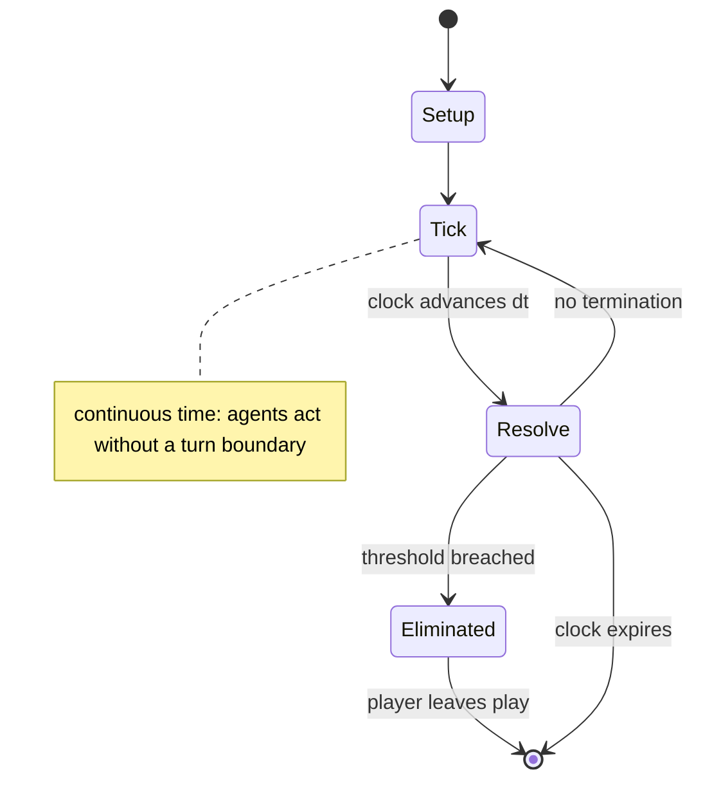

# Escape from Colditz

*board game published in 1973*

`escape_from_colditz` &nbsp; state: **DEEPENED** &nbsp; method: **heuristic**

## Found layer (recorded, not trusted)

| field | value |
| --- | --- |
| wikidata | Q2389288 |
| wikipedia | Escape from Colditz |
| genres (source) | action-adventure game |
| instance of (source) | board game |
| country of origin | United Kingdom |

## Declared layer (orders bench work)

| field | value |
| --- | --- |
| year created | 1973 |
| epoch | DIGITAL |
| region | EUROPE_WEST |
| media | BOARD |
| players | 2-6 |
| age band | -- |
| exogenous process | IID |
| loss shape | ELIMINATION |
| live axes | SPATIAL, TRADE |
| horizon | CLOCK_LIMITED |
| scoring shape | SET_COLLECTION_CONVEX |
| information | SIMULTANEOUS |
| interaction | SOLITAIRE |
| turn structure | REAL_TIME |
| tractability | EXACT_WITH_CUT |
| randomness | DICE, HIDDEN_INFO |
| luck factor | 0.63 |
| rules complexity | 2.61 |
| strategic depth | 2.29 |
| novelty | 0.7123 |
| solved status | -- |
| strategies | route_optimisation, set_collection |
| algorithms | -- |

## Object model

```
Episode
  players      : 2-6
  turn_structure: REAL_TIME
  horizon       : CLOCK_LIMITED
  scoring       : SET_COLLECTION_CONVEX

Board          -- spatial substrate; cells carry position and occupancy
Piece          -- movable token owned by a player
Placement      -- position subject to geometric legality
Offer          -- proposed exchange between two agents
```

## State transition diagram



## Research item -- clock trace

```
# Escape from Colditz -- simulated clock trace (no turn boundary)
# generated from the DECLARED vector, not from a rulebook.
# structure: exo=IID loss=ELIMINATION horizon=CLOCK_LIMITED scoring=SET_COLLECTION_CONVEX axes=SPATIAL,TRADE

clk=0.000s  START        agents=6  clock=counts down
clk=2.001s  ACTION       a2 acts continuously; no turn boundary crossed
clk=3.615s  CONTEST      a4 and a5 contend for the same resource
clk=5.493s  SCORE        a4 scores (+2)
clk=5.763s  INFRACTION   a2 commits infraction (count=1)
clk=6.473s  CONTEST      a2 and a3 contend for the same resource
clk=8.335s  ACTION       a5 acts continuously; no turn boundary crossed
clk=8.866s  CONTEST      a4 and a5 contend for the same resource
clk=11.621s  ACTION       a1 acts continuously; no turn boundary crossed
clk=13.139s  STOPPAGE     clock halts; state frozen
clk=13.408s  CONTEST      a6 and a1 contend for the same resource
clk=15.415s  SCORE        a5 scores (+2)
clk=16.228s  ACTION       a6 acts continuously; no turn boundary crossed
clk=18.736s  ACTION       a2 acts continuously; no turn boundary crossed
clk=19.914s  INFRACTION   a4 commits infraction (count=1)
clk=22.430s  ACTION       a5 acts continuously; no turn boundary crossed
clk=24.393s  CONTEST      a2 and a3 contend for the same resource
clk=26.365s  INFRACTION   a4 commits infraction (count=2)
clk=26.852s  CONTEST      a1 and a2 contend for the same resource
clk=27.400s  ACTION       a5 acts continuously; no turn boundary crossed
clk=29.353s  ACTION       a3 acts continuously; no turn boundary crossed
clk=31.945s  ACTION       a1 acts continuously; no turn boundary crossed
clk=33.983s  INFRACTION   a1 commits infraction (count=1)
clk=34.286s  INFRACTION   a2 commits infraction (count=2)
clk=35.485s  INFRACTION   a5 commits infraction (count=1)
clk=37.073s  ACTION       a4 acts continuously; no turn boundary crossed
clk=38.433s  SCORE        a2 scores (+2)

note: elapsed time, not move count, is the episode's ordering variable.
```

## Conditions

| kind | threshold | effect | trigger |
| --- | --- | --- | --- |
| ELIMINATE | -- | out of the game | If the amount of movement generated is not enough for the POW to reach a target area, the escape attempt fails and that player is out of the game. |
| WIN | -- | -- | If any player reaches the agreed-to number of successful escapes, the game is over and that player is the winner. |
| WIN | -- | -- | If the time limit is reached before any player has made the required number of escapes, the German Security Officer player is the winner. |
| PENALTY | -- | -- | If the arrest happens in the outer courtyard, the Escape Officer must forfeit an Equipment card. |

## Source extract

Escape from Colditz is a board game produced by Gibsons Games of London in 1973 that simulates
attempted escapes by Allied prisoners-of-war (POWs) from Oflag IV-C (better known as Colditz
Castle) during World War II. Designed in part by Pat Reid, a former POW who escaped from
Colditz, the game was released during the first run of the popular television series Colditz,
and the game likewise proved popular. Licensed editions were published by Parker Brothers and a
number of other companies. The game proved especially popular in Spain, and resulted in a
Spanish-language sequel.    == Description == Escape from Colditz is a board game for 2–6
players in which one player takes on the role of the German security officer at Colditz, and the
other players represent the various nationalities of POWs being held there who are trying to
find the means to escape.   === Components === The game box contains:  The game board, covered
with a grid of linked circles,  is a pictorial plan of Colditz Castle showing the inner and
outer courtyards, various rooms, safe areas, cells, and barracks. Five sets of eight tokens
representing five nationalities of POWs. One set of sixteen black tokens representin

<sub>Wikipedia, CC BY-SA. Retained as evidence for the structural
classification above. Every rule inferred from it is HYPOTHESIZED
until audited against a rulebook.</sub>
