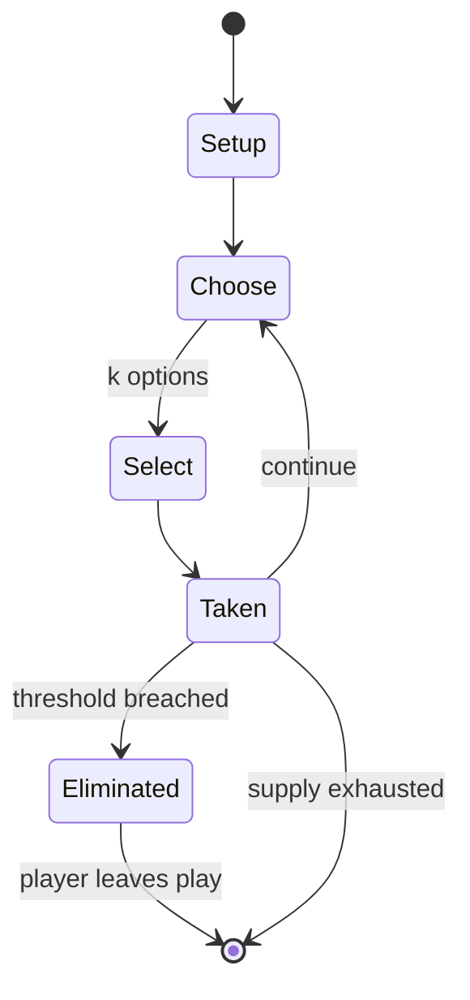

# Eson xorgol

*mancala game*

`eson_xorgol` &nbsp; state: **DEEPENED** &nbsp; method: **heuristic**

## Found layer (recorded, not trusted)

| field | value |
| --- | --- |
| wikidata | Q5398614 |
| wikipedia | Eson xorgol |
| genres (source) | -- |
| instance of (source) | board game, mancala |
| country of origin | -- |

## Declared layer (orders bench work)

| field | value |
| --- | --- |
| year created | -- |
| epoch | -- |
| region | -- |
| media | BOARD, MANCALA |
| players | -- |
| age band | -- |
| exogenous process | NONE |
| loss shape | ELIMINATION |
| live axes | SELECT |
| horizon | VARIABLE |
| scoring shape | -- |
| information | PERFECT |
| interaction | SOLITAIRE |
| turn structure | -- |
| tractability | EXACT_WITH_CUT |
| randomness | NONE |
| luck factor | 0.02 |
| rules complexity | 2.19 |
| strategic depth | 2.4 |
| novelty | 0.776 |
| solved status | -- |
| strategies | -- |
| algorithms | -- |

## Object model

```
Episode
  players      : ?
  turn_structure: ?
  horizon       : VARIABLE
  scoring       : ?

Board          -- spatial substrate; cells carry position and occupancy
Piece          -- movable token owned by a player
Pits           -- cyclic array of counts
Store          -- player's banked seeds
OptionSet      -- the choices available after an exogenous draw
```

## State transition diagram



## Research item -- turn trace

```
# Eson xorgol -- simulated turn events
# generated from the DECLARED vector, not from a rulebook.
# structure: exo=NONE loss=ELIMINATION horizon=VARIABLE scoring=None axes=SELECT

t=0    SETUP        players=2  pot=0  capacity=7
t=1    SELECT       p1 2 options; take #1  (pot_gain=+1.8, capacity=-0)
t=2    SELECT       p1 3 options; take #2  (pot_gain=+2.0, capacity=-0)
t=3    ENDTURN      turn passes to p2
t=4    SELECT       p2 2 options; take #2  (pot_gain=+2.5, capacity=-1)
t=5    ENDTURN      turn passes to p1
t=6    SELECT       p1 4 options; take #2  (pot_gain=+0.9, capacity=-1)
t=7    ENDTURN      turn passes to p2
t=8    SELECT       p2 1 options; take #1  (pot_gain=+2.0, capacity=-1)
t=9    SELECT       p2 2 options; take #1  (pot_gain=+2.0, capacity=-1)
t=10   SELECT       p2 4 options; take #3  (pot_gain=+3.1, capacity=-0)
t=11   SELECT       p2 2 options; take #2  (pot_gain=+0.9, capacity=-2)
t=12   SELECT       p2 3 options; take #1  (pot_gain=+0.5, capacity=-1)
t=13   ENDTURN      turn passes to p1
t=14   SELECT       p1 4 options; take #1  (pot_gain=+3.5, capacity=-0)
t=15   SELECT       p1 3 options; take #1  (pot_gain=+0.6, capacity=-2)
t=16   SELECT       p1 4 options; take #4  (pot_gain=+1.8, capacity=-0)
t=17   SELECT       p1 1 options; take #1  (pot_gain=+1.8, capacity=-1)
t=18   SELECT       p1 1 options; take #1  (pot_gain=+3.4, capacity=-0)
t=19   SELECT       p1 1 options; take #1  (pot_gain=+2.1, capacity=-2)
t=20   SELECT       p1 4 options; take #2  (pot_gain=+2.9, capacity=-2)
t=21   SELECT       p1 4 options; take #4  (pot_gain=+3.0, capacity=-2)
t=22   SELECT       p1 3 options; take #3  (pot_gain=+1.1, capacity=-1)
t=23   ENDTURN      turn passes to p2
t=24   SELECT       p2 1 options; take #1  (pot_gain=+2.9, capacity=-0)
t=25   SELECT       p2 4 options; take #3  (pot_gain=+1.8, capacity=-1)
t=26   ENDTURN      turn passes to p1

terminal: VARIABLE
```

## Conditions

| kind | threshold | effect | trigger |
| --- | --- | --- | --- |
| TERMINATE | 1 player | -- | The game is over when one player has captured 25 or more seeds, or each player has taken 24 seeds (draw). |
| WIN | -- | -- | Since the game has only 48 seeds, capturing 25 is sufficient to win the game. |
| TERMINATE | -- | -- | If both players agree that the game has been reduced to an endless cycle, the game ends when each player has seeds in their holes and then each player captures the seeds on their side of the board. |
| PENALTY | -- | -- | However, if a move would capture all of an opponent's seeds, the capture is forfeited since this would prevent the opponent from continuing the game, and the seeds are instead left on the board. |

## Source extract

Oware is an abstract strategy game among the mancala family of board games (pit and pebble
games) played worldwide with slight variations as to the layout of the game, number of players
and strategy of play. Its origin is uncertain, but it is widely believed to be of Ashanti
origin. Played in the Bono Region, Bono East Region, Ahafo Region, Central Region, Western
Region, Eastern Region, and Ashanti Region of Ghana as well as throughout the Caribbean, oware
and its variants have many names - ayò, ayoayo (Yoruba), awalé (Ivory Coast, Benin), wari
(Mali), ouri, ouril or uril (Cape Verde), warri (Caribbean), wali (Dagbani), adji (Ewe),
nchọ/ókwè (Igbo), ise (Edo), awale (Ga) (meaning "spoons" in English). A common name in English
is awari but one of the earliest Western scholars to study the game, Robert Sutherland Rattray,
used the name wari.   == Rules == The following are the rules for the abapa variation,
considered to be the most appropriate for serious, adult play.   === Equipment === The game
requires an oware board and 48 seeds. A typical oware board has two straight rows of six pits,
called "houses", and optionally one large "score" house at each end. Each player controls the

<sub>Wikipedia, CC BY-SA. Retained as evidence for the structural
classification above. Every rule inferred from it is HYPOTHESIZED
until audited against a rulebook.</sub>
