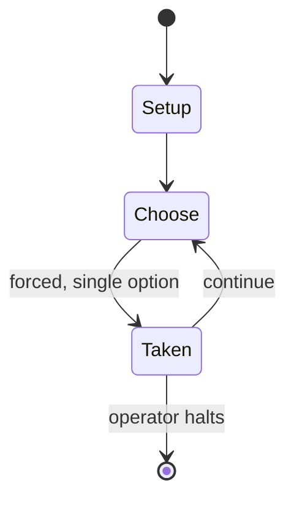

# Europa

*board wargame series*

`europa` &nbsp; state: **DEEPENED** &nbsp; method: **heuristic**

## Found layer (recorded, not trusted)

| field | value |
| --- | --- |
| wikidata | Q5412030 |
| wikipedia | Europa (wargame) |
| genres (source) | -- |
| instance of (source) | board wargame, sequence |
| country of origin | -- |

## Declared layer (orders bench work)

| field | value |
| --- | --- |
| year created | 1973 |
| epoch | DIGITAL |
| region | -- |
| media | BOARD, WARGAME |
| players | -- |
| age band | -- |
| exogenous process | NONE |
| loss shape | OPPORTUNITY_ONLY |
| live axes | ORDER |
| horizon | OPEN_ENDED |
| scoring shape | SET_COLLECTION_CONVEX |
| information | PERFECT |
| interaction | -- |
| turn structure | -- |
| tractability | EXACT_WITH_CUT |
| randomness | NONE |
| luck factor | 0.02 |
| rules complexity | 3.38 |
| strategic depth | 2.65 |
| novelty | 0.7709 |
| solved status | -- |
| strategies | set_collection |
| algorithms | -- |

## Object model

```
Episode
  players      : ?
  turn_structure: ?
  horizon       : OPEN_ENDED
  scoring       : SET_COLLECTION_CONVEX

Board          -- spatial substrate; cells carry position and occupancy
Piece          -- movable token owned by a player
Sequence       -- the permutation under the player's control
```

## State transition diagram



## Research item -- turn trace

```
# Europa -- simulated turn events
# generated from the DECLARED vector, not from a rulebook.
# structure: exo=NONE loss=OPPORTUNITY_ONLY horizon=OPEN_ENDED scoring=SET_COLLECTION_CONVEX axes=ORDER

t=0    SETUP        players=2  pot=0  capacity=8
t=1    FORCED       p1 single legal option taken (pot_gain=+1.2)
t=2    FORCED       p1 single legal option taken (pot_gain=+1.7)
t=3    FORCED       p1 single legal option taken (pot_gain=+1.4)
t=4    FORCED       p1 single legal option taken (pot_gain=+0.5)
t=5    FORCED       p1 single legal option taken (pot_gain=+1.9)
t=6    FORCED       p1 single legal option taken (pot_gain=+1.3)
t=7    FORCED       p1 single legal option taken (pot_gain=+1.7)
t=8    FORCED       p1 single legal option taken (pot_gain=+1.3)
t=9    FORCED       p1 single legal option taken (pot_gain=+1.7)
t=10   FORCED       p1 single legal option taken (pot_gain=+0.6)
t=11   ENDTURN      turn passes to p2
t=12   FORCED       p2 single legal option taken (pot_gain=+0.6)
t=13   ENDTURN      turn passes to p1
t=14   FORCED       p1 single legal option taken (pot_gain=+1.5)
t=15   FORCED       p1 single legal option taken (pot_gain=+1.9)
t=16   FORCED       p1 single legal option taken (pot_gain=+0.8)
t=17   ENDTURN      turn passes to p2
t=18   FORCED       p2 single legal option taken (pot_gain=+0.6)
t=19   FORCED       p2 single legal option taken (pot_gain=+1.8)
t=20   FORCED       p2 single legal option taken (pot_gain=+1.7)
t=21   FORCED       p2 single legal option taken (pot_gain=+1.5)
t=22   FORCED       p2 single legal option taken (pot_gain=+0.7)
t=23   FORCED       p2 single legal option taken (pot_gain=+0.7)
t=24   FORCED       p2 single legal option taken (pot_gain=+1.7)
t=25   FORCED       p2 single legal option taken (pot_gain=+1.6)
t=26   FORCED       p2 single legal option taken (pot_gain=+1.3)
t=27   ENDTURN      turn passes to p1

terminal: OPEN_ENDED
```

## Source extract

Europa is a series of board wargames planned to cover combat over the entire European Theater of
World War II at a scale that represents units from divisions down to battalions and game turns
that represent two weeks of time. The series was launched in 1973, and is still in production as
of 2013, with over a dozen titles published and several more still in production or planning.
Most of the titles qualify as "monster games", a subgenre of wargames featuring extensive orders
of battle, a complex ruleset and usually a large game-map area with a detailed representation of
the terrain they cover.   == Publishers and related publications ==   === Games === The Europa
series has been produced by four different publishers, as follows:  Game Designers Workshop
(GDW), 1973–1987 Game Research/Design (GRD), 1989–2000 Mill Creek Ventures, 2001–2003 Historical
Military Services (HMS), 2004–present GRD began publishing play aids for Europa under a license
from GDW, while GDW was still publishing the games. In 1989, they acquired use of the Europa
trademark and began publishing the games, both new titles and "Deluxe Edition" revisions of
previously published titles. When GRD's Winston Hamilton d

<sub>Wikipedia, CC BY-SA. Retained as evidence for the structural
classification above. Every rule inferred from it is HYPOTHESIZED
until audited against a rulebook.</sub>
