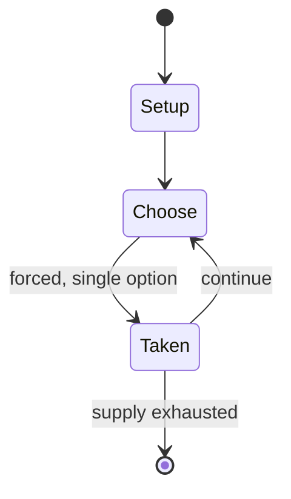

# EuroShogi

*shogi variant invented by Vladimír Pribylinec starting in 2000*

`euroshogi` &nbsp; state: **DEEPENED** &nbsp; method: **heuristic**

## Found layer (recorded, not trusted)

| field | value |
| --- | --- |
| wikidata | Q5192239 |
| wikipedia | EuroShogi |
| genres (source) | -- |
| instance of (source) | shogi variant |
| country of origin | -- |

## Declared layer (orders bench work)

| field | value |
| --- | --- |
| year created | 2000 |
| epoch | CONTEMPORARY |
| region | -- |
| media | BOARD |
| players | -- |
| age band | -- |
| exogenous process | NONE |
| loss shape | -- |
| live axes | SPATIAL |
| horizon | -- |
| scoring shape | WINNER_TAKE_ALL |
| information | -- |
| interaction | -- |
| turn structure | -- |
| tractability | SAMPLING_ONLY |
| randomness | NONE |
| luck factor | 0.35 |
| rules complexity | 1.72 |
| strategic depth | 2.0 |
| novelty | 0.0938 |
| solved status | -- |
| strategies | memory_recall |
| algorithms | -- |

## Object model

```
Episode
  players      : ?
  turn_structure: ?
  horizon       : ?
  scoring       : WINNER_TAKE_ALL

Board          -- spatial substrate; cells carry position and occupancy
Piece          -- movable token owned by a player
Placement      -- position subject to geometric legality
```

## State transition diagram



## Research item -- turn trace

```
# EuroShogi -- simulated turn events
# generated from the DECLARED vector, not from a rulebook.
# structure: exo=NONE loss=None horizon=None scoring=WINNER_TAKE_ALL axes=SPATIAL

t=0    SETUP        players=2  pot=0  capacity=6
t=1    FORCED       p1 single legal option taken (pot_gain=+1.6)
t=2    SPATIAL      p1 places at (3,4); adjacency legal
t=3    FORCED       p1 single legal option taken (pot_gain=+0.5)
t=4    SPATIAL      p1 places at (6,0); adjacency legal
t=5    FORCED       p1 single legal option taken (pot_gain=+1.9)
t=6    FORCED       p1 single legal option taken (pot_gain=+1.6)
t=7    ENDTURN      turn passes to p2
t=8    FORCED       p2 single legal option taken (pot_gain=+0.6)
t=9    ENDTURN      turn passes to p1
t=10   FORCED       p1 single legal option taken (pot_gain=+1.8)
t=11   FORCED       p1 single legal option taken (pot_gain=+0.6)
t=12   SPATIAL      p1 places at (0,0); adjacency legal
t=13   FORCED       p1 single legal option taken (pot_gain=+0.9)
t=14   SPATIAL      p1 places at (0,2); adjacency legal
t=15   ENDTURN      turn passes to p2
t=16   FORCED       p2 single legal option taken (pot_gain=+1.6)
t=17   FORCED       p2 single legal option taken (pot_gain=+0.6)
t=18   SPATIAL      p2 places at (4,1); adjacency legal
t=19   ENDTURN      turn passes to p1
t=20   FORCED       p1 single legal option taken (pot_gain=+1.5)
t=21   FORCED       p1 single legal option taken (pot_gain=+1.5)
t=22   SPATIAL      p1 places at (4,5); adjacency legal
t=23   ENDTURN      turn passes to p2
t=24   FORCED       p2 single legal option taken (pot_gain=+1.9)
t=25   FORCED       p2 single legal option taken (pot_gain=+0.5)
t=26   SPATIAL      p2 places at (6,5); adjacency legal
t=27   ENDTURN      turn passes to p1

terminal: VARIABLE
```

## Source extract

EuroShogi is a shogi variant invented by Vladimír Pribylinec starting in 2000. The game
developed from an early version of chess variant Echos in 1977, leading to Cubic Chess, then
later to Cubic Shogi, and finally to EuroShogi. Instead of the classic figures, 18 black and 18
white cubes are used, which are on two opposing sides without symbols. The other two cubes on
the opposite sides have one white and one black symbol. The other opposing sides are the same
symbols of the opposite color - their promotion is indicated by a circle around symbol. Symbol
on top of its mobility. The pieces are placed on the board so that they are oriented towards
players without any symbolic surfaces. Plays on a board with 8x8 fields of the same color.  A
major tenet of EuroShogi is simplification without radical changes, while maintaining good
gameplay. The variant Heian shogi with playing board 8×8 or 9×8 is the only shogi variant
somewhat similar to EuroShogi; other variants are larger or smaller, have new units, or lack
drops.   == Game rules == On the board the furthest three ranks from each player is their
promotion zone. The starting setup is as shown. Pieces capture the same as they move. Com

<sub>Wikipedia, CC BY-SA. Retained as evidence for the structural
classification above. Every rule inferred from it is HYPOTHESIZED
until audited against a rulebook.</sub>
