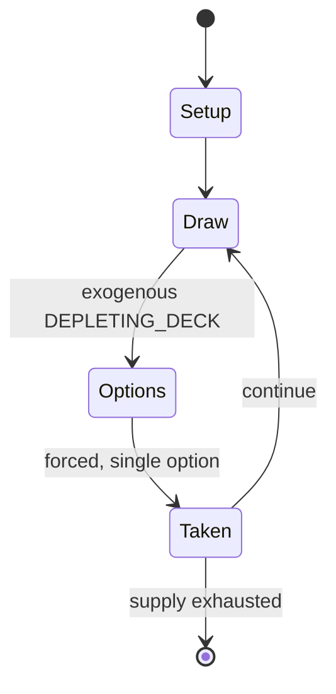

# Ex Libris

*party game*

`ex_libris` &nbsp; state: **DEEPENED** &nbsp; method: **heuristic**

## Found layer (recorded, not trusted)

| field | value |
| --- | --- |
| wikidata | Q5419155 |
| wikipedia | Ex Libris (game) |
| genres (source) | -- |
| instance of (source) | party game |
| country of origin | -- |

## Declared layer (orders bench work)

| field | value |
| --- | --- |
| year created | 1991 |
| epoch | DIGITAL |
| region | -- |
| media | BOARD, PARTY |
| players | -- |
| age band | -- |
| exogenous process | DEPLETING_DECK |
| loss shape | -- |
| live axes | BLUFF |
| horizon | -- |
| scoring shape | -- |
| information | IMPERFECT |
| interaction | -- |
| turn structure | -- |
| tractability | EXACT_WITH_CUT |
| randomness | DECK_SHUFFLE |
| luck factor | 0.48 |
| rules complexity | 2.04 |
| strategic depth | 2.25 |
| novelty | 0.7616 |
| solved status | -- |
| strategies | bluffing |
| algorithms | -- |

## Object model

```
Episode
  players      : ?
  turn_structure: ?
  horizon       : ?
  scoring       : ?

Board          -- spatial substrate; cells carry position and occupancy
Piece          -- movable token owned by a player
Belief         -- what an observer is induced to think is true
```

## State transition diagram



## Research item -- turn trace

```
# Ex Libris -- simulated turn events
# generated from the DECLARED vector, not from a rulebook.
# structure: exo=DEPLETING_DECK loss=None horizon=None scoring=None axes=BLUFF

t=0    SETUP        players=2  pot=0  capacity=3
t=1    DRAW         p1 draw from deck -> outcome #4  (p=0.031)
t=2    FORCED       p1 single legal option taken (pot_gain=+2.0)
t=3    BLUFF        p1 represents a holding it does not have
t=4    DRAW         p1 draw from deck -> outcome #1  (p=0.076)
t=5    FORCED       p1 single legal option taken (pot_gain=+1.2)
t=6    BLUFF        p1 represents a holding it does not have
t=7    ENDTURN      turn passes to p2
t=8    DRAW         p2 draw from deck -> outcome #1  (p=0.155)
t=9    FORCED       p2 single legal option taken (pot_gain=+1.1)
t=10   ENDTURN      turn passes to p1
t=11   DRAW         p1 draw from deck -> outcome #5  (p=0.226)
t=12   FORCED       p1 single legal option taken (pot_gain=+0.8)
t=13   BLUFF        p1 represents a holding it does not have
t=14   ENDTURN      turn passes to p2
t=15   DRAW         p2 draw from deck -> outcome #5  (p=0.116)
t=16   FORCED       p2 single legal option taken (pot_gain=+0.6)
t=17   BLUFF        p2 represents a holding it does not have
t=18   ENDTURN      turn passes to p1
t=19   DRAW         p1 draw from deck -> outcome #3  (p=0.249)
t=20   FORCED       p1 single legal option taken (pot_gain=+1.8)
t=21   ENDTURN      turn passes to p2
t=22   DRAW         p2 draw from deck -> outcome #3  (p=0.033)
t=23   FORCED       p2 single legal option taken (pot_gain=+1.0)
t=24   ENDTURN      turn passes to p1
t=25   DRAW         p1 draw from deck -> outcome #6  (p=0.098)
t=26   FORCED       p1 single legal option taken (pot_gain=+1.8)

terminal: VARIABLE
```

## Source extract

Ex Libris: The Game of First Lines and Last Words is a party game of literary bluff related to
fictionary.  First published in 1991 by the English board game company Oxford Games Ltd., Ex
Libris was devised and compiled by Leslie Scott (the creator of Jenga) and designed by Sara
Finch. The game involves having to write fake, but plausible, opening (or closing) sentences of
genuine books in an attempt to fool fellow players into believing your words are the authentic
first (or last) lines of a given book.   == Rules of play == The game comprises one hundred
cards, each of which provide on one side, the title, author, and plot summary of a published
book or short story; And, on the other, the first and last sentences of the book.  In each
round, a different player takes the role of reader and reads aloud the title, author and plot
summary. The other players are then required to write plausible first or last sentences for the
book, handing their efforts over to the reader, who has meanwhile copied the correct line onto a
similar piece of paper, which they shuffle amongst the 'fake' scripts. The reader then reads
aloud all the sentences, taking care to disguise the genuine. Players vot

<sub>Wikipedia, CC BY-SA. Retained as evidence for the structural
classification above. Every rule inferred from it is HYPOTHESIZED
until audited against a rulebook.</sub>
