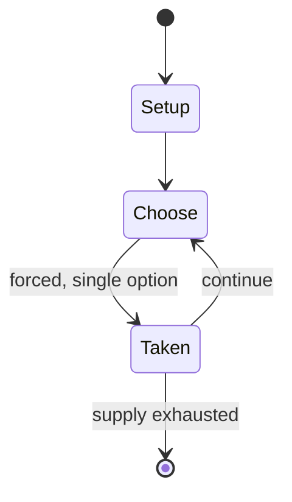

# Exeter Book Riddle 24

*one of the Old English riddles found in the later tenth-century Exeter Book*

`exeter_book_riddle_24` &nbsp; state: **DEEPENED** &nbsp; method: **heuristic**

## Found layer (recorded, not trusted)

| field | value |
| --- | --- |
| wikidata | Q28224776 |
| wikipedia | Exeter Book Riddle 24 |
| genres (source) | -- |
| instance of (source) | riddle |
| country of origin | -- |

## Declared layer (orders bench work)

| field | value |
| --- | --- |
| year created | -- |
| epoch | -- |
| region | -- |
| media | PUZZLE |
| players | -- |
| age band | -- |
| exogenous process | -- |
| loss shape | -- |
| live axes | - |
| horizon | -- |
| scoring shape | -- |
| information | -- |
| interaction | -- |
| turn structure | -- |
| tractability | SAMPLING_ONLY |
| randomness | -- |
| luck factor | 0.35 |
| rules complexity | 1.68 |
| strategic depth | 2.0 |
| novelty | 0.0876 |
| solved status | -- |
| strategies | -- |
| algorithms | -- |

## Object model

```
Episode
  players      : ?
  turn_structure: ?
  horizon       : ?
  scoring       : ?

Configuration  -- the arrangement to be resolved
Constraint     -- predicate a legal configuration must satisfy
```

## State transition diagram



## Research item -- turn trace

```
# Exeter Book Riddle 24 -- simulated turn events
# generated from the DECLARED vector, not from a rulebook.
# structure: exo=None loss=None horizon=None scoring=None axes=-

t=0    SETUP        players=2  pot=0  capacity=3
t=1    FORCED       p1 single legal option taken (pot_gain=+1.0)
t=2    FORCED       p1 single legal option taken (pot_gain=+1.3)
t=3    ENDTURN      turn passes to p2
t=4    FORCED       p2 single legal option taken (pot_gain=+1.3)
t=5    FORCED       p2 single legal option taken (pot_gain=+0.7)
t=6    FORCED       p2 single legal option taken (pot_gain=+1.0)
t=7    ENDTURN      turn passes to p1
t=8    FORCED       p1 single legal option taken (pot_gain=+0.8)
t=9    FORCED       p1 single legal option taken (pot_gain=+1.9)
t=10   FORCED       p1 single legal option taken (pot_gain=+1.3)
t=11   FORCED       p1 single legal option taken (pot_gain=+0.9)
t=12   FORCED       p1 single legal option taken (pot_gain=+1.3)
t=13   FORCED       p1 single legal option taken (pot_gain=+1.9)
t=14   FORCED       p1 single legal option taken (pot_gain=+0.6)
t=15   ENDTURN      turn passes to p2
t=16   FORCED       p2 single legal option taken (pot_gain=+1.9)
t=17   FORCED       p2 single legal option taken (pot_gain=+1.8)
t=18   ENDTURN      turn passes to p1
t=19   FORCED       p1 single legal option taken (pot_gain=+1.5)
t=20   FORCED       p1 single legal option taken (pot_gain=+1.3)
t=21   FORCED       p1 single legal option taken (pot_gain=+1.0)
t=22   FORCED       p1 single legal option taken (pot_gain=+1.7)
t=23   FORCED       p1 single legal option taken (pot_gain=+1.6)
t=24   FORCED       p1 single legal option taken (pot_gain=+1.7)
t=25   FORCED       p1 single legal option taken (pot_gain=+1.2)
t=26   FORCED       p1 single legal option taken (pot_gain=+0.7)

terminal: VARIABLE
```

## Source extract

Exeter Book Riddle 24 (according to the numbering of the Anglo-Saxon Poetic Records) is one of
the Old English riddles found in the later tenth-century Exeter Book. The riddle is one of a
number to include runes as clues: they spell an anagram of the Old English word higoræ 'jay,
magpie'. There has, therefore, been little debate about the solution.   == Text and translation
== As edited by Williamson and translated by Stanton, the riddle reads:  It is clear for
metrical reasons that the runes were supposed to be sounded by their names, which are also words
in their own right, so that in a sense the translation should also be something like:   ==
Interpretation == The riddles alludes to the jay's proclivity for imitating other species, and
it has been argued that the poem's soundplay also reflects this.   == Editions == Krapp, George
Philip and Elliott Van Kirk Dobbie (eds), The Exeter Book, The Anglo-Saxon Poetic Records, 3
(New York: Columbia University Press, 1936), pp. 192–93,
https://web.archive.org/web/20181206091232/http://ota.ox.ac.uk/desc/3009. Williamson, Craig
(ed.), The Old English Riddles of the Exeter Book (Chapel Hill: University of North Carolina
Press, 1977), p. 82.

<sub>Wikipedia, CC BY-SA. Retained as evidence for the structural
classification above. Every rule inferred from it is HYPOTHESIZED
until audited against a rulebook.</sub>
