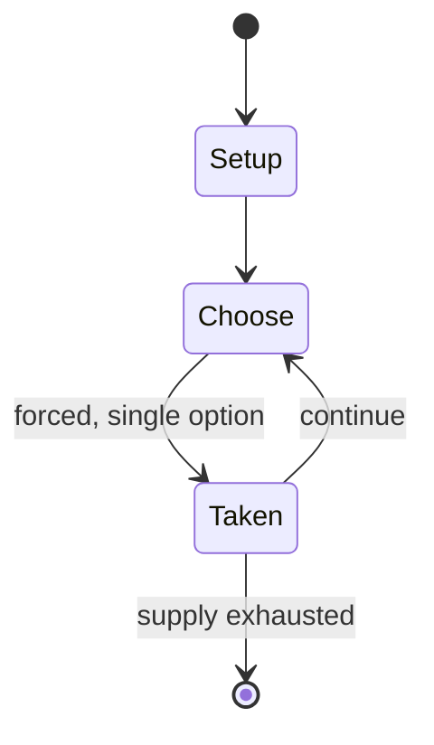

# Exeter Book Riddle 27

*Anglo-Saxon riddle*

`exeter_book_riddle_27` &nbsp; state: **DEEPENED** &nbsp; method: **heuristic**

## Found layer (recorded, not trusted)

| field | value |
| --- | --- |
| wikidata | Q26827918 |
| wikipedia | Exeter Book Riddle 27 |
| genres (source) | -- |
| instance of (source) | riddle |
| country of origin | -- |

## Declared layer (orders bench work)

| field | value |
| --- | --- |
| year created | -- |
| epoch | -- |
| region | -- |
| media | PUZZLE |
| players | -- |
| age band | -- |
| exogenous process | -- |
| loss shape | -- |
| live axes | - |
| horizon | -- |
| scoring shape | -- |
| information | -- |
| interaction | -- |
| turn structure | -- |
| tractability | SAMPLING_ONLY |
| randomness | -- |
| luck factor | 0.35 |
| rules complexity | 1.78 |
| strategic depth | 2.0 |
| novelty | 0.0876 |
| solved status | -- |
| strategies | -- |
| algorithms | -- |

## Object model

```
Episode
  players      : ?
  turn_structure: ?
  horizon       : ?
  scoring       : ?

Configuration  -- the arrangement to be resolved
Constraint     -- predicate a legal configuration must satisfy
```

## State transition diagram



## Research item -- turn trace

```
# Exeter Book Riddle 27 -- simulated turn events
# generated from the DECLARED vector, not from a rulebook.
# structure: exo=None loss=None horizon=None scoring=None axes=-

t=0    SETUP        players=2  pot=0  capacity=6
t=1    FORCED       p1 single legal option taken (pot_gain=+1.1)
t=2    ENDTURN      turn passes to p2
t=3    FORCED       p2 single legal option taken (pot_gain=+1.4)
t=4    ENDTURN      turn passes to p1
t=5    FORCED       p1 single legal option taken (pot_gain=+1.7)
t=6    FORCED       p1 single legal option taken (pot_gain=+1.0)
t=7    FORCED       p1 single legal option taken (pot_gain=+1.5)
t=8    ENDTURN      turn passes to p2
t=9    FORCED       p2 single legal option taken (pot_gain=+2.0)
t=10   FORCED       p2 single legal option taken (pot_gain=+1.3)
t=11   ENDTURN      turn passes to p1
t=12   FORCED       p1 single legal option taken (pot_gain=+1.7)
t=13   FORCED       p1 single legal option taken (pot_gain=+1.1)
t=14   ENDTURN      turn passes to p2
t=15   FORCED       p2 single legal option taken (pot_gain=+1.7)
t=16   ENDTURN      turn passes to p1
t=17   FORCED       p1 single legal option taken (pot_gain=+1.5)
t=18   FORCED       p1 single legal option taken (pot_gain=+1.6)
t=19   FORCED       p1 single legal option taken (pot_gain=+0.8)
t=20   FORCED       p1 single legal option taken (pot_gain=+1.2)
t=21   FORCED       p1 single legal option taken (pot_gain=+1.4)
t=22   ENDTURN      turn passes to p2
t=23   FORCED       p2 single legal option taken (pot_gain=+1.8)
t=24   ENDTURN      turn passes to p1
t=25   FORCED       p1 single legal option taken (pot_gain=+1.9)
t=26   FORCED       p1 single legal option taken (pot_gain=+1.4)

terminal: VARIABLE
```

## Source extract

Exeter Book Riddle 27 (according to the numbering of the Anglo-Saxon Poetic Records) is one of
the Old English riddles found in the later tenth-century Exeter Book. The riddle is almost
universally solved as 'mead'.   == Text == As edited by Krapp and Dobbie in the Anglo-Saxon
Poetic Records series, Riddle 27 runs:  Ic eom weorð werum, wide funden, brungen of bearwum ond
of burghleoþum, of denum ond of dunum. Dæges mec wægun feþre on lifte, feredon mid liste under
hrofes hleo. Hæleð mec siþþan baþedan in dydene. Nu ic eom bindere ond swingere, sona weorpere;
esne to eorþan hwilum ealdne ceorl. Sona þæt on findeð, se þe mec fehð ongean ond wið mægenþisan
minre genæsteð, þæt he hrycge sceal hrusan secan, gif he unrædes ær ne geswiceð; strengo
bistolen, strong on spræce, mægene binumen, nah his modes geweald, fota ne folma. Frige hwæt ic
hatte, ðe on eorðan swa esnas binde dole æfter dyntum be dæges leohte.  I am valuable/useful to
men, found widely, brought from groves and from mountain slopes, from valleys and from hills. By
day, feathers carried me up high, took me skillfully under the shelter of a roof. A man then
washed me in a container. Now I am a binder and a striker; I bring

<sub>Wikipedia, CC BY-SA. Retained as evidence for the structural
classification above. Every rule inferred from it is HYPOTHESIZED
until audited against a rulebook.</sub>
