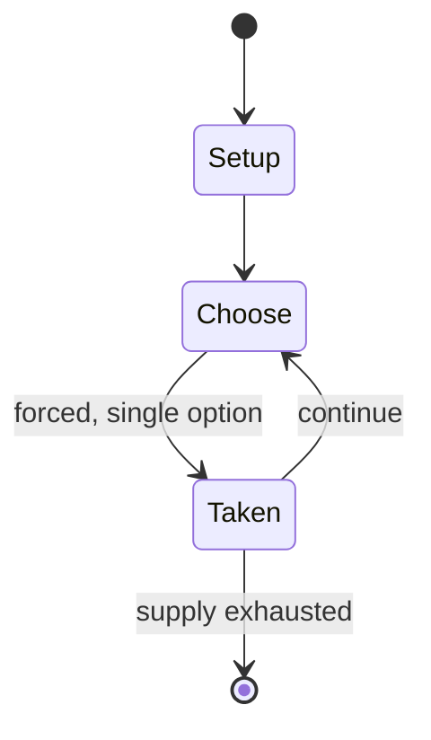

# Exeter Book Riddle 47

*Old English riddle*

`exeter_book_riddle_47` &nbsp; state: **DEEPENED** &nbsp; method: **heuristic**

## Found layer (recorded, not trusted)

| field | value |
| --- | --- |
| wikidata | Q28224617 |
| wikipedia | Exeter Book Riddle 47 |
| genres (source) | -- |
| instance of (source) | riddle |
| country of origin | -- |

## Declared layer (orders bench work)

| field | value |
| --- | --- |
| year created | -- |
| epoch | -- |
| region | -- |
| media | PUZZLE |
| players | -- |
| age band | -- |
| exogenous process | -- |
| loss shape | -- |
| live axes | - |
| horizon | -- |
| scoring shape | -- |
| information | -- |
| interaction | -- |
| turn structure | -- |
| tractability | SAMPLING_ONLY |
| randomness | -- |
| luck factor | 0.35 |
| rules complexity | 1.64 |
| strategic depth | 2.0 |
| novelty | 0.0876 |
| solved status | -- |
| strategies | -- |
| algorithms | -- |

## Object model

```
Episode
  players      : ?
  turn_structure: ?
  horizon       : ?
  scoring       : ?

Configuration  -- the arrangement to be resolved
Constraint     -- predicate a legal configuration must satisfy
```

## State transition diagram



## Research item -- turn trace

```
# Exeter Book Riddle 47 -- simulated turn events
# generated from the DECLARED vector, not from a rulebook.
# structure: exo=None loss=None horizon=None scoring=None axes=-

t=0    SETUP        players=2  pot=0  capacity=4
t=1    FORCED       p1 single legal option taken (pot_gain=+1.5)
t=2    FORCED       p1 single legal option taken (pot_gain=+1.2)
t=3    ENDTURN      turn passes to p2
t=4    FORCED       p2 single legal option taken (pot_gain=+0.8)
t=5    ENDTURN      turn passes to p1
t=6    FORCED       p1 single legal option taken (pot_gain=+0.8)
t=7    FORCED       p1 single legal option taken (pot_gain=+1.7)
t=8    FORCED       p1 single legal option taken (pot_gain=+0.5)
t=9    FORCED       p1 single legal option taken (pot_gain=+1.6)
t=10   ENDTURN      turn passes to p2
t=11   FORCED       p2 single legal option taken (pot_gain=+1.8)
t=12   FORCED       p2 single legal option taken (pot_gain=+0.7)
t=13   ENDTURN      turn passes to p1
t=14   FORCED       p1 single legal option taken (pot_gain=+0.7)
t=15   FORCED       p1 single legal option taken (pot_gain=+1.7)
t=16   ENDTURN      turn passes to p2
t=17   FORCED       p2 single legal option taken (pot_gain=+0.7)
t=18   FORCED       p2 single legal option taken (pot_gain=+1.9)
t=19   ENDTURN      turn passes to p1
t=20   FORCED       p1 single legal option taken (pot_gain=+1.1)
t=21   FORCED       p1 single legal option taken (pot_gain=+0.5)
t=22   FORCED       p1 single legal option taken (pot_gain=+0.8)
t=23   ENDTURN      turn passes to p2
t=24   FORCED       p2 single legal option taken (pot_gain=+1.5)
t=25   FORCED       p2 single legal option taken (pot_gain=+1.1)
t=26   FORCED       p2 single legal option taken (pot_gain=+1.1)

terminal: VARIABLE
```

## Source extract

Exeter Book Riddle 47 (according to the numbering of the Anglo-Saxon Poetic Records) is one of
the most famous of the Old English riddles found in the later tenth-century Exeter Book. Its
solution is 'book-worm' or 'moth'.   == Text ==   == Glossary ==   == Interpretation == The
extensive commentary on this riddle is concisely summarised by Cavell, and more fully by Foys.
== Editions == Krapp, George Philip and Elliott Van Kirk Dobbie (eds), The Exeter Book, The
Anglo-Saxon Poetic Records, 3 (New York: Columbia University Press, 1936), p. 236. Williamson,
Craig (ed.), The Old English Riddles of the Exeter Book (Chapel Hill: University of North
Carolina Press, 1977). Muir, Bernard J. (ed.), The Exeter Anthology of Old English Poetry: An
Edition of Exeter Dean and Chapter MS 3501, 2nd edn, 2 vols (Exeter: Exeter University Press,
2000). Foys, Martin et al. (eds.) Old English Poetry in Facsimile Project, (Madison, WI: Center
for the History of Print and Digital Culture, 2019-). Online edition annotated and linked to
digital facsimile, with a modern translation.   === Recordings === Michael D. C. Drout, 'Riddle
47', performed from the Anglo-Saxon Poetic Records edition (29 October 20

<sub>Wikipedia, CC BY-SA. Retained as evidence for the structural
classification above. Every rule inferred from it is HYPOTHESIZED
until audited against a rulebook.</sub>
