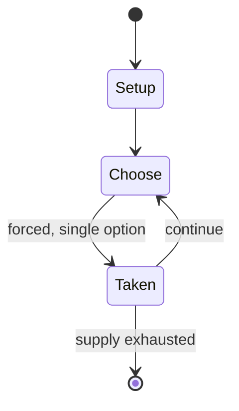

# Exeter Book Riddle 60

*Old English riddle*

`exeter_book_riddle_60` &nbsp; state: **DEEPENED** &nbsp; method: **heuristic**

## Found layer (recorded, not trusted)

| field | value |
| --- | --- |
| wikidata | Q28401644 |
| wikipedia | Exeter Book Riddle 60 |
| genres (source) | -- |
| instance of (source) | riddle |
| country of origin | -- |

## Declared layer (orders bench work)

| field | value |
| --- | --- |
| year created | -- |
| epoch | -- |
| region | -- |
| media | PUZZLE |
| players | -- |
| age band | -- |
| exogenous process | -- |
| loss shape | -- |
| live axes | - |
| horizon | -- |
| scoring shape | -- |
| information | -- |
| interaction | -- |
| turn structure | -- |
| tractability | SAMPLING_ONLY |
| randomness | -- |
| luck factor | 0.35 |
| rules complexity | 1.72 |
| strategic depth | 2.0 |
| novelty | 0.0876 |
| solved status | -- |
| strategies | -- |
| algorithms | -- |

## Object model

```
Episode
  players      : ?
  turn_structure: ?
  horizon       : ?
  scoring       : ?

Configuration  -- the arrangement to be resolved
Constraint     -- predicate a legal configuration must satisfy
```

## State transition diagram



## Research item -- turn trace

```
# Exeter Book Riddle 60 -- simulated turn events
# generated from the DECLARED vector, not from a rulebook.
# structure: exo=None loss=None horizon=None scoring=None axes=-

t=0    SETUP        players=2  pot=0  capacity=7
t=1    FORCED       p1 single legal option taken (pot_gain=+1.8)
t=2    FORCED       p1 single legal option taken (pot_gain=+1.3)
t=3    FORCED       p1 single legal option taken (pot_gain=+1.3)
t=4    ENDTURN      turn passes to p2
t=5    FORCED       p2 single legal option taken (pot_gain=+0.5)
t=6    ENDTURN      turn passes to p1
t=7    FORCED       p1 single legal option taken (pot_gain=+0.8)
t=8    FORCED       p1 single legal option taken (pot_gain=+1.2)
t=9    FORCED       p1 single legal option taken (pot_gain=+0.8)
t=10   FORCED       p1 single legal option taken (pot_gain=+1.8)
t=11   FORCED       p1 single legal option taken (pot_gain=+0.5)
t=12   ENDTURN      turn passes to p2
t=13   FORCED       p2 single legal option taken (pot_gain=+1.7)
t=14   FORCED       p2 single legal option taken (pot_gain=+1.3)
t=15   FORCED       p2 single legal option taken (pot_gain=+0.9)
t=16   FORCED       p2 single legal option taken (pot_gain=+1.1)
t=17   FORCED       p2 single legal option taken (pot_gain=+1.2)
t=18   FORCED       p2 single legal option taken (pot_gain=+1.4)
t=19   FORCED       p2 single legal option taken (pot_gain=+0.8)
t=20   ENDTURN      turn passes to p1
t=21   FORCED       p1 single legal option taken (pot_gain=+2.0)
t=22   FORCED       p1 single legal option taken (pot_gain=+1.6)
t=23   ENDTURN      turn passes to p2
t=24   FORCED       p2 single legal option taken (pot_gain=+1.5)
t=25   FORCED       p2 single legal option taken (pot_gain=+1.4)
t=26   FORCED       p2 single legal option taken (pot_gain=+0.5)
t=27   ENDTURN      turn passes to p1

terminal: VARIABLE
```

## Source extract

Exeter Book Riddle 60 (according to the numbering of the Anglo-Saxon Poetic Records) is one of
the Old English riddles found in the later tenth-century Exeter Book. The riddle is usually
solved as 'reed pen', although such pens were not in use in Anglo-Saxon times, rather being
Roman technology; but it can also be understood as 'reed pipe'.   == Text == As edited by Krapp
and Dobbie in the Anglo-Saxon Poetic Records series, Riddle 60 runs:  There has been some debate
as to whether Riddle 60 is a text in its own right: it is followed by the poem The Husband's
Message and has been read as the opening to that. Most scholars agree, however, that the two
texts are separate.   == Sources == The text is usually thought to have been inspired by the
second riddle in Symphosius's collection, whose answer is 'harundo' ('reed'). The same riddle
also occurs in the Latin romance of Apollonius of Tyre:   == Interpretation == Riddle 60 is
generally read alongside other Anglo-Saxon riddles about writing implements, as giving an
insight into Anglo-Saxon attitudes to the craft of writing generally. However, it also provides
interesting links to the language and style of the so-called Old English eleg

<sub>Wikipedia, CC BY-SA. Retained as evidence for the structural
classification above. Every rule inferred from it is HYPOTHESIZED
until audited against a rulebook.</sub>
