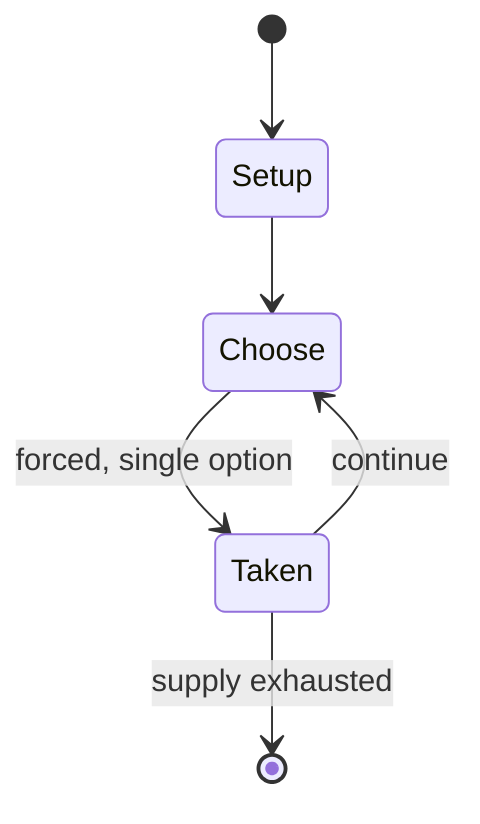

# Exeter Book Riddle 83

*one of the Old English riddles found in the later tenth-century Exeter Book*

`exeter_book_riddle_83` &nbsp; state: **DEEPENED** &nbsp; method: **heuristic**

## Found layer (recorded, not trusted)

| field | value |
| --- | --- |
| wikidata | Q25350631 |
| wikipedia | Exeter Book Riddle 83 |
| genres (source) | -- |
| instance of (source) | riddle |
| country of origin | -- |

## Declared layer (orders bench work)

| field | value |
| --- | --- |
| year created | -- |
| epoch | -- |
| region | -- |
| media | PUZZLE |
| players | -- |
| age band | -- |
| exogenous process | -- |
| loss shape | -- |
| live axes | - |
| horizon | -- |
| scoring shape | -- |
| information | -- |
| interaction | -- |
| turn structure | -- |
| tractability | SAMPLING_ONLY |
| randomness | -- |
| luck factor | 0.35 |
| rules complexity | 1.67 |
| strategic depth | 2.0 |
| novelty | 0.0876 |
| solved status | -- |
| strategies | -- |
| algorithms | -- |

## Object model

```
Episode
  players      : ?
  turn_structure: ?
  horizon       : ?
  scoring       : ?

Configuration  -- the arrangement to be resolved
Constraint     -- predicate a legal configuration must satisfy
```

## State transition diagram



## Research item -- turn trace

```
# Exeter Book Riddle 83 -- simulated turn events
# generated from the DECLARED vector, not from a rulebook.
# structure: exo=None loss=None horizon=None scoring=None axes=-

t=0    SETUP        players=2  pot=0  capacity=8
t=1    FORCED       p1 single legal option taken (pot_gain=+1.5)
t=2    FORCED       p1 single legal option taken (pot_gain=+0.6)
t=3    ENDTURN      turn passes to p2
t=4    FORCED       p2 single legal option taken (pot_gain=+1.8)
t=5    FORCED       p2 single legal option taken (pot_gain=+1.4)
t=6    FORCED       p2 single legal option taken (pot_gain=+2.0)
t=7    FORCED       p2 single legal option taken (pot_gain=+1.9)
t=8    FORCED       p2 single legal option taken (pot_gain=+1.6)
t=9    FORCED       p2 single legal option taken (pot_gain=+1.2)
t=10   ENDTURN      turn passes to p1
t=11   FORCED       p1 single legal option taken (pot_gain=+1.7)
t=12   FORCED       p1 single legal option taken (pot_gain=+1.2)
t=13   FORCED       p1 single legal option taken (pot_gain=+0.6)
t=14   ENDTURN      turn passes to p2
t=15   FORCED       p2 single legal option taken (pot_gain=+0.9)
t=16   ENDTURN      turn passes to p1
t=17   FORCED       p1 single legal option taken (pot_gain=+1.8)
t=18   FORCED       p1 single legal option taken (pot_gain=+1.2)
t=19   FORCED       p1 single legal option taken (pot_gain=+1.0)
t=20   FORCED       p1 single legal option taken (pot_gain=+1.5)
t=21   FORCED       p1 single legal option taken (pot_gain=+1.1)
t=22   FORCED       p1 single legal option taken (pot_gain=+1.0)
t=23   FORCED       p1 single legal option taken (pot_gain=+1.9)
t=24   ENDTURN      turn passes to p2
t=25   FORCED       p2 single legal option taken (pot_gain=+1.6)
t=26   FORCED       p2 single legal option taken (pot_gain=+1.5)
t=27   ENDTURN      turn passes to p1

terminal: VARIABLE
```

## Source extract

Exeter Book Riddle 83 (according to the numbering of the Anglo-Saxon Poetic Records) is one of
the Old English riddles found in the later tenth-century Exeter Book. Its interpretation has
occasioned a range of scholarly investigations, but it is taken to mean 'Ore/Gold/Metal', with
most commentators preferring 'precious metal' or 'gold', and John D. Niles arguing specifically
for the Old English solution ōra, meaning both 'ore' and 'a kind of silver coin'.   == Text and
translation == As edited by Williamson, the riddle reads:   == Interpretation == Interpretation
has focused on whether the riddle alludes to biblical figures, prominently Tubal-cain, though
allusions to fallen angels have also been envisaged.   == Analogues == The principal analogue
noted in past work is Riddle 91 in the collection by Symphosius on 'money':   == Editions ==
Krapp, George Philip and Elliott Van Kirk Dobbie (eds), The Exeter Book, The Anglo-Saxon Poetic
Records, 3 (New York: Columbia University Press, 1936), p. 236,
https://web.archive.org/web/20181206091232/http://ota.ox.ac.uk/desc/3009. Williamson, Craig
(ed.), The Old English Riddles of the Exeter Book (Chapel Hill: University of North Carolina Pre

<sub>Wikipedia, CC BY-SA. Retained as evidence for the structural
classification above. Every rule inferred from it is HYPOTHESIZED
until audited against a rulebook.</sub>
