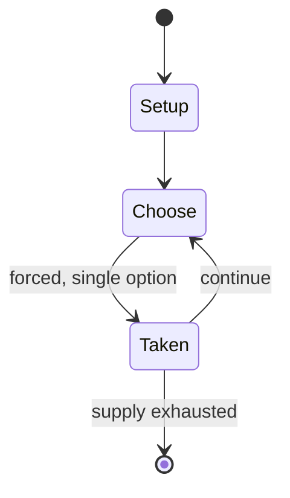

# Exeter Book Riddles 68 and 69

*Old English riddles found in the later tenth-century Exeter Book*

`exeter_book_riddles_68_and_69` &nbsp; state: **DEEPENED** &nbsp; method: **heuristic**

## Found layer (recorded, not trusted)

| field | value |
| --- | --- |
| wikidata | Q26905426 |
| wikipedia | Exeter Book Riddles 68-69 |
| genres (source) | -- |
| instance of (source) | riddle |
| country of origin | -- |

## Declared layer (orders bench work)

| field | value |
| --- | --- |
| year created | -- |
| epoch | -- |
| region | -- |
| media | PUZZLE |
| players | -- |
| age band | -- |
| exogenous process | -- |
| loss shape | -- |
| live axes | - |
| horizon | -- |
| scoring shape | -- |
| information | -- |
| interaction | -- |
| turn structure | -- |
| tractability | SAMPLING_ONLY |
| randomness | -- |
| luck factor | 0.35 |
| rules complexity | 1.72 |
| strategic depth | 2.25 |
| novelty | 0.0876 |
| solved status | -- |
| strategies | signalling |
| algorithms | -- |

## Object model

```
Episode
  players      : ?
  turn_structure: ?
  horizon       : ?
  scoring       : ?

Configuration  -- the arrangement to be resolved
Constraint     -- predicate a legal configuration must satisfy
```

## State transition diagram



## Research item -- turn trace

```
# Exeter Book Riddles 68 and 69 -- simulated turn events
# generated from the DECLARED vector, not from a rulebook.
# structure: exo=None loss=None horizon=None scoring=None axes=-

t=0    SETUP        players=2  pot=0  capacity=6
t=1    FORCED       p1 single legal option taken (pot_gain=+0.8)
t=2    FORCED       p1 single legal option taken (pot_gain=+0.8)
t=3    FORCED       p1 single legal option taken (pot_gain=+1.1)
t=4    FORCED       p1 single legal option taken (pot_gain=+1.6)
t=5    ENDTURN      turn passes to p2
t=6    FORCED       p2 single legal option taken (pot_gain=+2.0)
t=7    ENDTURN      turn passes to p1
t=8    FORCED       p1 single legal option taken (pot_gain=+1.4)
t=9    FORCED       p1 single legal option taken (pot_gain=+0.9)
t=10   ENDTURN      turn passes to p2
t=11   FORCED       p2 single legal option taken (pot_gain=+1.2)
t=12   ENDTURN      turn passes to p1
t=13   FORCED       p1 single legal option taken (pot_gain=+1.6)
t=14   ENDTURN      turn passes to p2
t=15   FORCED       p2 single legal option taken (pot_gain=+1.5)
t=16   FORCED       p2 single legal option taken (pot_gain=+1.3)
t=17   FORCED       p2 single legal option taken (pot_gain=+1.5)
t=18   FORCED       p2 single legal option taken (pot_gain=+1.2)
t=19   FORCED       p2 single legal option taken (pot_gain=+1.7)
t=20   FORCED       p2 single legal option taken (pot_gain=+0.8)
t=21   FORCED       p2 single legal option taken (pot_gain=+2.0)
t=22   FORCED       p2 single legal option taken (pot_gain=+1.4)
t=23   ENDTURN      turn passes to p1
t=24   FORCED       p1 single legal option taken (pot_gain=+0.8)
t=25   FORCED       p1 single legal option taken (pot_gain=+1.7)
t=26   ENDTURN      turn passes to p2

terminal: VARIABLE
```

## Conditions

| kind | threshold | effect | trigger |
| --- | --- | --- | --- |
| BOUNDARY | -- | -- | However, since at least 1858, editors have discussed reading the riddles numbered by Krapp and Dobbie as 68 and 69 as one text. |

## Source extract

Exeter Book Riddles 68 and 69 (according to the numbering of the Anglo-Saxon Poetic Records) are
two (or arguably one) of the Old English riddles found in the later tenth-century Exeter Book.
Their interpretation has occasioned a range of scholarly investigations, but clearly has
something to do with ice and one or both of the riddles are likely indeed to have the solution
"ice".   == Text == As the image of Exeter Book folio 125v shows, Riddles 68 and 69 are clearly
presented in the manuscript as different texts. As edited by Krapp and Dobbie in the Anglo-Saxon
Poetic Records series, Riddle 68 runs  Meanwhile, in their edition, Riddle 69 is the shortest
text of the Exeter Book:  However, since at least 1858, editors have discussed reading the
riddles numbered by Krapp and Dobbie as 68 and 69 as one text. This is inconsistent with the
manuscript punctuation, but works well in terms of the otherwise observable conventions of Old
English riddles' form and helps to make sense of Riddle 68:  Twenty-first-century scholarship
has remained divided on this question, with recent commentators arguing both for reading 68 and
69 as discrete texts or as one text.   == Interpretation == Reading

<sub>Wikipedia, CC BY-SA. Retained as evidence for the structural
classification above. Every rule inferred from it is HYPOTHESIZED
until audited against a rulebook.</sub>
