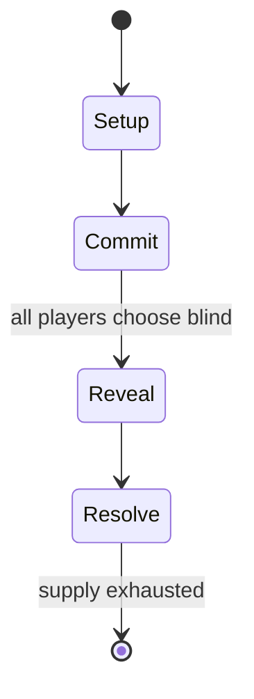

# Exorbitare

*1981 board game*

`exorbitare` &nbsp; state: **DEEPENED** &nbsp; method: **heuristic**

## Found layer (recorded, not trusted)

| field | value |
| --- | --- |
| wikidata | Q104881836 |
| wikipedia | Exorbitare |
| genres (source) | -- |
| instance of (source) | board game |
| country of origin | -- |

## Declared layer (orders bench work)

| field | value |
| --- | --- |
| year created | 1981 |
| epoch | DIGITAL |
| region | -- |
| media | BOARD, DICE |
| players | -- |
| age band | -- |
| exogenous process | IID |
| loss shape | -- |
| live axes | COMMIT_BLIND, SELECT |
| horizon | -- |
| scoring shape | SET_COLLECTION_CONVEX |
| information | SIMULTANEOUS |
| interaction | -- |
| turn structure | SIMULTANEOUS |
| tractability | EXACT_WITH_CUT |
| randomness | DICE |
| luck factor | 0.58 |
| rules complexity | 2.38 |
| strategic depth | 2.12 |
| novelty | 0.7881 |
| solved status | -- |
| strategies | set_collection |
| algorithms | -- |

## Object model

```
Episode
  players      : ?
  turn_structure: SIMULTANEOUS
  horizon       : ?
  scoring       : SET_COLLECTION_CONVEX

Board          -- spatial substrate; cells carry position and occupancy
Piece          -- movable token owned by a player
DicePool       -- n dice, each an iid categorical draw
Roll           -- realised outcome of a pool
SealedChoice   -- irrevocable choice made without observation
OptionSet      -- the choices available after an exogenous draw
```

## State transition diagram



## Research item -- turn trace

```
# Exorbitare -- simulated turn events
# generated from the DECLARED vector, not from a rulebook.
# structure: exo=IID loss=None horizon=None scoring=SET_COLLECTION_CONVEX axes=COMMIT_BLIND,SELECT

t=0    SETUP        players=2  pot=0  capacity=4
t=1    DRAW         p1 roll from d6 pool -> outcome #5  (p=0.251)
t=2    SELECT       p1 3 options; take #3  (pot_gain=+2.0, capacity=-2)
t=3    DRAW         p1 roll from d6 pool -> outcome #5  (p=0.141)
t=4    SELECT       p1 4 options; take #4  (pot_gain=+1.7, capacity=-2)
t=5    DRAW         p1 roll from d6 pool -> outcome #2  (p=0.024)
t=6    SELECT       p1 2 options; take #1  (pot_gain=+0.7, capacity=-2)
t=7    DRAW         p1 roll from d6 pool -> outcome #1  (p=0.284)
t=8    SELECT       p1 2 options; take #2  (pot_gain=+1.6, capacity=-1)
t=9    DRAW         p1 roll from d6 pool -> outcome #3  (p=0.193)
t=10   SELECT       p1 4 options; take #2  (pot_gain=+0.7, capacity=-2)
t=11   DRAW         p1 roll from d6 pool -> outcome #6  (p=0.055)
t=12   SELECT       p1 2 options; take #1  (pot_gain=+2.1, capacity=-2)
t=13   DRAW         p1 roll from d6 pool -> outcome #5  (p=0.141)
t=14   SELECT       p1 1 options; take #1  (pot_gain=+1.5, capacity=-1)
t=15   DRAW         p1 roll from d6 pool -> outcome #5  (p=0.231)
t=16   SELECT       p1 2 options; take #1  (pot_gain=+1.8, capacity=-2)
t=17   DRAW         p1 roll from d6 pool -> outcome #6  (p=0.178)
t=18   SELECT       p1 4 options; take #2  (pot_gain=+2.3, capacity=-2)
t=19   DRAW         p1 roll from d6 pool -> outcome #5  (p=0.008)
t=20   SELECT       p1 4 options; take #3  (pot_gain=+1.5, capacity=-0)
t=21   DRAW         p1 roll from d6 pool -> outcome #2  (p=0.083)
t=22   SELECT       p1 1 options; take #1  (pot_gain=+2.1, capacity=-1)
t=23   ENDTURN      turn passes to p2
t=24   DRAW         p2 roll from d6 pool -> outcome #2  (p=0.273)
t=25   SELECT       p2 4 options; take #3  (pot_gain=+2.6, capacity=-2)
t=26   DRAW         p2 roll from d6 pool -> outcome #4  (p=0.271)
t=27   SELECT       p2 4 options; take #3  (pot_gain=+0.8, capacity=-2)

terminal: VARIABLE
```

## Conditions

| kind | threshold | effect | trigger |
| --- | --- | --- | --- |
| WIN | -- | -- | To win the game, a player must achieve "Quantum Jump" by fulfilling two conditions simultaneously: |
| WIN | -- | -- | For the purposes of winning, this is the only time in the game when the player can choose to take the total of just one die or the other rather than the sum total of both dice, if doing so will win the game. |
| WIN | -- | -- | When these two conditions are fulfilled, the player with their counter on the Quantum Jump square wins immediately. |
| BOUNDARY | -- | -- | Once a player has at least one counter on the board, the player has the option of bringing another counter onto the board the next time the player rolls a 6. |

## Source extract

Exorbitare, also known as Quantum Jump, is an abstract board game published by Orca Games in
1981.   == Description ==  Exorbitare is an abstract family game for 2–6 players in which the
circular board represents the first 86 elements on the Periodic Table of the Elements from
hydrogen to radon, as well as an atom's various energy levels.    === Components === Circular
board with five concentric tracks Two 6-sided dice Gamebox with rules printed on the back cover
Six sets of coloured counters   === Gameplay === Players choose a colour and take a quantity of
counters based on the number of players: two players have 8 each, three players have 6 each,
four players have four each, and five or six players have two each. To start the game, players
place all of their counters in the centre of the board. They then take turns rolling the dice.
If a player rolls a 6, the player must move one counter onto the lowest energy track — the one
closest to the centre — and then move the counter the full amount of both dice. Every time a
player rolls a 6, the player rerolls one die and adds that number to movement. (If a player
rolls a 6 on both dice, the player re-rolls both dice and adds the total

<sub>Wikipedia, CC BY-SA. Retained as evidence for the structural
classification above. Every rule inferred from it is HYPOTHESIZED
until audited against a rulebook.</sub>
