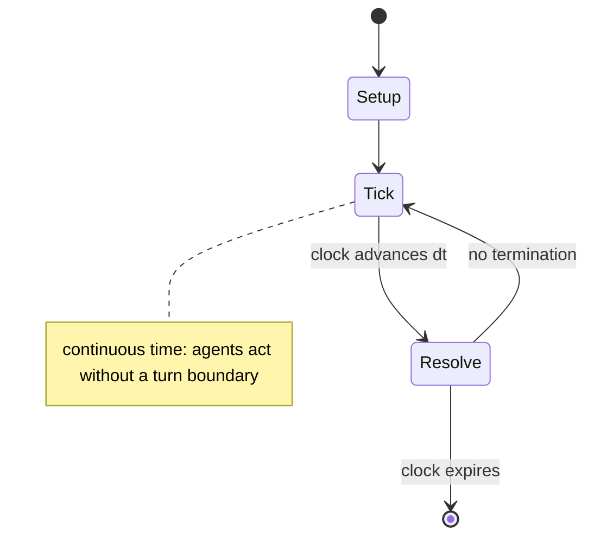

# Expensive Planetarium

*1962 video game*

`expensive_planetarium` &nbsp; state: **DEEPENED** &nbsp; method: **heuristic**

## Found layer (recorded, not trusted)

| field | value |
| --- | --- |
| wikidata | Q2079937 |
| wikipedia | Expensive Planetarium |
| genres (source) | simulation video game |
| instance of (source) | planetarium, video game |
| country of origin | -- |

## Declared layer (orders bench work)

| field | value |
| --- | --- |
| year created | 1971 |
| epoch | DIGITAL |
| region | -- |
| media | VIDEO |
| players | -- |
| age band | -- |
| exogenous process | CONTINUOUS_TIME |
| loss shape | -- |
| live axes | - |
| horizon | CLOCK_LIMITED |
| scoring shape | SURVIVAL |
| information | -- |
| interaction | SOLITAIRE |
| turn structure | REAL_TIME |
| tractability | SAMPLING_ONLY |
| randomness | REAL_TIME_PHYSICAL |
| luck factor | 0.35 |
| rules complexity | 2.02 |
| strategic depth | 2.25 |
| novelty | 0.398 |
| solved status | -- |
| strategies | probability_estimation |
| algorithms | -- |

## Object model

```
Episode
  players      : ?
  turn_structure: REAL_TIME
  horizon       : CLOCK_LIMITED
  scoring       : SURVIVAL

WorldState     -- simulation state advanced by the engine
Avatar         -- player-controlled agent
Clock          -- frame or tick counter
```

## State transition diagram



## Research item -- clock trace

```
# Expensive Planetarium -- simulated clock trace (no turn boundary)
# generated from the DECLARED vector, not from a rulebook.
# structure: exo=CONTINUOUS_TIME loss=None horizon=CLOCK_LIMITED scoring=SURVIVAL axes=-

clk=0.000s  START        agents=4  clock=counts down
clk=2.288s  ACTION       a1 acts continuously; no turn boundary crossed
clk=3.179s  STOPPAGE     clock halts; state frozen
clk=4.653s  STOPPAGE     clock halts; state frozen
clk=4.866s  ACTION       a4 acts continuously; no turn boundary crossed
clk=5.464s  SCORE        a2 scores (+2)
clk=6.721s  CONTEST      a2 and a3 contend for the same resource
clk=6.993s  ACTION       a1 acts continuously; no turn boundary crossed
clk=8.205s  SCORE        a1 scores (+3)
clk=9.152s  ACTION       a2 acts continuously; no turn boundary crossed
clk=11.858s  INFRACTION   a1 commits infraction (count=1)
clk=12.731s  SCORE        a1 scores (+1)
clk=14.613s  ACTION       a3 acts continuously; no turn boundary crossed
clk=16.732s  ACTION       a1 acts continuously; no turn boundary crossed
clk=18.737s  INFRACTION   a3 commits infraction (count=1)
clk=19.319s  SCORE        a3 scores (+1)
clk=21.748s  INFRACTION   a1 commits infraction (count=2)
clk=23.425s  ACTION       a1 acts continuously; no turn boundary crossed
clk=24.035s  ACTION       a2 acts continuously; no turn boundary crossed
clk=25.043s  CONTEST      a3 and a4 contend for the same resource
clk=27.197s  SCORE        a2 scores (+2)
clk=28.184s  ACTION       a3 acts continuously; no turn boundary crossed
clk=28.950s  ACTION       a3 acts continuously; no turn boundary crossed
clk=29.512s  SCORE        a3 scores (+2)
clk=31.567s  ACTION       a4 acts continuously; no turn boundary crossed
clk=32.004s  CONTEST      a2 and a3 contend for the same resource
clk=34.392s  CONTEST      a2 and a3 contend for the same resource

note: elapsed time, not move count, is the episode's ordering variable.
```

## Source extract

Spacewar! is a space combat video game developed in 1962 by Steve Russell in collaboration with
Martin Graetz, Wayne Wiitanen, Bob Saunders, Steve Piner, and others. It was written for the
newly installed DEC PDP-1 minicomputer at the Massachusetts Institute of Technology. It was
later expanded by other students and employees of universities in the area, including by Dan
Edwards and Peter Samson. It also spread to many of the few dozen installations of PDP-1s,
making it the first video game to be played at multiple computer installations. The game
features two spaceships, "the needle" and "the wedge", engaged in a dogfight while maneuvering
in the gravity well of a star. Both ships are controlled by human players. Each ship has limited
ammunition and fuel for maneuvering, and the ships remain in motion even when the player is not
accelerating. Flying near the star to provide a gravity assist is a common tactic. Ships are
destroyed when they collide with a torpedo, the star, or each other. At any time, the player can
engage a hyperspace feature to jump to a new and random location on the screen, though in some
versions each use has an increasing chance of destroying the ship instead

<sub>Wikipedia, CC BY-SA. Retained as evidence for the structural
classification above. Every rule inferred from it is HYPOTHESIZED
until audited against a rulebook.</sub>
