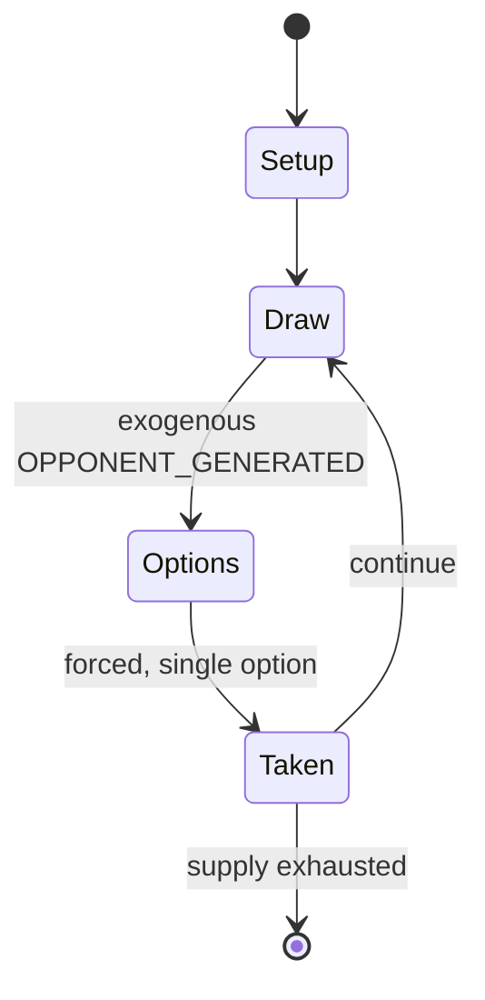

# F.A.T.A.L.

*fantasy tabletop role-playing game*

`f_a_t_a_l` &nbsp; state: **DEEPENED** &nbsp; method: **heuristic**

## Found layer (recorded, not trusted)

| field | value |
| --- | --- |
| wikidata | Q104854054 |
| wikipedia | F.A.T.A.L. |
| genres (source) | tabletop role-playing game |
| instance of (source) | tabletop role-playing game |
| country of origin | United States |

## Declared layer (orders bench work)

| field | value |
| --- | --- |
| year created | 2002 |
| epoch | CONTEMPORARY |
| region | NORTH_AMERICA |
| media | RPG |
| players | -- |
| age band | -- |
| exogenous process | OPPONENT_GENERATED |
| loss shape | -- |
| live axes | - |
| horizon | -- |
| scoring shape | SURVIVAL |
| information | -- |
| interaction | -- |
| turn structure | -- |
| tractability | SAMPLING_ONLY |
| randomness | DICE |
| luck factor | 0.58 |
| rules complexity | 3.19 |
| strategic depth | 2.12 |
| novelty | 0.6662 |
| solved status | -- |
| strategies | area_control |
| algorithms | -- |

## Object model

```
Episode
  players      : ?
  turn_structure: ?
  horizon       : ?
  scoring       : SURVIVAL

Character      -- persistent stat block owned by a player
GameMaster     -- adjudicating agent outside the scoring loop
Scenario       -- authored state the players traverse
```

## State transition diagram



## Research item -- turn trace

```
# F.A.T.A.L. -- simulated turn events
# generated from the DECLARED vector, not from a rulebook.
# structure: exo=OPPONENT_GENERATED loss=None horizon=None scoring=SURVIVAL axes=-

t=0    SETUP        players=2  pot=0  capacity=8
t=1    DRAW         p1 observe from opponent move -> outcome #6  (p=0.300)
t=2    FORCED       p1 single legal option taken (pot_gain=+1.6)
t=3    DRAW         p1 observe from opponent move -> outcome #4  (p=0.072)
t=4    FORCED       p1 single legal option taken (pot_gain=+1.5)
t=5    ENDTURN      turn passes to p2
t=6    DRAW         p2 observe from opponent move -> outcome #6  (p=0.212)
t=7    FORCED       p2 single legal option taken (pot_gain=+1.0)
t=8    DRAW         p2 observe from opponent move -> outcome #4  (p=0.040)
t=9    FORCED       p2 single legal option taken (pot_gain=+1.5)
t=10   DRAW         p2 observe from opponent move -> outcome #3  (p=0.071)
t=11   FORCED       p2 single legal option taken (pot_gain=+0.7)
t=12   ENDTURN      turn passes to p1
t=13   DRAW         p1 observe from opponent move -> outcome #6  (p=0.280)
t=14   FORCED       p1 single legal option taken (pot_gain=+0.7)
t=15   DRAW         p1 observe from opponent move -> outcome #4  (p=0.256)
t=16   FORCED       p1 single legal option taken (pot_gain=+1.8)
t=17   ENDTURN      turn passes to p2
t=18   DRAW         p2 observe from opponent move -> outcome #5  (p=0.085)
t=19   FORCED       p2 single legal option taken (pot_gain=+0.9)
t=20   DRAW         p2 observe from opponent move -> outcome #5  (p=0.158)
t=21   FORCED       p2 single legal option taken (pot_gain=+1.3)
t=22   DRAW         p2 observe from opponent move -> outcome #1  (p=0.010)
t=23   FORCED       p2 single legal option taken (pot_gain=+1.7)
t=24   DRAW         p2 observe from opponent move -> outcome #2  (p=0.128)
t=25   FORCED       p2 single legal option taken (pot_gain=+0.7)
t=26   DRAW         p2 observe from opponent move -> outcome #2  (p=0.077)
t=27   FORCED       p2 single legal option taken (pot_gain=+0.6)

terminal: VARIABLE
```

## Conditions

| kind | threshold | effect | trigger |
| --- | --- | --- | --- |
| BOUNDARY | -- | -- | For instance, in the first edition, Average Speech Rate and Maximum Speech Rate are unrelated, meaning the former can be higher than the latter. |
| PENALTY | -- | -- | Female characters are unable to enter many character classes, particularly those related to combat or spellcasting; they also receive significant penalties to most physical and intellectual attributes. |

## Source extract

F.A.T.A.L., an acronym of Fantasy Adventure to Adult Lechery (first edition) or From Another
Time Another Land (second edition), is a dark fantasy tabletop role-playing game first published
in 2002 by Fatal Games. F.A.T.A.L. is known for its graphic violent and sexual content, as well
as the complexity of the underlying game system, involving higher-level mathematics and an
unusual amount of randomization in character development. It acquired a strongly negative
reputation in the tabletop roleplaying community, being universally panned and described as one
of the most controversial games ever released. It is particularly known as the subject of a 2003
review published on RPGnet by Darren MacLennan and Jason Sartin, which described it as "the
Necronomicon of role-playing games", "fundamentally broken in its attitude towards sexuality",
and characterized by "bitter misogyny".   == System == F.A.T.A.L. has a simulationist system
with an unusual level of complexity, especially regarding sexual violence and bodily
characteristics. Character creation involves twenty separate attributes, none of which correlate
with one another even when they might be intuitively assumed to be related. Fo

<sub>Wikipedia, CC BY-SA. Retained as evidence for the structural
classification above. Every rule inferred from it is HYPOTHESIZED
until audited against a rulebook.</sub>
