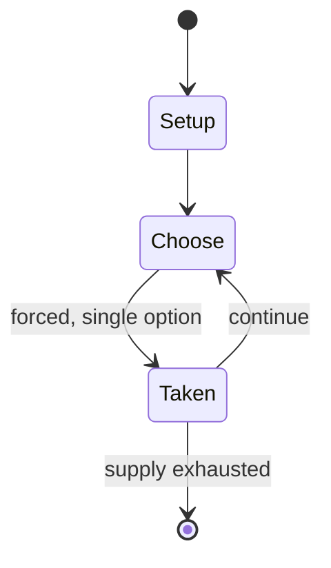

# Face Turning Octahedron

*mechanical puzzles*

`face_turning_octahedron` &nbsp; state: **DEEPENED** &nbsp; method: **heuristic**

## Found layer (recorded, not trusted)

| field | value |
| --- | --- |
| wikidata | Q133885485 |
| wikipedia | Face Turning Octahedron |
| genres (source) | -- |
| instance of (source) | abstract strategy game |
| country of origin | -- |

## Declared layer (orders bench work)

| field | value |
| --- | --- |
| year created | -- |
| epoch | -- |
| region | -- |
| media | PUZZLE |
| players | 1 |
| age band | -- |
| exogenous process | -- |
| loss shape | -- |
| live axes | - |
| horizon | -- |
| scoring shape | SET_COLLECTION_CONVEX |
| information | -- |
| interaction | -- |
| turn structure | -- |
| tractability | SAMPLING_ONLY |
| randomness | -- |
| luck factor | 0.35 |
| rules complexity | 1.73 |
| strategic depth | 2.25 |
| novelty | 0.4166 |
| solved status | -- |
| strategies | set_collection |
| algorithms | -- |

## Object model

```
Episode
  players      : 1
  turn_structure: ?
  horizon       : ?
  scoring       : SET_COLLECTION_CONVEX

Configuration  -- the arrangement to be resolved
Constraint     -- predicate a legal configuration must satisfy
```

## State transition diagram



## Research item -- turn trace

```
# Face Turning Octahedron -- simulated turn events
# generated from the DECLARED vector, not from a rulebook.
# structure: exo=None loss=None horizon=None scoring=SET_COLLECTION_CONVEX axes=-

t=0    SETUP        players=1  pot=0  capacity=7
t=1    FORCED       p1 single legal option taken (pot_gain=+1.6)
t=2    FORCED       p1 single legal option taken (pot_gain=+1.1)
t=3    ENDTURN      turn passes to p1
t=4    FORCED       p1 single legal option taken (pot_gain=+1.5)
t=5    FORCED       p1 single legal option taken (pot_gain=+1.7)
t=6    FORCED       p1 single legal option taken (pot_gain=+1.4)
t=7    ENDTURN      turn passes to p1
t=8    FORCED       p1 single legal option taken (pot_gain=+1.0)
t=9    FORCED       p1 single legal option taken (pot_gain=+1.8)
t=10   ENDTURN      turn passes to p1
t=11   FORCED       p1 single legal option taken (pot_gain=+1.7)
t=12   ENDTURN      turn passes to p1
t=13   FORCED       p1 single legal option taken (pot_gain=+1.4)
t=14   FORCED       p1 single legal option taken (pot_gain=+1.4)
t=15   ENDTURN      turn passes to p1
t=16   FORCED       p1 single legal option taken (pot_gain=+0.5)
t=17   FORCED       p1 single legal option taken (pot_gain=+0.7)
t=18   FORCED       p1 single legal option taken (pot_gain=+1.9)
t=19   FORCED       p1 single legal option taken (pot_gain=+0.6)
t=20   FORCED       p1 single legal option taken (pot_gain=+1.8)
t=21   ENDTURN      turn passes to p1
t=22   FORCED       p1 single legal option taken (pot_gain=+0.9)
t=23   ENDTURN      turn passes to p1
t=24   FORCED       p1 single legal option taken (pot_gain=+1.6)
t=25   FORCED       p1 single legal option taken (pot_gain=+0.5)
t=26   FORCED       p1 single legal option taken (pot_gain=+1.9)
t=27   ENDTURN      turn passes to p1

terminal: VARIABLE
```

## Source extract

The Face Turning Octahedron (or Face-Turning Octahedron, often abbreviated as FTO) is a
combination and mechanical puzzle. Unlike cubic puzzles, the FTO is based on an octahedral
geometry with eight triangular faces that rotate independently.   == History == The idea of the
FTO began in the early 1980s, shortly after the success of the Rubik's Cube. The earliest
recorded idea came from Ernő Rubik, the creator of the Rubik's Cube. He expressed interest in
the development of an FTO. Rubik envisioned a version of the puzzle that incorporated only
corners and centers, and Rubik filed a patent in Hungary on October 3, 1980 with an
international patent being filed on February 9, 1981. The concept for the FTO was further
established through a series of patent filings by different people. On February 9, 1982,
Clarence W. Hewlett Jr. filed the first patent for an FTO in the United States, and just two
weeks later, on February 24, 1982, Karl Rohrbach filed a similar patent in Germany. However,
neither patent led to a commercial product which left the concept theoretical for years. On
September 15, 1997, Xie Zongliang (謝宗良) from Taiwan applied for a patent for the FTO. According
to a report,

<sub>Wikipedia, CC BY-SA. Retained as evidence for the structural
classification above. Every rule inferred from it is HYPOTHESIZED
until audited against a rulebook.</sub>
