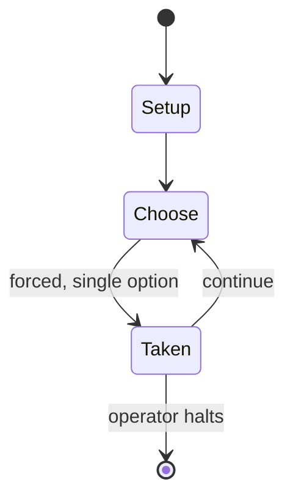

# Fading Suns

*tabletop role-playing game*

`fading_suns` &nbsp; state: **DEEPENED** &nbsp; method: **heuristic**

## Found layer (recorded, not trusted)

| field | value |
| --- | --- |
| wikidata | Q1034734 |
| wikipedia | Fading Suns |
| genres (source) | tabletop role-playing game |
| instance of (source) | tabletop role-playing game |
| country of origin | United States |

## Declared layer (orders bench work)

| field | value |
| --- | --- |
| year created | 1997 |
| epoch | DIGITAL |
| region | NORTH_AMERICA |
| media | RPG |
| players | -- |
| age band | -- |
| exogenous process | -- |
| loss shape | -- |
| live axes | - |
| horizon | OPEN_ENDED |
| scoring shape | -- |
| information | -- |
| interaction | TRAITOR |
| turn structure | -- |
| tractability | SAMPLING_ONLY |
| randomness | HIDDEN_INFO |
| luck factor | 0.35 |
| rules complexity | 4.04 |
| strategic depth | 2.0 |
| novelty | 0.6311 |
| solved status | -- |
| strategies | -- |
| algorithms | -- |

## Object model

```
Episode
  players      : ?
  turn_structure: ?
  horizon       : OPEN_ENDED
  scoring       : ?

Character      -- persistent stat block owned by a player
GameMaster     -- adjudicating agent outside the scoring loop
Scenario       -- authored state the players traverse
```

## State transition diagram



## Research item -- turn trace

```
# Fading Suns -- simulated turn events
# generated from the DECLARED vector, not from a rulebook.
# structure: exo=None loss=None horizon=OPEN_ENDED scoring=None axes=-

t=0    SETUP        players=2  pot=0  capacity=5
t=1    FORCED       p1 single legal option taken (pot_gain=+0.6)
t=2    ENDTURN      turn passes to p2
t=3    FORCED       p2 single legal option taken (pot_gain=+1.7)
t=4    FORCED       p2 single legal option taken (pot_gain=+1.7)
t=5    FORCED       p2 single legal option taken (pot_gain=+2.0)
t=6    FORCED       p2 single legal option taken (pot_gain=+1.1)
t=7    ENDTURN      turn passes to p1
t=8    FORCED       p1 single legal option taken (pot_gain=+1.0)
t=9    FORCED       p1 single legal option taken (pot_gain=+1.8)
t=10   FORCED       p1 single legal option taken (pot_gain=+0.8)
t=11   ENDTURN      turn passes to p2
t=12   FORCED       p2 single legal option taken (pot_gain=+0.7)
t=13   ENDTURN      turn passes to p1
t=14   FORCED       p1 single legal option taken (pot_gain=+1.7)
t=15   FORCED       p1 single legal option taken (pot_gain=+0.6)
t=16   FORCED       p1 single legal option taken (pot_gain=+1.9)
t=17   FORCED       p1 single legal option taken (pot_gain=+1.5)
t=18   ENDTURN      turn passes to p2
t=19   FORCED       p2 single legal option taken (pot_gain=+0.5)
t=20   FORCED       p2 single legal option taken (pot_gain=+1.2)
t=21   FORCED       p2 single legal option taken (pot_gain=+0.7)
t=22   ENDTURN      turn passes to p1
t=23   FORCED       p1 single legal option taken (pot_gain=+0.8)
t=24   FORCED       p1 single legal option taken (pot_gain=+1.5)
t=25   FORCED       p1 single legal option taken (pot_gain=+1.3)
t=26   FORCED       p1 single legal option taken (pot_gain=+1.2)
t=27   ENDTURN      turn passes to p2

terminal: OPEN_ENDED
```

## Source extract

Fading Suns is a science fiction space opera role-playing game introduced in 1997. It is
published by Ulisses Spiele and previously until 2016 by Holistic Design. The setting also
features in a PC game (Emperor of the Fading Suns), a live action role-playing game (Passion
Play), and a space combat miniature game (Noble Armada).   == History == After their success
with computer game Machiavelli the Prince, Holistic Design looked to try something new - a space
strategy computer game, which ultimately became Emperor of the Fading Suns (1996). Holistic
commissioned Andrew Greenberg and Bill Bridges to use their world building experience to create
a universe for the game, which would also be used as the setting for a tabletop role-playing
game to be released simultaneously. Greenberg and Bridges had previously helped define the style
of White Wolf Publishing's World of Darkness and, according to Shannon Appelcline, people
noticed this game's similarity to the "White Wolf style". Appelcline comments further: "Fading
Suns is unique mainly for its distinctive setting. It is a hard science-fiction game, but much
of the universe has fallen back to Medieval technology: noble houses, guilds an

<sub>Wikipedia, CC BY-SA. Retained as evidence for the structural
classification above. Every rule inferred from it is HYPOTHESIZED
until audited against a rulebook.</sub>
