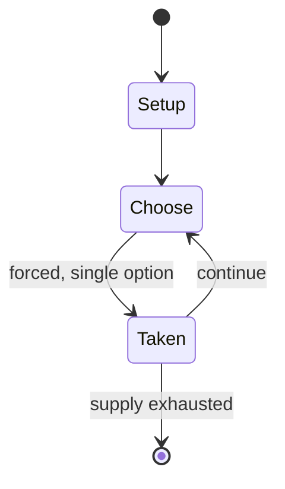

# Falcon's Eye

*2000 video game*

`falcon_s_eye` &nbsp; state: **DEEPENED** &nbsp; method: **heuristic**

## Found layer (recorded, not trusted)

| field | value |
| --- | --- |
| wikidata | Q1861413 |
| wikipedia | Falcon's Eye |
| genres (source) | roguelike |
| instance of (source) | free software, tile-based video game, video game |
| country of origin | -- |

## Declared layer (orders bench work)

| field | value |
| --- | --- |
| year created | 1999 |
| epoch | DIGITAL |
| region | -- |
| media | VIDEO |
| players | -- |
| age band | -- |
| exogenous process | -- |
| loss shape | -- |
| live axes | - |
| horizon | -- |
| scoring shape | -- |
| information | -- |
| interaction | -- |
| turn structure | -- |
| tractability | SAMPLING_ONLY |
| randomness | -- |
| luck factor | 0.35 |
| rules complexity | 1.7 |
| strategic depth | 2.0 |
| novelty | 0.0914 |
| solved status | -- |
| strategies | -- |
| algorithms | -- |

## Object model

```
Episode
  players      : ?
  turn_structure: ?
  horizon       : ?
  scoring       : ?

WorldState     -- simulation state advanced by the engine
Avatar         -- player-controlled agent
Clock          -- frame or tick counter
```

## State transition diagram



## Research item -- turn trace

```
# Falcon's Eye -- simulated turn events
# generated from the DECLARED vector, not from a rulebook.
# structure: exo=None loss=None horizon=None scoring=None axes=-

t=0    SETUP        players=2  pot=0  capacity=8
t=1    FORCED       p1 single legal option taken (pot_gain=+1.6)
t=2    FORCED       p1 single legal option taken (pot_gain=+1.6)
t=3    FORCED       p1 single legal option taken (pot_gain=+0.9)
t=4    FORCED       p1 single legal option taken (pot_gain=+1.7)
t=5    ENDTURN      turn passes to p2
t=6    FORCED       p2 single legal option taken (pot_gain=+0.8)
t=7    ENDTURN      turn passes to p1
t=8    FORCED       p1 single legal option taken (pot_gain=+1.9)
t=9    FORCED       p1 single legal option taken (pot_gain=+1.7)
t=10   FORCED       p1 single legal option taken (pot_gain=+1.8)
t=11   FORCED       p1 single legal option taken (pot_gain=+1.9)
t=12   FORCED       p1 single legal option taken (pot_gain=+0.5)
t=13   ENDTURN      turn passes to p2
t=14   FORCED       p2 single legal option taken (pot_gain=+1.6)
t=15   ENDTURN      turn passes to p1
t=16   FORCED       p1 single legal option taken (pot_gain=+1.8)
t=17   FORCED       p1 single legal option taken (pot_gain=+1.2)
t=18   ENDTURN      turn passes to p2
t=19   FORCED       p2 single legal option taken (pot_gain=+1.0)
t=20   FORCED       p2 single legal option taken (pot_gain=+0.9)
t=21   ENDTURN      turn passes to p1
t=22   FORCED       p1 single legal option taken (pot_gain=+1.7)
t=23   ENDTURN      turn passes to p2
t=24   FORCED       p2 single legal option taken (pot_gain=+1.0)
t=25   FORCED       p2 single legal option taken (pot_gain=+1.9)
t=26   ENDTURN      turn passes to p1

terminal: VARIABLE
```

## Conditions

| kind | threshold | effect | trigger |
| --- | --- | --- | --- |
| BOUNDARY | -- | -- | In the interim, at least one unofficial update has appeared in the portage package management system. |

## Source extract

Falcon's Eye is a version of the roguelike video game NetHack which introduces isometric
graphics and mouse control. Falcon's Eye has been praised for improving NetHack's visuals and
audio to an almost commercial level and has been noted by Linux Journal as among the best free
games available. After development stalled in 2001, the game was continued as Vulture's Eye and
later Vulture for Nethack.   == Gameplay == The main change of Falcon's Eye over earlier Nethack
variants is a massive improved graphical representation: it switched from a text-based 80x25
terminal representation to a 3D isometric perspective graphical representation. The objects and
enemies in the game are no longer represented by minimalistic ASCII characters, but now have
actual graphical representations. Whilst adding some features, such as a path finding tool,
Falcon's Eye doesn't alter the NetHack gameplay. Peltonen says that this was to ensure that
future versions remain compatible with future releases of NetHack. Falcon's Eye provides a
context menu when a creature or item is right-clicked. Users can customize the interface by
configuring the keyboard commands or by adding sound effects.   == History ==

<sub>Wikipedia, CC BY-SA. Retained as evidence for the structural
classification above. Every rule inferred from it is HYPOTHESIZED
until audited against a rulebook.</sub>
