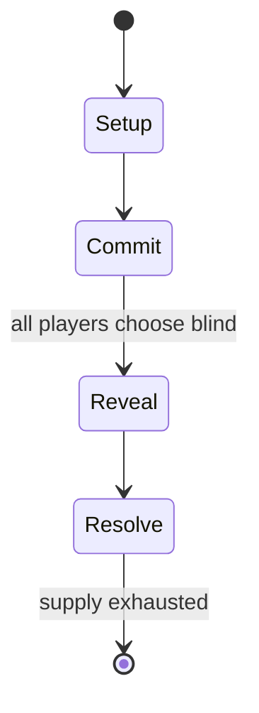

# Fanorona

`fanorona` &nbsp; state: **DEEPENED** &nbsp; method: **heuristic**

## Found layer (recorded, not trusted)

| field | value |
| --- | --- |
| wikidata | Q1395834 |
| wikipedia | Fanorona |
| genres (source) | -- |
| instance of (source) | -- |
| country of origin | -- |

## Declared layer (orders bench work)

| field | value |
| --- | --- |
| year created | -- |
| epoch | -- |
| region | -- |
| media | BOARD |
| players | 2 |
| age band | -- |
| exogenous process | NONE |
| loss shape | OPPORTUNITY_ONLY |
| live axes | ORDER, SELECT, SPATIAL |
| horizon | VARIABLE |
| scoring shape | -- |
| information | PERFECT |
| interaction | SOLITAIRE |
| turn structure | SIMULTANEOUS |
| tractability | SAMPLING_ONLY |
| randomness | SIMULTANEOUS_CHOICE |
| luck factor | 0.3 |
| rules complexity | 2.74 |
| strategic depth | 2.0 |
| novelty | 0.6384 |
| solved status | -- |
| strategies | -- |
| algorithms | alpha_beta |

## Object model

```
Episode
  players      : 2
  turn_structure: SIMULTANEOUS
  horizon       : VARIABLE
  scoring       : ?

Board          -- spatial substrate; cells carry position and occupancy
Piece          -- movable token owned by a player
Sequence       -- the permutation under the player's control
OptionSet      -- the choices available after an exogenous draw
Placement      -- position subject to geometric legality
```

## State transition diagram



## Research item -- turn trace

```
# Fanorona -- simulated turn events
# generated from the DECLARED vector, not from a rulebook.
# structure: exo=NONE loss=OPPORTUNITY_ONLY horizon=VARIABLE scoring=None axes=ORDER,SELECT,SPATIAL

t=0    SETUP        players=2  pot=0  capacity=8
t=1    SELECT       p1 4 options; take #3  (pot_gain=+3.4, capacity=-2)
t=2    ENDTURN      turn passes to p2
t=3    SELECT       p2 1 options; take #1  (pot_gain=+2.3, capacity=-1)
t=4    SPATIAL      p2 places at (2,2); adjacency legal
t=5    ENDTURN      turn passes to p1
t=6    SELECT       p1 4 options; take #2  (pot_gain=+2.4, capacity=-2)
t=7    SELECT       p1 2 options; take #1  (pot_gain=+0.6, capacity=-2)
t=8    ENDTURN      turn passes to p2
t=9    SELECT       p2 1 options; take #1  (pot_gain=+0.7, capacity=-0)
t=10   SPATIAL      p2 places at (0,7); adjacency legal
t=11   SELECT       p2 1 options; take #1  (pot_gain=+2.6, capacity=-2)
t=12   ENDTURN      turn passes to p1
t=13   SELECT       p1 2 options; take #1  (pot_gain=+3.0, capacity=-0)
t=14   SELECT       p1 4 options; take #2  (pot_gain=+3.1, capacity=-2)
t=15   SELECT       p1 3 options; take #1  (pot_gain=+1.7, capacity=-0)
t=16   SELECT       p1 1 options; take #1  (pot_gain=+2.4, capacity=-1)
t=17   SELECT       p1 1 options; take #1  (pot_gain=+2.0, capacity=-2)
t=18   SPATIAL      p1 places at (7,4); adjacency legal
t=19   SELECT       p1 4 options; take #2  (pot_gain=+0.9, capacity=-1)
t=20   ENDTURN      turn passes to p2
t=21   SELECT       p2 4 options; take #4  (pot_gain=+1.4, capacity=-1)
t=22   SPATIAL      p2 places at (0,4); adjacency legal
t=23   SELECT       p2 2 options; take #2  (pot_gain=+3.4, capacity=-1)
t=24   SPATIAL      p2 places at (7,7); adjacency legal
t=25   ENDTURN      turn passes to p1
t=26   SELECT       p1 3 options; take #2  (pot_gain=+3.0, capacity=-1)
t=27   SPATIAL      p1 places at (5,0); adjacency legal

terminal: VARIABLE
```

## Conditions

| kind | threshold | effect | trigger |
| --- | --- | --- | --- |
| TERMINATE | 1 player | -- | The game ends when one player captures all stones of the opponent. |

## Source extract

Fanorona (Malagasy pronunciation: [fə̥ˈnurnə̥]) is a strategy board game for two players. The
game is indigenous to Madagascar.   == Rules == Fanorona has three standard versions: Fanoron-
Telo, Fanoron-Dimy, and Fanoron-Sivy. The difference between these variants is the size of
board. Fanoron-Telo is played on a 3×3 board and the difficulty can be compared to the game of
Tic-tac-toe. Fanoron-Dimy is played on a 5×5 board and Fanoron-Sivy is played on a 9×5
board—Sivy being the most popular. The Sivy board consists of lines and intersections that
create a grid with 5 rows and 9 columns subdivided diagonally to form part of the tetrakis
square tiling of the plane. A line represents the path where a stone can move during the game.
There are weak and strong intersections. At a weak intersection, it is only possible to move a
stone horizontally and vertically, while on a strong intersection, it is also possible to move a
stone diagonally. A stone can only move from one intersection to an adjacent intersection. Black
and white pieces, twenty-two each, are arranged on all points except the center. The objective
of the game is to capture all the opponents pieces. The game is a draw if neit

<sub>Wikipedia, CC BY-SA. Retained as evidence for the structural
classification above. Every rule inferred from it is HYPOTHESIZED
until audited against a rulebook.</sub>
