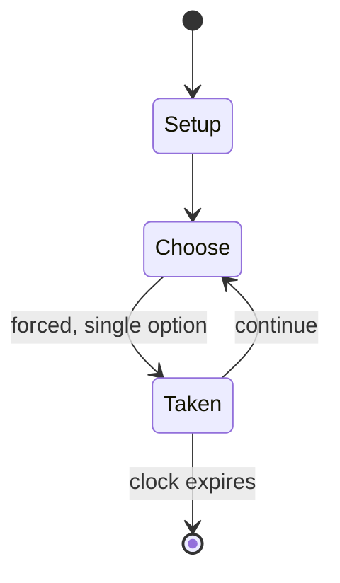

# Fantasy Zone

`fantasy_zone` &nbsp; state: **DEEPENED** &nbsp; method: **heuristic**

## Found layer (recorded, not trusted)

| field | value |
| --- | --- |
| wikidata | Q2962094 |
| wikipedia | Fantasy Zone |
| genres (source) | -- |
| instance of (source) | -- |
| country of origin | -- |

## Declared layer (orders bench work)

| field | value |
| --- | --- |
| year created | -- |
| epoch | -- |
| region | -- |
| media | VIDEO |
| players | -- |
| age band | -- |
| exogenous process | -- |
| loss shape | -- |
| live axes | - |
| horizon | CLOCK_LIMITED |
| scoring shape | -- |
| information | -- |
| interaction | -- |
| turn structure | -- |
| tractability | SAMPLING_ONLY |
| randomness | -- |
| luck factor | 0.35 |
| rules complexity | 1.81 |
| strategic depth | 2.0 |
| novelty | 0.5082 |
| solved status | -- |
| strategies | -- |
| algorithms | -- |

## Object model

```
Episode
  players      : ?
  turn_structure: ?
  horizon       : CLOCK_LIMITED
  scoring       : ?

WorldState     -- simulation state advanced by the engine
Avatar         -- player-controlled agent
Clock          -- frame or tick counter
```

## State transition diagram



## Research item -- turn trace

```
# Fantasy Zone -- simulated turn events
# generated from the DECLARED vector, not from a rulebook.
# structure: exo=None loss=None horizon=CLOCK_LIMITED scoring=None axes=-

t=0    SETUP        players=2  pot=0  capacity=5
t=1    FORCED       p1 single legal option taken (pot_gain=+1.1)
t=2    FORCED       p1 single legal option taken (pot_gain=+1.8)
t=3    FORCED       p1 single legal option taken (pot_gain=+0.6)
t=4    FORCED       p1 single legal option taken (pot_gain=+1.7)
t=5    FORCED       p1 single legal option taken (pot_gain=+1.8)
t=6    FORCED       p1 single legal option taken (pot_gain=+1.8)
t=7    FORCED       p1 single legal option taken (pot_gain=+1.8)
t=8    FORCED       p1 single legal option taken (pot_gain=+0.8)
t=9    FORCED       p1 single legal option taken (pot_gain=+0.6)
t=10   FORCED       p1 single legal option taken (pot_gain=+1.8)
t=11   FORCED       p1 single legal option taken (pot_gain=+2.0)
t=12   FORCED       p1 single legal option taken (pot_gain=+1.6)
t=13   FORCED       p1 single legal option taken (pot_gain=+0.9)
t=14   FORCED       p1 single legal option taken (pot_gain=+0.7)
t=15   FORCED       p1 single legal option taken (pot_gain=+0.6)
t=16   FORCED       p1 single legal option taken (pot_gain=+1.8)
t=17   FORCED       p1 single legal option taken (pot_gain=+1.5)
t=18   FORCED       p1 single legal option taken (pot_gain=+0.6)
t=19   FORCED       p1 single legal option taken (pot_gain=+1.3)
t=20   ENDTURN      turn passes to p2
t=21   FORCED       p2 single legal option taken (pot_gain=+1.9)
t=22   ENDTURN      turn passes to p1
t=23   FORCED       p1 single legal option taken (pot_gain=+0.9)
t=24   ENDTURN      turn passes to p2
t=25   FORCED       p2 single legal option taken (pot_gain=+0.9)
t=26   ENDTURN      turn passes to p1

terminal: CLOCK_LIMITED
```

## Source extract

Fantasy Zone is a 1986 horizontally scrolling shooter video game developed and published by Sega
for arcades. It is the first game in the Fantasy Zone series, and was later ported to several
home consoles, including Sega's Master System. The player controls a sentient spaceship named
Opa-Opa who fights an enemy invasion in the titular group of planets. The game contains a number
of features atypical of the traditional scrolling shooter. The main character, Opa-Opa, is
sometimes referred to as Sega's first mascot character. The game's design and main character
have similarities to Konami's TwinBee, and both games are credited with establishing the cute
'em up subgenre. Fantasy Zone also popularized the concept of a boss rush, a stage where the
player faces multiple previous bosses again in succession. The game was followed by several
sequels, beginning with Fantasy Zone II: The Tears of Opa-Opa in 1987.   == Gameplay ==  In the
game, the player's ship is placed in a level with a number of bases to destroy. When all the
bases are gone, the stage boss appears, who must be defeated in order to move on to the next
stage. There are eight stages, and in all of them, except the final one,

<sub>Wikipedia, CC BY-SA. Retained as evidence for the structural
classification above. Every rule inferred from it is HYPOTHESIZED
until audited against a rulebook.</sub>
