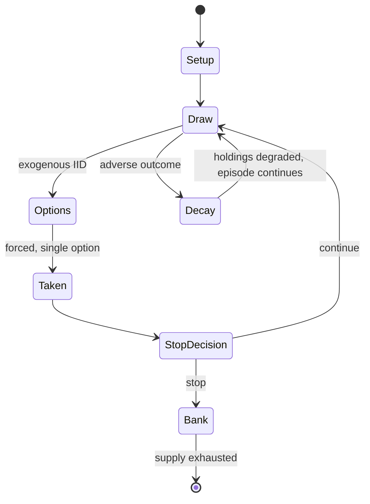

# Farkle

`farkle` &nbsp; state: **DEEPENED** &nbsp; method: **heuristic**

## Found layer (recorded, not trusted)

| field | value |
| --- | --- |
| wikidata | Q5435387 |
| wikipedia | Farkle |
| genres (source) | -- |
| instance of (source) | -- |
| country of origin | -- |

## Declared layer (orders bench work)

| field | value |
| --- | --- |
| year created | -- |
| epoch | -- |
| region | -- |
| media | DICE |
| players | -- |
| age band | -- |
| exogenous process | IID |
| loss shape | PARTIAL_DECAY |
| live axes | STOP |
| horizon | -- |
| scoring shape | SET_COLLECTION_CONVEX |
| information | IMPERFECT |
| interaction | -- |
| turn structure | -- |
| tractability | EXACT_WITH_CUT |
| randomness | DICE |
| luck factor | 0.58 |
| rules complexity | 2.25 |
| strategic depth | 2.37 |
| novelty | 0.6473 |
| solved status | -- |
| strategies | probability_estimation, set_collection |
| algorithms | -- |

## Object model

```
Episode
  players      : ?
  turn_structure: ?
  horizon       : ?
  scoring       : SET_COLLECTION_CONVEX

DicePool       -- n dice, each an iid categorical draw
Roll           -- realised outcome of a pool
Pot            -- value accumulated this episode and at risk until banked
```

## State transition diagram



## Research item -- turn trace

```
# Farkle -- simulated turn events
# generated from the DECLARED vector, not from a rulebook.
# structure: exo=IID loss=PARTIAL_DECAY horizon=None scoring=SET_COLLECTION_CONVEX axes=STOP

t=0    SETUP        players=2  pot=0  capacity=3
t=1    DRAW         p1 roll from d6 pool -> outcome #4  (p=0.253)
t=2    FORCED       p1 single legal option taken (pot_gain=+1.8)
t=3    STOP?        p1 pot=1.8  P(bust|continue)=0.28  E[gain]=0.73 -> CONTINUE
t=4    DRAW         p1 roll from d6 pool -> outcome #6  (p=0.256)
t=5    FORCED       p1 single legal option taken (pot_gain=+1.6)
t=6    STOP?        p1 pot=3.4  P(bust|continue)=0.37  E[gain]=1.39 -> CONTINUE
t=7    DRAW         p1 roll from d6 pool -> outcome #1  (p=0.279)
t=8    FORCED       p1 single legal option taken (pot_gain=+0.7)
t=9    STOP?        p1 pot=4.1  P(bust|continue)=0.43  E[gain]=1.82 -> CONTINUE
t=10   DRAW         p1 roll from d6 pool -> outcome #5  (p=0.027)
t=11   FORCED       p1 single legal option taken (pot_gain=+1.1)
t=12   STOP?        p1 pot=5.2  P(bust|continue)=0.58  E[gain]=1.05 -> BANK
t=13   BANK         p1 banks 5.2  (pot now safe)
t=14   DRAW         p2 roll from d6 pool -> outcome #1  (p=0.265)
t=15   FORCED       p2 single legal option taken (pot_gain=+1.5)
t=16   STOP?        p2 pot=1.5  P(bust|continue)=0.23  E[gain]=1.65 -> CONTINUE
t=17   DRAW         p2 roll from d6 pool -> outcome #5  (p=0.049)
t=18   FORCED       p2 single legal option taken (pot_gain=+1.3)
t=19   STOP?        p2 pot=2.8  P(bust|continue)=0.40  E[gain]=1.66 -> CONTINUE
t=20   DRAW         p2 roll from d6 pool -> outcome #3  (p=0.148)
t=21   FORCED       p2 single legal option taken (pot_gain=+1.7)
t=22   STOP?        p2 pot=4.5  P(bust|continue)=0.53  E[gain]=1.11 -> BANK
t=23   BANK         p2 banks 4.5  (pot now safe)
t=24   DRAW         p1 roll from d6 pool -> outcome #6  (p=0.086)
t=25   FORCED       p1 single legal option taken (pot_gain=+0.5)
t=26   STOP?        p1 pot=0.5  P(bust|continue)=0.22  E[gain]=1.93 -> CONTINUE

terminal: VARIABLE
```

## Conditions

| kind | threshold | effect | trigger |
| --- | --- | --- | --- |
| PENALTY | 500 points | -- | Penalties for repeated farkles, for example deduction of 500 points for three farkles in a row. |
| WIN | -- | -- | In this version, players cannot score three pairs, and this variation often couples an "instant" win option, where on the first roll of the five dice on any turn, if the player rolls five of a kind, that player instantly |
| BOUNDARY | -- | -- | If they score at least one die, they score 1000 plus whatever additional score they accumulate. |
| BOUNDARY | -- | -- | Players may be required to make at least one additional throw when they have hot dice, even if they have accumulated a high enough score that they would choose not to risk farkling. |

## Source extract

Farkle, or Farkel, is a family dice game with varying rules. Alternate names and similar games
include Dix Mille, Ten Thousand, Cosmic Wimpout, Chicago, Greed, Hot Dice, Volle Lotte, Squelch,
Zilch, and Zonk. A version has been marketed commercially since 1996 under the brand name Pocket
Farkel by Legendary Games Inc. The game is believed to have arrived to North America on French
sailing ships in the 1600s and has been passed down in families as a folk game ever since. As
such, while the basic rules are well-established, there is a wide range of variation in scoring
and play. The game is played with six dice (five in some variations), along with paper and a
pencil or pen for keeping score.   == History == According to the official Pocket Farkel game
documents, scholars believe the game arrived on French sailing ships in the 1600s and has been
passed down in families ever since. The game has also been claimed to originate from Iceland
through the purported English nobleman Sir Albert Farkle, who is said to have first played it
there in the 1300s or 1400s, but this is not considered credible. Another claim is that the game
originates in Texas, based on the fact that farkleberries gr

<sub>Wikipedia, CC BY-SA. Retained as evidence for the structural
classification above. Every rule inferred from it is HYPOTHESIZED
until audited against a rulebook.</sub>
