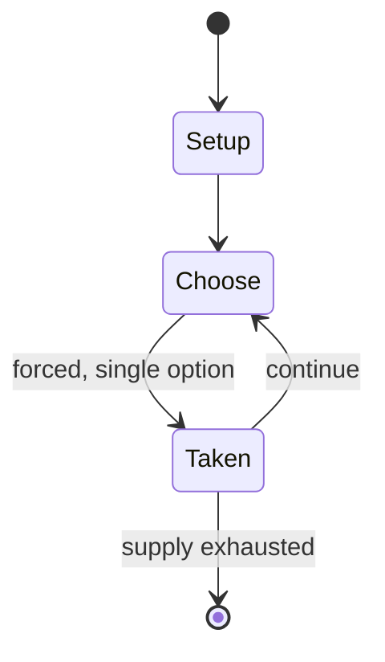

# Felli

`felli` &nbsp; state: **DEEPENED** &nbsp; method: **heuristic**

## Found layer (recorded, not trusted)

| field | value |
| --- | --- |
| wikidata | Q5442468 |
| wikipedia | Felli |
| genres (source) | -- |
| instance of (source) | -- |
| country of origin | -- |

## Declared layer (orders bench work)

| field | value |
| --- | --- |
| year created | -- |
| epoch | -- |
| region | -- |
| media | ABSTRACT, BOARD |
| players | -- |
| age band | -- |
| exogenous process | -- |
| loss shape | -- |
| live axes | ORDER, SPATIAL |
| horizon | -- |
| scoring shape | -- |
| information | -- |
| interaction | COMPETITIVE |
| turn structure | -- |
| tractability | SAMPLING_ONLY |
| randomness | -- |
| luck factor | 0.35 |
| rules complexity | 2.43 |
| strategic depth | 2.0 |
| novelty | 0.3553 |
| solved status | -- |
| strategies | -- |
| algorithms | -- |

## Object model

```
Episode
  players      : ?
  turn_structure: ?
  horizon       : ?
  scoring       : ?

Board          -- spatial substrate; cells carry position and occupancy
Piece          -- movable token owned by a player
Sequence       -- the permutation under the player's control
Placement      -- position subject to geometric legality
```

## State transition diagram



## Research item -- turn trace

```
# Felli -- simulated turn events
# generated from the DECLARED vector, not from a rulebook.
# structure: exo=None loss=None horizon=None scoring=None axes=ORDER,SPATIAL

t=0    SETUP        players=2  pot=0  capacity=3
t=1    FORCED       p1 single legal option taken (pot_gain=+1.6)
t=2    SPATIAL      p1 places at (6,7); adjacency legal
t=3    FORCED       p1 single legal option taken (pot_gain=+1.1)
t=4    FORCED       p1 single legal option taken (pot_gain=+1.5)
t=5    ENDTURN      turn passes to p2
t=6    FORCED       p2 single legal option taken (pot_gain=+0.8)
t=7    SPATIAL      p2 places at (5,3); adjacency legal
t=8    ENDTURN      turn passes to p1
t=9    FORCED       p1 single legal option taken (pot_gain=+1.8)
t=10   SPATIAL      p1 places at (2,1); adjacency legal
t=11   FORCED       p1 single legal option taken (pot_gain=+1.3)
t=12   FORCED       p1 single legal option taken (pot_gain=+1.5)
t=13   SPATIAL      p1 places at (3,1); adjacency legal
t=14   ENDTURN      turn passes to p2
t=15   FORCED       p2 single legal option taken (pot_gain=+1.1)
t=16   ENDTURN      turn passes to p1
t=17   FORCED       p1 single legal option taken (pot_gain=+1.3)
t=18   FORCED       p1 single legal option taken (pot_gain=+1.7)
t=19   SPATIAL      p1 places at (3,7); adjacency legal
t=20   FORCED       p1 single legal option taken (pot_gain=+1.8)
t=21   FORCED       p1 single legal option taken (pot_gain=+0.5)
t=22   FORCED       p1 single legal option taken (pot_gain=+0.8)
t=23   FORCED       p1 single legal option taken (pot_gain=+1.2)
t=24   FORCED       p1 single legal option taken (pot_gain=+1.5)
t=25   FORCED       p1 single legal option taken (pot_gain=+0.6)
t=26   SPATIAL      p1 places at (2,6); adjacency legal

terminal: VARIABLE
```

## Source extract

Felli is a two-player abstract strategy board game from Morocco. It is related to Alquerque and
draughts as pieces leap over one another to capture. Felli's closest relatives are several
thousand miles away in the form of Lau kata kati from India and the game called Butterfly from
Mozambique. One main difference is that the Felli board has only one horizontal line across its
breadth as opposed to two found in the other two games. There is another version, and perhaps
even the correction version, where the pieces are promoted to "Mullahs" upon reaching the other
player's first rank.  The "Mullahs" are like the "Kings" in International draughts, and they can
move any number of unoccupied spaces.  They can also leap over an enemy piece from any distance
and land any distance behind it. The game is also called Fich.    == Goal == The goal of each
player is to capture all the other player's pieces or stalemate the other player by immobilizing
its pieces.   == Equipment == The board is two triangles joined together at a common vertex.
Each triangle has one horizontal line that dissects it across its breadth.  A line also dissects
both triangles across their lengths through the common ve

<sub>Wikipedia, CC BY-SA. Retained as evidence for the structural
classification above. Every rule inferred from it is HYPOTHESIZED
until audited against a rulebook.</sub>
