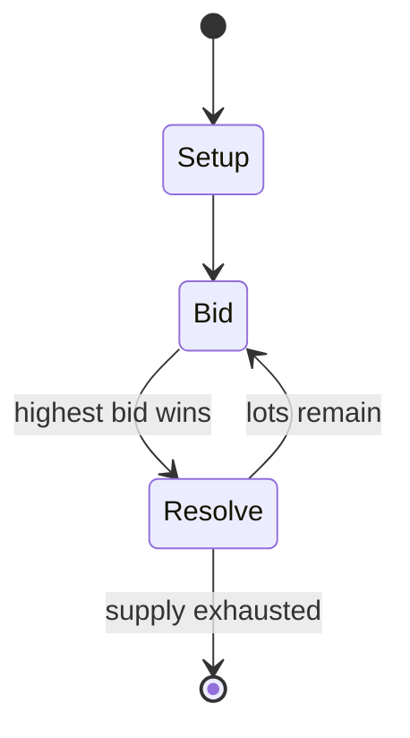

# Fenn treasure

*found treasure*

`fenn_treasure` &nbsp; state: **DEEPENED** &nbsp; method: **heuristic**

## Found layer (recorded, not trusted)

| field | value |
| --- | --- |
| wikidata | Q16980606 |
| wikipedia | Fenn treasure |
| genres (source) | -- |
| instance of (source) | canard, competition, riddle, treasure, treasure hunt |
| country of origin | -- |

## Declared layer (orders bench work)

| field | value |
| --- | --- |
| year created | 2013 |
| epoch | CONTEMPORARY |
| region | -- |
| media | PUZZLE |
| players | -- |
| age band | -- |
| exogenous process | -- |
| loss shape | -- |
| live axes | BID |
| horizon | -- |
| scoring shape | -- |
| information | -- |
| interaction | COMPETITIVE |
| turn structure | AUCTION_ROUND |
| tractability | SAMPLING_ONLY |
| randomness | HIDDEN_INFO |
| luck factor | 0.35 |
| rules complexity | 2.61 |
| strategic depth | 2.0 |
| novelty | 0.56 |
| solved status | -- |
| strategies | bluffing |
| algorithms | -- |

## Object model

```
Episode
  players      : ?
  turn_structure: AUCTION_ROUND
  horizon       : ?
  scoring       : ?

Configuration  -- the arrangement to be resolved
Constraint     -- predicate a legal configuration must satisfy
Auction        -- priced competition resolving to one winner
```

## State transition diagram



## Research item -- turn trace

```
# Fenn treasure -- simulated turn events
# generated from the DECLARED vector, not from a rulebook.
# structure: exo=None loss=None horizon=None scoring=None axes=BID

t=0    SETUP        players=2  pot=0  capacity=7
t=1    FORCED       p1 single legal option taken (pot_gain=+0.7)
t=2    ENDTURN      turn passes to p2
t=3    FORCED       p2 single legal option taken (pot_gain=+1.1)
t=4    ENDTURN      turn passes to p1
t=5    FORCED       p1 single legal option taken (pot_gain=+1.6)
t=6    FORCED       p1 single legal option taken (pot_gain=+1.3)
t=7    BID          p1 sealed bid of 7 against 1 rivals
t=8    FORCED       p1 single legal option taken (pot_gain=+1.0)
t=9    ENDTURN      turn passes to p2
t=10   FORCED       p2 single legal option taken (pot_gain=+1.4)
t=11   BID          p2 sealed bid of 3 against 1 rivals
t=12   FORCED       p2 single legal option taken (pot_gain=+0.8)
t=13   FORCED       p2 single legal option taken (pot_gain=+1.9)
t=14   BID          p2 sealed bid of 8 against 1 rivals
t=15   FORCED       p2 single legal option taken (pot_gain=+0.6)
t=16   ENDTURN      turn passes to p1
t=17   FORCED       p1 single legal option taken (pot_gain=+1.8)
t=18   BID          p1 sealed bid of 8 against 1 rivals
t=19   FORCED       p1 single legal option taken (pot_gain=+1.5)
t=20   FORCED       p1 single legal option taken (pot_gain=+2.0)
t=21   BID          p1 sealed bid of 8 against 1 rivals
t=22   ENDTURN      turn passes to p2
t=23   FORCED       p2 single legal option taken (pot_gain=+1.2)
t=24   FORCED       p2 single legal option taken (pot_gain=+1.9)
t=25   FORCED       p2 single legal option taken (pot_gain=+2.0)
t=26   FORCED       p2 single legal option taken (pot_gain=+2.0)

terminal: VARIABLE
```

## Source extract

The Fenn Treasure was a cache of gold and jewels that Forrest Fenn, an art dealer and author
from Santa Fe, New Mexico, hid in the Rocky Mountains of the United States. It was found
approximately a decade later in 2020 in Wyoming by an anonymous treasure hunter later revealed
to be former journalist and medical student Jack Stuef. In attempting to honor what he perceives
to be Fenn's wishes after his death in September 2020, he has refused to reveal the location of
the treasure. An auction of items from the treasure chest in December 2022 resulted in $1.3
million in sales.   == History ==  Forrest Fenn (August 22, 1930 – September 7, 2020) was born
in Temple, Texas to William "Marvin" Fenn, a teacher by profession and Lillie Gay Simpson, who
had worked as a nurse before her marriage.  The middle child of the three children born to the
couple, Fenn attended Temple High School in 1947, after which he studied at Temple Junior
College. Struggling academically, Fenn preferred to spend his time outdoors with friends, rather
than studying. Fenn left school after graduatingand enrolled in the Air Force on September 6,
1950.  During his time as a pilot in the United States Air Force, Fenn o

<sub>Wikipedia, CC BY-SA. Retained as evidence for the structural
classification above. Every rule inferred from it is HYPOTHESIZED
until audited against a rulebook.</sub>
